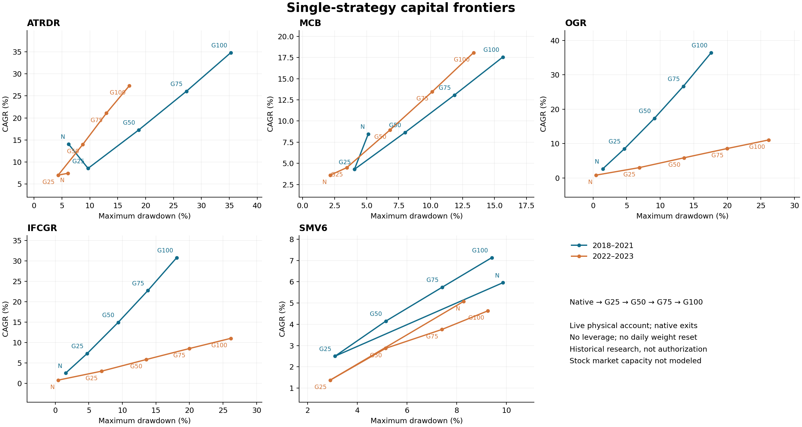
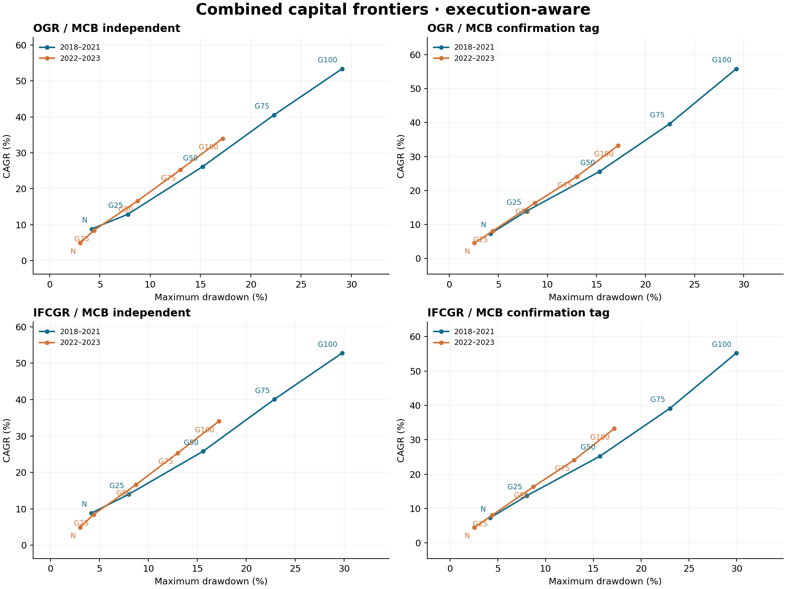

# 五策略资本、风险与代码最终研究 V1

计算完成：132/132 个规定切片，包含 18 Native、36 G100 双等级极限、54 中间档位、8 入场式 G100 和 16 单资金袖优先诊断。最终判断：**CAPITAL_SCALING_HAS_HEADROOM**。唯一优先研究程序：**G25 整本资本缩放的影子执行与容量证伪**。任何较强档位仅为影子研究候选，不授权生产缩放。

全部 Native、G25、G50、G75、G100 都来自合法时序物理账户。没有新 alpha、止损、板块、股票池、绩效权重、杠杆或回撤门控；OGR 与 IFCGR 始终互斥。2018–2021 和 2022–2023 是两个历史段；2018–2023 年度表是诊断分解，不是六次独立验证。

## 代码与基准（问题 1–5）

新确认并修复了一处可影响资金实际使用的 P0 调度缺陷：同一原生回调中的合法卖出释放现金后，后续买单仍使用旧的已消耗预算。最小用例由只买到 200 股修正为可买 800 股，仍然不融资。SMV6 单独账户随后与封存父基准对齐。父基准账户数字未被强行覆盖；18 个 Native 切片均按现金、NAV、gross 和必要原生请求层对账。

其他修复为 SMV6 上一交易/事件日元数据（含首次回调的历史数据）、空结果表列、缺失时间戳拒绝和按配置文件目录解析及按所选策略校验输入。冻结 alpha 源码不变；元数据修复不改变原生事件时钟。此前 ATRDR 完成状态前视和 SMV6 开盘未来收盘估值修复保留并重新测试。具体证据见 bug_hardening_report。

实际极限运行还发现并修复了 ETF 恰好足额一手被浮点取整漏买，以及大额股票订单请求与实际含费账单运算顺序不一致的问题；后者曾使现金充足的 603348.SH 订单被错误拒绝。修补没有放宽容差或裁剪负现金，当前 132 场景全部由统一后的生产者生成。

股票池：ATRDR/MCB/OGR 为精确父 MAIN+CHINEXT；ATRDR 路线资格和 MCB 同一完成收盘跨板确认保留；IFCGR 严格继承 OGR 后过滤、维持 PIT-B；SMV6 为冻结 152 ETF 与原生每日资格。没有新增 STAR、北京、ETF、ST 或上市年龄规则。SMV6 原生 SuperMind 等价性仍未验证，股票市场容量未建模。

## 缩放定义与实际暴露

原生 P0 预资金请求提供同一经济事件的原生目标金额，作为独立定仓参照；活跃持仓集合、现金、库存、公司行动与原生退出由实际缩放账户推进。每个合法集合变化点统一归一化整本有效目标。不是将旧 NAV 或已完成交易收益乘倍数。每段沿用父已验证实际初始股数和 NAV；不在段初人为平仓或把继承持仓追溯放大。

G25/G50/G75 是调仓目标，价格漂移不会触发每日恢复；因此持有期间实际 gross 可以偏离对应目标。不能同时宣称“绝不因价格再平衡”和“每天恒等固定 gross”。100% 无融资约束始终对真实账户执行。缺失合法报价、当天买入及 pending 股数不能拿来假装完成减仓；目标达成率和末端未完成调整均保留。

下文 MaxDD、CVaR5、Sharpe 和仓位分位数沿用日末账户口径；最大证券/家族权重则取全部已记录完成时点。target_attainment_diagnostics.csv 另列完成时点最大回撤、实际仓位、权重偏差及目标未达成情况。资本日是元乘日历日，不是交易日计数。

## 单策略前沿与 G100（问题 6–11）

### ATRDR

| period | target | CAGR | MaxDD | CVaR5 | Sharpe | average_gross_exposure | capital_days | max_single_security_weight |
| --- | --- | --- | --- | --- | --- | --- | --- | --- |
| 2018_2021 | NATIVE | 14.08% | 6.16% | -1.26% | 1.61 | 21.79% | 6.351e+08 | 2.34% |
| 2018_2021 | G25 | 8.54% | 9.68% | -1.09% | 1.184 | 19.94% | 5.081e+08 | 27.55% |
| 2018_2021 | G50 | 17.28% | 18.78% | -2.18% | 1.183 | 39.86% | 1.116e+09 | 53.29% |
| 2018_2021 | G75 | 26.05% | 27.32% | -3.30% | 1.178 | 59.86% | 1.833e+09 | 77.39% |
| 2018_2021 | G100 | 34.82% | 35.28% | -4.43% | 1.175 | 79.94% | 2.665e+09 | 100.00% |
| 2022_2023 | NATIVE | 7.44% | 6.08% | -1.15% | 1.089 | 22.18% | 4.58e+08 | 2.32% |
| 2022_2023 | G25 | 7.01% | 4.31% | -0.87% | 1.165 | 18.96% | 3.889e+08 | 28.21% |
| 2022_2023 | G50 | 13.97% | 8.72% | -1.76% | 1.147 | 37.90% | 8.206e+08 | 54.10% |
| 2022_2023 | G75 | 21.09% | 12.97% | -2.65% | 1.149 | 56.88% | 1.304e+09 | 77.96% |
| 2022_2023 | G100 | 27.30% | 17.08% | -3.53% | 1.121 | 75.93% | 1.817e+09 | 100.00% |

G100 的日末 MaxDD 为 35.28% / 17.08%，属于 RISK_LIMITED。G25 在较早段收益低于 Native 而回撤更高，说明整本定仓会改变资本分配路径，前沿不保证单调优于原生。

### MCB

| period | target | CAGR | MaxDD | CVaR5 | Sharpe | average_gross_exposure | capital_days | max_single_security_weight |
| --- | --- | --- | --- | --- | --- | --- | --- | --- |
| 2018_2021 | NATIVE | 8.47% | 5.13% | -0.84% | 1.362 | 10.72% | 2.376e+08 | 2.32% |
| 2018_2021 | G25 | 4.29% | 4.04% | -0.57% | 1.177 | 8.56% | 1.702e+08 | 25.62% |
| 2018_2021 | G50 | 8.64% | 8.00% | -1.13% | 1.179 | 17.13% | 3.635e+08 | 50.82% |
| 2018_2021 | G75 | 13.07% | 11.87% | -1.70% | 1.181 | 25.73% | 5.827e+08 | 75.61% |
| 2018_2021 | G100 | 17.56% | 15.65% | -2.27% | 1.183 | 34.36% | 8.306e+08 | 100.00% |
| 2022_2023 | NATIVE | 3.61% | 2.15% | -0.59% | 0.9416 | 10.30% | 1.417e+08 | 2.25% |
| 2022_2023 | G25 | 4.49% | 3.45% | -0.56% | 1.267 | 10.02% | 1.395e+08 | 25.00% |
| 2022_2023 | G50 | 8.94% | 6.82% | -1.12% | 1.253 | 20.01% | 2.887e+08 | 50.00% |
| 2022_2023 | G75 | 13.46% | 10.13% | -1.67% | 1.251 | 30.00% | 4.496e+08 | 75.00% |
| 2022_2023 | G100 | 18.08% | 13.36% | -2.23% | 1.251 | 40.00% | 6.231e+08 | 100.00% |

G100 的日末 MaxDD 为 15.65% / 13.36%；G75 为 11.87% / 10.13%。它在组合的单资金袖优先诊断中具有最高的跨段最弱资本日效率，但这个事实不授权把独立 MCB 无条件推到 G100。

### OGR

| period | target | CAGR | MaxDD | CVaR5 | Sharpe | average_gross_exposure | capital_days | max_single_security_weight |
| --- | --- | --- | --- | --- | --- | --- | --- | --- |
| 2018_2021 | NATIVE | 2.65% | 1.44% | -0.10% | 1.53 | 1.47% | 2.111e+07 | 0.75% |
| 2018_2021 | G25 | 8.47% | 4.66% | -0.77% | 1.521 | 9.03% | 1.492e+08 | 26.75% |
| 2018_2021 | G50 | 17.36% | 9.14% | -1.53% | 1.525 | 18.08% | 3.589e+08 | 52.10% |
| 2018_2021 | G75 | 26.68% | 13.45% | -2.30% | 1.529 | 27.15% | 6.515e+08 | 76.17% |
| 2018_2021 | G100 | 36.47% | 17.60% | -3.07% | 1.535 | 36.25% | 1.056e+09 | 100.00% |
| 2022_2023 | NATIVE | 0.81% | 0.43% | -0.05% | 1.601 | 0.67% | 5.548e+06 | 0.73% |
| 2022_2023 | G25 | 3.00% | 6.89% | -0.83% | 0.5655 | 9.68% | 8.198e+07 | 26.12% |
| 2022_2023 | G50 | 5.86% | 13.55% | -1.68% | 0.5706 | 19.43% | 1.668e+08 | 51.47% |
| 2022_2023 | G75 | 8.55% | 19.97% | -2.53% | 0.5758 | 29.25% | 2.541e+08 | 76.09% |
| 2022_2023 | G100 | 11.06% | 26.16% | -3.39% | 0.5813 | 39.15% | 3.432e+08 | 100.00% |

G100 在较早段 CAGR 为 36.47%、MaxDD 为 17.60%；较晚段只有约 11.06% CAGR 而 MaxDD 达 26.16%，且前五事件净利润占比超过 100%。属于 CONCENTRATION_LIMITED 与 RISK_LIMITED。

### IFCGR

| period | target | CAGR | MaxDD | CVaR5 | Sharpe | average_gross_exposure | capital_days | max_single_security_weight |
| --- | --- | --- | --- | --- | --- | --- | --- | --- |
| 2018_2021 | NATIVE | 2.53% | 1.55% | -0.10% | 1.472 | 1.44% | 2.071e+07 | 0.74% |
| 2018_2021 | G25 | 7.35% | 4.77% | -0.76% | 1.38 | 8.87% | 1.437e+08 | 26.87% |
| 2018_2021 | G50 | 14.95% | 9.37% | -1.53% | 1.382 | 17.75% | 3.371e+08 | 52.44% |
| 2018_2021 | G75 | 22.79% | 13.82% | -2.29% | 1.384 | 26.66% | 5.95e+08 | 76.78% |
| 2018_2021 | G100 | 30.82% | 18.10% | -3.06% | 1.385 | 35.58% | 9.352e+08 | 100.00% |
| 2022_2023 | NATIVE | 0.81% | 0.43% | -0.05% | 1.601 | 0.67% | 5.522e+06 | 0.73% |
| 2022_2023 | G25 | 3.00% | 6.89% | -0.83% | 0.5652 | 9.68% | 8.161e+07 | 26.12% |
| 2022_2023 | G50 | 5.86% | 13.55% | -1.68% | 0.5703 | 19.43% | 1.661e+08 | 51.47% |
| 2022_2023 | G75 | 8.55% | 19.97% | -2.53% | 0.5755 | 29.25% | 2.53e+08 | 76.09% |
| 2022_2023 | G100 | 11.05% | 26.16% | -3.39% | 0.5811 | 39.15% | 3.416e+08 | 100.00% |

G100 在较早段 CAGR 为 30.82%、MaxDD 为 18.10%；较晚段风险几乎与 OGR 相同。发行人过滤没有消除满仓 Gap 的尾部损失，PIT-B 身份保持。

### SMV6

| period | target | CAGR | MaxDD | CVaR5 | Sharpe | average_gross_exposure | capital_days | max_single_security_weight |
| --- | --- | --- | --- | --- | --- | --- | --- | --- |
| 2018_2021 | NATIVE | 5.95% | 9.86% | -1.34% | 0.7349 | 15.07% | 2.426e+08 | 51.39% |
| 2018_2021 | G25 | 2.50% | 3.10% | -0.44% | 0.9238 | 5.64% | 8.332e+07 | 26.11% |
| 2018_2021 | G50 | 4.15% | 5.15% | -0.80% | 0.8611 | 9.85% | 1.511e+08 | 51.44% |
| 2018_2021 | G75 | 5.74% | 7.41% | -1.15% | 0.8359 | 13.79% | 2.2e+08 | 76.08% |
| 2018_2021 | G100 | 7.13% | 9.41% | -1.47% | 0.8191 | 17.26% | 2.85e+08 | 99.98% |
| 2022_2023 | NATIVE | 5.07% | 8.27% | -1.32% | 0.604 | 12.50% | 9.95e+07 | 51.00% |
| 2022_2023 | G25 | 1.37% | 2.91% | -0.43% | 0.5103 | 4.10% | 3.058e+07 | 25.73% |
| 2022_2023 | G50 | 2.87% | 5.14% | -0.80% | 0.5629 | 7.68% | 5.88e+07 | 50.97% |
| 2022_2023 | G75 | 3.76% | 7.40% | -1.15% | 0.5255 | 10.98% | 8.571e+07 | 75.16% |
| 2022_2023 | G100 | 4.63% | 9.25% | -1.50% | 0.5133 | 13.99% | 1.112e+08 | 99.98% |

G100 平均 gross 仅 17.26% / 13.99%，CAGR 为 7.13% / 4.63%；较晚段低于 Native 的 5.07%。原生触发窗口与本地成交限制使提高目标难以转化成持续的实际暴露，不能据目标为 100% 就称其为全年满仓 ETF 策略。

单策略 G100 允许唯一有效证券接近全账户，不添加单名上限。上表同时展示由此承担的历史风险。完整最差月/季/21日/63日、最长回撤、恢复时间、换手、费用、头部/尾部事件均在 single_strategy_scaling_frontier.csv；G100 两个执行等级和峰谷归因另有专表。

## 组合前沿（问题 12–16）

| gap | mcb_mode | period | target | CAGR | MaxDD | CVaR5 | Sharpe | average_gross_exposure | p95_exposure | capital_days | max_single_security_weight | max_family_weight |
| --- | --- | --- | --- | --- | --- | --- | --- | --- | --- | --- | --- | --- |
| IFCGR | confirmation_tag | 2018_2021 | NATIVE | 7.30% | 4.21% | -0.73% | 1.511 | 12.26% | 42.26% | 9.835e+08 | 10.70% | 55.75% |
| IFCGR | confirmation_tag | 2018_2021 | G25 | 13.75% | 8.05% | -0.91% | 1.934 | 20.71% | 25.56% | 1.759e+09 | 29.37% | 29.37% |
| IFCGR | confirmation_tag | 2018_2021 | G50 | 25.26% | 15.71% | -1.86% | 1.742 | 40.58% | 50.70% | 4.054e+09 | 52.14% | 52.14% |
| IFCGR | confirmation_tag | 2018_2021 | G75 | 39.14% | 23.02% | -2.78% | 1.759 | 60.35% | 75.49% | 7.162e+09 | 76.57% | 76.57% |
| IFCGR | confirmation_tag | 2018_2021 | G100 | 55.19% | 29.95% | -3.68% | 1.802 | 79.69% | 100.00% | 1.142e+10 | 100.00% | 100.00% |
| IFCGR | confirmation_tag | 2022_2023 | NATIVE | 4.58% | 2.57% | -0.59% | 1.285 | 12.34% | 43.86% | 6.162e+08 | 7.82% | 60.17% |
| IFCGR | confirmation_tag | 2022_2023 | G25 | 8.05% | 4.42% | -0.99% | 1.203 | 21.02% | 25.58% | 1.079e+09 | 28.42% | 28.42% |
| IFCGR | confirmation_tag | 2022_2023 | G50 | 16.35% | 8.73% | -1.97% | 1.216 | 41.23% | 50.58% | 2.268e+09 | 54.37% | 54.37% |
| IFCGR | confirmation_tag | 2022_2023 | G75 | 24.12% | 13.00% | -2.95% | 1.198 | 61.87% | 75.41% | 3.592e+09 | 78.14% | 78.14% |
| IFCGR | confirmation_tag | 2022_2023 | G100 | 33.27% | 17.21% | -3.92% | 1.232 | 82.06% | 100.00% | 5.126e+09 | 100.00% | 100.00% |
| IFCGR | independent | 2018_2021 | NATIVE | 8.82% | 4.19% | -0.80% | 1.62 | 13.73% | 50.66% | 1.136e+09 | 10.70% | 61.84% |
| IFCGR | independent | 2018_2021 | G25 | 13.97% | 7.99% | -0.90% | 1.963 | 20.76% | 25.56% | 1.77e+09 | 29.37% | 29.37% |
| IFCGR | independent | 2018_2021 | G50 | 25.82% | 15.60% | -1.85% | 1.773 | 40.65% | 50.69% | 4.1e+09 | 52.14% | 52.14% |
| IFCGR | independent | 2018_2021 | G75 | 40.06% | 22.87% | -2.76% | 1.788 | 60.44% | 75.48% | 7.277e+09 | 76.57% | 76.57% |
| IFCGR | independent | 2018_2021 | G100 | 52.76% | 29.78% | -3.75% | 1.716 | 80.06% | 100.00% | 1.121e+10 | 100.00% | 100.00% |
| IFCGR | independent | 2022_2023 | NATIVE | 4.95% | 3.05% | -0.69% | 1.221 | 14.08% | 58.07% | 7.047e+08 | 7.82% | 67.63% |
| IFCGR | independent | 2022_2023 | G25 | 8.43% | 4.40% | -0.99% | 1.261 | 21.07% | 25.55% | 1.084e+09 | 28.42% | 28.42% |
| IFCGR | independent | 2022_2023 | G50 | 16.62% | 8.73% | -1.96% | 1.237 | 41.66% | 50.58% | 2.28e+09 | 54.37% | 54.37% |
| IFCGR | independent | 2022_2023 | G75 | 25.32% | 13.00% | -2.93% | 1.251 | 62.04% | 75.41% | 3.647e+09 | 78.14% | 78.14% |
| IFCGR | independent | 2022_2023 | G100 | 34.03% | 17.21% | -3.88% | 1.256 | 82.28% | 100.00% | 5.144e+09 | 100.00% | 100.00% |
| OGR | confirmation_tag | 2018_2021 | NATIVE | 7.32% | 4.21% | -0.73% | 1.515 | 12.25% | 42.23% | 9.839e+08 | 10.70% | 55.72% |
| OGR | confirmation_tag | 2018_2021 | G25 | 13.88% | 7.83% | -0.91% | 1.951 | 20.74% | 25.56% | 1.766e+09 | 29.37% | 29.37% |
| OGR | confirmation_tag | 2018_2021 | G50 | 25.58% | 15.31% | -1.86% | 1.761 | 40.66% | 50.70% | 4.09e+09 | 52.14% | 52.14% |
| OGR | confirmation_tag | 2018_2021 | G75 | 39.61% | 22.44% | -2.77% | 1.777 | 60.42% | 75.49% | 7.24e+09 | 76.57% | 76.57% |
| OGR | confirmation_tag | 2018_2021 | G100 | 55.81% | 29.24% | -3.67% | 1.818 | 79.74% | 100.00% | 1.158e+10 | 100.00% | 100.00% |
| OGR | confirmation_tag | 2022_2023 | NATIVE | 4.58% | 2.57% | -0.59% | 1.285 | 12.33% | 43.83% | 6.163e+08 | 7.81% | 60.13% |
| OGR | confirmation_tag | 2022_2023 | G25 | 8.05% | 4.42% | -0.99% | 1.203 | 21.02% | 25.58% | 1.08e+09 | 28.42% | 28.42% |
| OGR | confirmation_tag | 2022_2023 | G50 | 16.35% | 8.74% | -1.97% | 1.216 | 41.23% | 50.58% | 2.27e+09 | 54.37% | 54.37% |
| OGR | confirmation_tag | 2022_2023 | G75 | 24.12% | 13.00% | -2.95% | 1.198 | 61.87% | 75.41% | 3.595e+09 | 78.14% | 78.14% |
| OGR | confirmation_tag | 2022_2023 | G100 | 33.27% | 17.21% | -3.92% | 1.232 | 82.06% | 100.00% | 5.129e+09 | 100.00% | 100.00% |
| OGR | independent | 2018_2021 | NATIVE | 8.84% | 4.19% | -0.80% | 1.624 | 13.72% | 50.62% | 1.136e+09 | 10.70% | 61.81% |
| OGR | independent | 2018_2021 | G25 | 12.92% | 7.77% | -0.93% | 1.805 | 20.76% | 25.54% | 1.754e+09 | 29.37% | 29.37% |
| OGR | independent | 2018_2021 | G50 | 26.14% | 15.20% | -1.85% | 1.792 | 40.73% | 50.69% | 4.136e+09 | 52.14% | 52.14% |
| OGR | independent | 2018_2021 | G75 | 40.53% | 22.30% | -2.76% | 1.805 | 60.51% | 75.48% | 7.355e+09 | 76.57% | 76.57% |
| OGR | independent | 2018_2021 | G100 | 53.38% | 29.06% | -3.75% | 1.731 | 80.12% | 100.00% | 1.136e+10 | 100.00% | 100.00% |
| OGR | independent | 2022_2023 | NATIVE | 4.95% | 3.05% | -0.69% | 1.221 | 14.07% | 58.03% | 7.047e+08 | 7.81% | 67.58% |
| OGR | independent | 2022_2023 | G25 | 8.43% | 4.40% | -0.99% | 1.26 | 21.07% | 25.55% | 1.085e+09 | 28.42% | 28.42% |
| OGR | independent | 2022_2023 | G50 | 16.62% | 8.74% | -1.96% | 1.237 | 41.66% | 50.58% | 2.282e+09 | 54.37% | 54.37% |
| OGR | independent | 2022_2023 | G75 | 25.32% | 13.00% | -2.93% | 1.251 | 62.04% | 75.41% | 3.65e+09 | 78.14% | 78.14% |
| OGR | independent | 2022_2023 | G100 | 34.03% | 17.21% | -3.88% | 1.256 | 82.28% | 100.00% | 5.148e+09 | 100.00% | 100.00% |

两段同时满足日末最大回撤上限的最高已测档位如下，另列全部已记录完成时点的参考，避免日内风险被日末统计隐藏。不插值、不增加新档位，也不将历史最大回撤当作未来保证。

| gap | mcb_mode | risk_band | admissible_targets | highest_tested_target | risk_measure | completed_timestamp_admissible_targets | highest_completed_timestamp_reference | interpretation |
| --- | --- | --- | --- | --- | --- | --- | --- | --- |
| IFCGR | confirmation_tag | 5.00% | NATIVE | NATIVE | DAILY_CLOSE_NAV_MAXDD | NATIVE | NATIVE | HISTORICAL_REFERENCE_NOT_PRODUCTION |
| IFCGR | confirmation_tag | 8.00% | NATIVE | NATIVE | DAILY_CLOSE_NAV_MAXDD | NATIVE | NATIVE | HISTORICAL_REFERENCE_NOT_PRODUCTION |
| IFCGR | confirmation_tag | 10.00% | NATIVE/G25 | G25 | DAILY_CLOSE_NAV_MAXDD | NATIVE/G25 | G25 | HISTORICAL_REFERENCE_NOT_PRODUCTION |
| IFCGR | confirmation_tag | 15.00% | NATIVE/G25 | G25 | DAILY_CLOSE_NAV_MAXDD | NATIVE/G25 | G25 | HISTORICAL_REFERENCE_NOT_PRODUCTION |
| IFCGR | independent | 5.00% | NATIVE | NATIVE | DAILY_CLOSE_NAV_MAXDD | NATIVE | NATIVE | HISTORICAL_REFERENCE_NOT_PRODUCTION |
| IFCGR | independent | 8.00% | NATIVE/G25 | G25 | DAILY_CLOSE_NAV_MAXDD | NATIVE | NATIVE | HISTORICAL_REFERENCE_NOT_PRODUCTION |
| IFCGR | independent | 10.00% | NATIVE/G25 | G25 | DAILY_CLOSE_NAV_MAXDD | NATIVE/G25 | G25 | HISTORICAL_REFERENCE_NOT_PRODUCTION |
| IFCGR | independent | 15.00% | NATIVE/G25 | G25 | DAILY_CLOSE_NAV_MAXDD | NATIVE/G25 | G25 | HISTORICAL_REFERENCE_NOT_PRODUCTION |
| OGR | confirmation_tag | 5.00% | NATIVE | NATIVE | DAILY_CLOSE_NAV_MAXDD | NATIVE | NATIVE | HISTORICAL_REFERENCE_NOT_PRODUCTION |
| OGR | confirmation_tag | 8.00% | NATIVE/G25 | G25 | DAILY_CLOSE_NAV_MAXDD | NATIVE/G25 | G25 | HISTORICAL_REFERENCE_NOT_PRODUCTION |
| OGR | confirmation_tag | 10.00% | NATIVE/G25 | G25 | DAILY_CLOSE_NAV_MAXDD | NATIVE/G25 | G25 | HISTORICAL_REFERENCE_NOT_PRODUCTION |
| OGR | confirmation_tag | 15.00% | NATIVE/G25 | G25 | DAILY_CLOSE_NAV_MAXDD | NATIVE/G25 | G25 | HISTORICAL_REFERENCE_NOT_PRODUCTION |
| OGR | independent | 5.00% | NATIVE | NATIVE | DAILY_CLOSE_NAV_MAXDD | NATIVE | NATIVE | HISTORICAL_REFERENCE_NOT_PRODUCTION |
| OGR | independent | 8.00% | NATIVE/G25 | G25 | DAILY_CLOSE_NAV_MAXDD | NATIVE/G25 | G25 | HISTORICAL_REFERENCE_NOT_PRODUCTION |
| OGR | independent | 10.00% | NATIVE/G25 | G25 | DAILY_CLOSE_NAV_MAXDD | NATIVE/G25 | G25 | HISTORICAL_REFERENCE_NOT_PRODUCTION |
| OGR | independent | 15.00% | NATIVE/G25 | G25 | DAILY_CLOSE_NAV_MAXDD | NATIVE/G25 | G25 | HISTORICAL_REFERENCE_NOT_PRODUCTION |

## 额外资金、MCB 与 Gap（问题 17–20）

按四个 Gap/历史段切片中最弱的已定义增量 P&L/资本日作保守描述，额外资本使用者为 MCB；新增最大回撤最重者为 ATRDR。这是结果排序，不是新的跨策略绩效配置权重。完整每段增量 CAGR、P&L、MaxDD、CVaR、资本日和分母状态如下。

| gap | period | priority | incremental_CAGR | incremental_MaxDD | incremental_CVaR5 | incremental_net_pnl | incremental_capital_days | incremental_pnl_per_capital_day | capital_day_denominator_status |
| --- | --- | --- | --- | --- | --- | --- | --- | --- | --- |
| OGR | 2018_2021 | ATRDR | 0.292 | 0.2616 | -0.03326 | 1.093e+07 | 7.49e+09 | 0.001459 | DEFINED |
| OGR | 2018_2021 | MCB | 0.09863 | 0.09337 | -0.01404 | 2.855e+06 | 2.354e+09 | 0.001213 | DEFINED |
| OGR | 2018_2021 | OGR | 0.3605 | 0.1386 | -0.02166 | 1.474e+07 | 5.778e+09 | 0.00255 | DEFINED |
| OGR | 2018_2021 | SMV6 | 0.00612 | 0.03741 | -0.004104 | 1.561e+05 | 5.227e+08 | 0.0002987 | DEFINED |
| OGR | 2022_2023 | ATRDR | 0.2343 | 0.1363 | -0.02768 | 3.617e+06 | 3.786e+09 | 0.0009553 | DEFINED |
| OGR | 2022_2023 | MCB | 0.1346 | 0.1047 | -0.01502 | 1.989e+06 | 1.703e+09 | 0.001168 | DEFINED |
| OGR | 2022_2023 | OGR | 0.04874 | 0.242 | -0.02538 | 6.928e+05 | 1.668e+09 | 0.0004153 | DEFINED |
| OGR | 2022_2023 | SMV6 | 0.02577 | 0.02825 | -0.005303 | 3.624e+05 | 2.923e+08 | 0.00124 | DEFINED |
| IFCGR | 2018_2021 | ATRDR | 0.2919 | 0.2616 | -0.03325 | 1.092e+07 | 7.485e+09 | 0.001459 | DEFINED |
| IFCGR | 2018_2021 | MCB | 0.09857 | 0.09334 | -0.01403 | 2.852e+06 | 2.352e+09 | 0.001212 | DEFINED |
| IFCGR | 2018_2021 | IFCGR | 0.3082 | 0.1433 | -0.02156 | 1.177e+07 | 5.126e+09 | 0.002297 | DEFINED |
| IFCGR | 2018_2021 | SMV6 | 0.006118 | 0.03739 | -0.004102 | 1.56e+05 | 5.223e+08 | 0.0002987 | DEFINED |
| IFCGR | 2022_2023 | ATRDR | 0.2342 | 0.1363 | -0.02768 | 3.614e+06 | 3.783e+09 | 0.0009554 | DEFINED |
| IFCGR | 2022_2023 | MCB | 0.1345 | 0.1046 | -0.01501 | 1.987e+06 | 1.702e+09 | 0.001168 | DEFINED |
| IFCGR | 2022_2023 | IFCGR | 0.04866 | 0.242 | -0.02537 | 6.912e+05 | 1.667e+09 | 0.0004147 | DEFINED |
| IFCGR | 2022_2023 | SMV6 | 0.02576 | 0.02823 | -0.005302 | 3.62e+05 | 2.921e+08 | 0.001239 | DEFINED |

MCB 独立与确认标签的资本角色为 MCB_ROLE_SCALING_SENSITIVE；不因历史重合就自动删除独立资金。mcb_scaling_role_comparison.csv 对照精确重合、MCB-only、重复信号占用的资本日、归因收益、Demand 集中度、最差日和整体 MaxDD 变化。这里的重复资本日定义为实际成交精确配对事件中的 MCB 资本日；T+1 附加批次可能使两者的最终退出时点不同，故不将该数称为双资金袖逐时同时持仓的重叠积分。Gap 保留 KEEP_BOTH_AS_ALTERNATIVE_SHADOWS；gap_scaling_comparison.csv 将发行人过滤排除与资金/状态导致的未成交分别列明，IFCGR 的 PIT-B 等级没有提升。

## G100 脆弱性与最深回撤（问题 21–24）

| period | CAGR | MaxDD | max_single_security_weight | max_family_weight | best_1_day_pnl | best_5_day_pnl | CAGR_excluding_best_1_days | CAGR_excluding_best_5_days | top_5_symbols_pnl_fraction | top_5_events_pnl_fraction |
| --- | --- | --- | --- | --- | --- | --- | --- | --- | --- | --- |
| 2018_2021 | 0.5338 | 0.2906 | 1 | 1 | 2.018e+06 | 4.378e+06 | 0.4977 | 0.3822 | 0.2831 | 0.3084 |
| 2022_2023 | 0.3403 | 0.1721 | 1 | 1 | 7.622e+05 | 3.015e+06 | 0.2777 | 0.1164 | 0.6062 | 0.6062 |

固定展示 OGR + MCB 独立切片，所有其他结构和单策略结果均保留在专表。移除最佳日只用于描述依赖程度，既不可执行，也没有据此添加过滤器。最高正收益事件、负收益事件、证券和事件日期均保留原始身份。

较晚一段的 G100 对少数盈利日依赖更强：OGR 独立组合去掉最佳五日后的描述性 CAGR 约 11.64%，原值约 34.03%；前五个事件占净利润约 60.6%。这不能被两段总收益都为正掩盖。

| period | peak_date | trough_date | recovery_date | ATRDR_pnl | MCB_pnl | OGR_pnl | SMV6_pnl | top_losing_securities | total_gross | cash |
| --- | --- | --- | --- | --- | --- | --- | --- | --- | --- | --- |
| 2018_2021 | 2018-04-02 | 2018-10-17 | 2018-12-24 | -1.507e+06 | -8.748e+04 | -2.108e+04 | 0 | {"603040.SH": -456639.3023379618, "000786.SZ": -356309.4785349439, "002048.SZ": -326267.774877128, "002458.SZ": -160973.6311606546, "002415.SZ": -130243.92126115659} | 1 | 1.153e-08 |
| 2022_2023 | 2022-04-06 | 2022-04-26 | 2022-06-24 | -1.04e+06 | 0 | -1.342e+05 | 0 | {"601827.SH": -464687.5491775297, "600017.SH": -339887.7252960103, "300520.SZ": -313311.91795593174, "002585.SZ": -72156.16397612178, "002727.SZ": -62034.49667803678} | 1 | 1.397e-08 |

每个目标的峰谷损失均由策略与证券贡献对账；native-equivalent 是相同峰谷窗口内 Native 账户贡献，incremental-scaled 是两者差值。调仓成本、资金竞争及真实持仓延迟也会进入增量，不能把全部损失机械地称作旧损失乘倍数。

OGR 独立组合最深回撤的损失主要来自 ATRDR：2018-04-02 至 2018-10-17 约亏 150.73 万元，2022-04-06 至 2022-04-26 约亏 103.95 万元；后者另有 Gap 约亏 13.42 万元。该证据指向现有 Demand 尾部风险随资本放大，不能用没有融资替代风险判断。

| gap | mcb_mode | period | CAGR_full_book | CAGR_entry_only | MaxDD_full_book | MaxDD_entry_only | delta_turnover | delta_max_single_security_weight | delta_average_gross_exposure | delta_capital_days | interpretation |
| --- | --- | --- | --- | --- | --- | --- | --- | --- | --- | --- | --- |
| OGR | independent | 2018_2021 | 0.5338 | 0.3097 | 0.2906 | 0.3786 | -172.5 | 0 | -0.1123 | -4.014e+09 | SCALING_MECHANICS_SENSITIVE |
| OGR | independent | 2022_2023 | 0.3403 | 0.2563 | 0.1721 | 0.3298 | -72.59 | 7.772e-16 | -0.114 | -1.342e+09 | SCALING_MECHANICS_SENSITIVE |
| OGR | confirmation_tag | 2018_2021 | 0.5581 | 0.3036 | 0.2924 | 0.389 | -168.2 | 0 | -0.108 | -4.323e+09 | SCALING_MECHANICS_SENSITIVE |
| OGR | confirmation_tag | 2022_2023 | 0.3327 | 0.2523 | 0.1721 | 0.3296 | -71.54 | 7.772e-16 | -0.1115 | -1.338e+09 | SCALING_MECHANICS_SENSITIVE |
| IFCGR | independent | 2018_2021 | 0.5276 | 0.3174 | 0.2978 | 0.3209 | -173.6 | 0 | -0.1185 | -3.794e+09 | SCALING_MECHANICS_SENSITIVE |
| IFCGR | independent | 2022_2023 | 0.3403 | 0.2562 | 0.1721 | 0.3297 | -72.59 | 7.772e-16 | -0.114 | -1.341e+09 | SCALING_MECHANICS_SENSITIVE |
| IFCGR | confirmation_tag | 2018_2021 | 0.5519 | 0.3149 | 0.2995 | 0.321 | -169.4 | 4.441e-16 | -0.1144 | -4.049e+09 | SCALING_MECHANICS_SENSITIVE |
| IFCGR | confirmation_tag | 2022_2023 | 0.3327 | 0.2523 | 0.1721 | 0.3296 | -71.54 | 2.22e-16 | -0.1115 | -1.337e+09 | SCALING_MECHANICS_SENSITIVE |

## 执行与容量（问题 25–27）

两种 G100 执行等级的最大 CAGR 差为 0，最大 MaxDD 差为 0。两者都必须保留已验证的 SMV6 本地手数、成本和分钟量规则；股票没有额外容量模型，因此差值可以为零。差值为零不能证明不存在执行或规模限制。

CAPACITY_NOT_MODELED。实际最大证券金额、成交分笔、日成交金额及同证券合计已计算；未从股票分数股研究账户推断任意规模都能交易。见 capacity_assumptions.md 与 capacity_diagnostics.csv。

当前原始前沿主要受历史风险与集中度限制；两种执行等级没有差值，不能据此识别尚未建模的真实执行损耗。SMV6 单独 G100 仍有大量零实际暴露日（694/973、383/484），且原生调仓检查点达到至少 90% gross 的比例仅约 40.2% / 25.6%；本地分钟容量分别触发 113 / 42 次。因此其低平均仓位同时反映原生窗口稀少和已有本地执行限制。

## 资本利用与边际补偿（问题 28–30）

Native 组合约 14% 平均 gross 只描述已有账户。是否存在定仓空间，要同时看下列离散边际变化、跨段回撤预算和集中度，不能仅由剩余现金比例判断。缩放与父共享广度研究使用不同干预：前者改变现有目标尺寸，后者主要资助原先未获资金的原生请求。

本次在 G25 看到有限的历史定仓空间：OGR 独立组合实际平均仓位约 20.76% / 21.07%，CAGR 约 12.92% / 8.43%，高于 Native 的 8.84% / 4.95%；代价是日末 MaxDD 从 4.19% / 3.05% 升至 7.77% / 4.40%。G50 的较早段已超过 15%，所以不把收益继续上升等同于可接受风险。相较父共享广度的 KEEP_FIXED_SLEEVES，有限缩放显示了更明确的收益增量；这仍不足以授权生产或认定 Native 定仓错误。

| period | from_target | to_target | delta_CAGR | delta_MaxDD | delta_CVaR5 | delta_average_gross_exposure | delta_capital_days | delta_net_pnl | incremental_pnl_per_added_capital_day | incremental_CAGR_per_incremental_MaxDD | drawdown_denominator_status |
| --- | --- | --- | --- | --- | --- | --- | --- | --- | --- | --- | --- |
| 2018_2021 | NATIVE | G25 | 0.04077 | 0.03586 | -0.001321 | 0.07033 | 6.18e+08 | 1.091e+06 | 0.001765 | 1.137 | DEFINED |
| 2018_2021 | G25 | G50 | 0.1322 | 0.07423 | -0.009151 | 0.1997 | 2.382e+09 | 4.444e+06 | 0.001866 | 1.781 | DEFINED |
| 2018_2021 | G50 | G75 | 0.1438 | 0.07102 | -0.009087 | 0.1977 | 3.219e+09 | 6.709e+06 | 0.002084 | 2.025 | DEFINED |
| 2018_2021 | G75 | G100 | 0.1285 | 0.06766 | -0.009918 | 0.1961 | 4.003e+09 | 8.018e+06 | 0.002003 | 1.9 | DEFINED |
| 2022_2023 | NATIVE | G25 | 0.03487 | 0.01354 | -0.002932 | 0.07004 | 3.802e+08 | 4.925e+05 | 0.001295 | 2.574 | DEFINED |
| 2022_2023 | G25 | G50 | 0.08189 | 0.04335 | -0.00979 | 0.2059 | 1.197e+09 | 1.22e+06 | 0.001019 | 1.889 | DEFINED |
| 2022_2023 | G50 | G75 | 0.087 | 0.04269 | -0.009634 | 0.2038 | 1.368e+09 | 1.393e+06 | 0.001018 | 2.038 | DEFINED |
| 2022_2023 | G75 | G100 | 0.08708 | 0.04204 | -0.009543 | 0.2024 | 1.498e+09 | 1.494e+06 | 0.0009974 | 2.071 | DEFINED |

边际补偿没有跨期一致的拐点：2022–2023 从 Native→G25 到 G25→G50，增量 P&L/资本日由 0.001295 降至 0.001019，新增 CAGR/新增 MaxDD 由 2.574 降至 1.889。2018–2021 则在 G75→G100 才同时低于前一步；对应增量 P&L/资本日为 0.002003，此前为 0.002084。因此拒绝高档位首先来自绝对回撤预算，不是声称每一步的风险补偿都下降。非正分母保留明确状态，没有拟合连续最优点。

## 结构闲置与下一研究（问题 31–35）

| period | habitat | days | fraction_of_structural_idle_days | average_account_gross | index_forward_5d_mean | index_forward_20d_mean |
| --- | --- | --- | --- | --- | --- | --- |
| 2018_2021 | BEAR/MINORITY_POSITIVE_20D | 423 | 0.4402 | 0.07094 | 0.002331 | 0.007223 |
| 2018_2021 | BULL/MAJORITY_POSITIVE_20D | 223 | 0.232 | 0.2338 | -0.00129 | 0.000863 |
| 2018_2021 | TRANSITION/MAJORITY_POSITIVE_20D | 188 | 0.1956 | 0.2195 | -0.001702 | 0.0002184 |
| 2018_2021 | TRANSITION/MINORITY_POSITIVE_20D | 127 | 0.1322 | 0.02917 | 0.004629 | 0.002403 |
| 2022_2023 | BEAR/MINORITY_POSITIVE_20D | 192 | 0.4 | 0.06408 | -0.002331 | 0.0004171 |
| 2022_2023 | BULL/MAJORITY_POSITIVE_20D | 93 | 0.1938 | 0.2461 | -0.006288 | -0.03846 |
| 2022_2023 | TRANSITION/MAJORITY_POSITIVE_20D | 108 | 0.225 | 0.218 | 0.0009365 | -0.0004698 |
| 2022_2023 | TRANSITION/MINORITY_POSITIVE_20D | 87 | 0.1812 | 0.0719 | -0.004644 | -0.007212 |

POST-HOC HABITAT DIAGNOSTIC：状态取前一完成日，后续指数/ETF 分布只描述市场路径。它能区分当前规则没有触发与市场完全没有机会，却不能直接证明新的可交易超额收益。详见 structural_idle_habitat.md 和最多三个 next_alpha_hypotheses；本任务没有实现或回测这些假设。

主栖息地为 BEAR + 低广度，占 OGR 独立组合结构闲置日的 44.0% / 40.0%，平均现金约 92.9% / 93.6%。其指数后续 20 日均值约 +0.72% / +0.04%，但既有 ETF 横截面中位数均值约 +0.84% / -1.03%；较晚一段 BULL + 高广度的指数后续 20 日均值反而约 -3.85%。因此既不能判定闲置全部无机会，也没有证据支持普遍、稳定、可直接填入资金的新增 alpha。下一美元研究优先验证 G25 缩放机制与成交约束，新家族暂保留证伪路线图。

最终缩放解释：CAPITAL_SCALING_HAS_HEADROOM。下一美元研究预算的唯一优先方向：G25 整本资本缩放的影子执行与容量证伪。这一步先检验资本缩放的经济结论是否能在真实支持的订单与容量语义中成立；G100 保留极限诊断身份，不等于生产配资批准。

## 复现与审计

经济契约 SHA256：`ff8ce68bfbb7ce7d86e4fd8de8b2c3ff9a0154a227a6ce6ca0a72ef36df36576`。输入、冻结源码、Native 基准、账户不融资、实际公司行动、场景唯一性、确定性重放和输出哈希均由运行器/收尾门禁核验。具体测试结果和 Git 发布状态见收尾证据；计算 COMPLETE 不替代提交与远端 HEAD 检查。

复跑入口：`PYTHONPATH=.:src research/shared_capital_v1/.venv/bin/python -m research.capital_scaling_v1.run --stage all`。详细依赖、父缓存绑定和最终门禁命令见 REPRODUCTION_COMMANDS.md。
