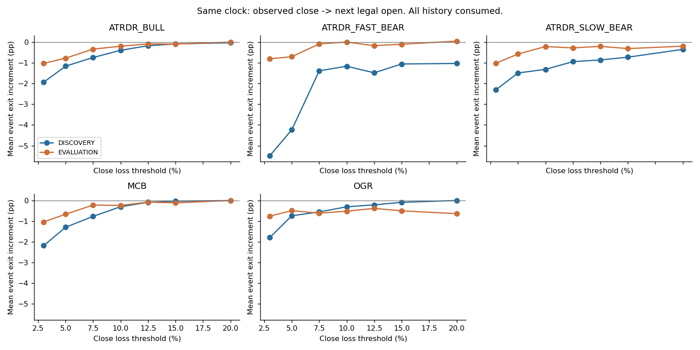
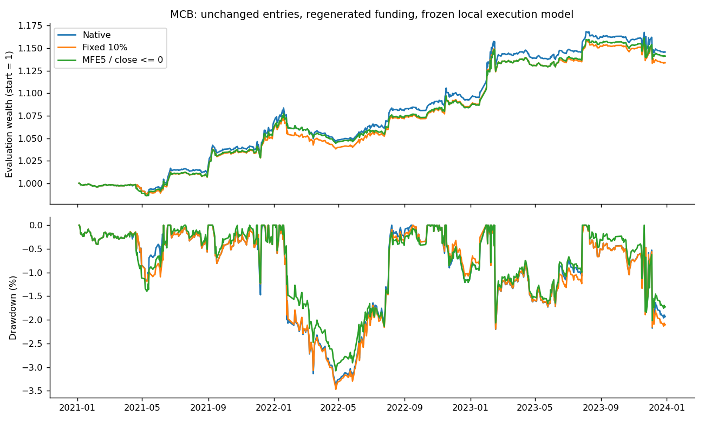
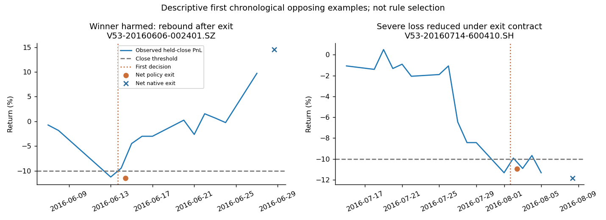

# 五策略持仓失败机制、退出决策价值与资金路径研究 V2

Run `20260907_v2_01`。本报告只引用独立反证后的重算结果。

**SHORTLIST = NONE。TASK_STATUS = PARTIAL_COMPLETE。** 可执行的研究计算、信息检验、11组账户比较、反证与测试均已完成；ATRDR 的正式因果账户结论仍被确认的生产前缀缺陷阻断，因此不将整项任务包装成已获得可靠的全路线决策。没有新独立验证，没有生产止损授权。

MCB 存在具体的风险收益交换：单一利润保护规则使2021–2023收益从14.57%降至14.12%，最大回撤从3.42%降至3.08%；不能在缺少风险效用偏好的情况下称它最优。OGR/IFCGR也只观察到有限的账户日尾部交换，而非信息优势或稳定止损区间。

唯一下一步：先补齐 **ATRDR V29 在保留全部已入场未成熟持仓后的因果账户配对证据**，明确修复并重验 Bull/Slow 的完成状态过滤，再重算已冻结候选；在这项证据成立前不进入共享资金优化。本轮不改生产源码。

## 1. 环境、接管与可追溯性

工作区 `/Users/linmei/Documents/CY-worktrees/five-strategy-exit-risk-v1`；分支 `research/five-strategy-exit-risk-v1`。BASELINE_HEAD=START_HEAD=`40d924ca718be40c6e891a64b3a9cac7f8d58f95`。冻结源码/配置共22个文件哈希保持一致，Git无生产差异；结束提交以 `git rev-parse HEAD` 和本次最终回复为准。

旧 `engine.py` 与 `run_exit_risk_v1.py` 保留，原件及哈希在外接盘 `prior_source/`。只复用哈希工具、已核实输入与登记逻辑，不复用日线low作为成交、同bar高低追踪止损或旧SMV6执行结果。旧任务已查看ATRDR/MCB基准和SMV6旧52事件残余；旧止损候选没有实际产出。接管时无遗留exit-risk计算进程，未终止其他CY任务。详见 `takeover_inventory.json`。

接管模式检查曾把含2024尾行的slow outcomes取入内存并显示日期极值；该越界接触已登记，未用2024收益、行情进行本轮政策评估。此后在SQL检索前限制日期并屏蔽跨界退出字段。`NEW_SEALED_VALIDATION_OPENED=NO` 不表示所有文件物理上只含2023以前数据。

## 2. 实际研究范围与执行时钟

ATRDR/MCB发现段2014–2020，后段2021–2023；OGR/IFCGR发现段2018–2021，后段2022–2023，两段独立初始化，不能拼接长期净值。SMV6真正回调账户始于2013-04-01，主研究事件取2018–2023，发现段至2021，后段2022–2023。全部标 `CONSUMED_HISTORY_TEMPORAL_CHECK`。后段不重选阈值；相同持仓可在连续账户跨边界持有，但不会跨训练/测试重复贡献。

| route           |   candidate_rows |   funded_episodes |   position_days |   independent_signal_dates |   censored_states |
|:----------------|-----------------:|------------------:|----------------:|---------------------------:|------------------:|
| ATRDR_BULL      |             2862 |              1494 |           21970 |                        314 |                 0 |
| ATRDR_FAST_BEAR |              155 |               128 |            1628 |                         33 |                 0 |
| ATRDR_SLOW_BEAR |             1021 |               499 |            7032 |                        160 |                 0 |
| IFCGR           |              391 |               292 |            2776 |                         78 |                 0 |
| MCB             |             1904 |              1010 |           16033 |                        124 |              1716 |
| OGR             |              399 |               299 |            2812 |                         80 |                 0 |
| SMV6            |              nan |                65 |            1191 |                         49 |                 0 |

以上股票candidate_rows是冻结生产机会层；不是宣称本轮重扫全市场。Fast Bear完整上游666条先重算T10/H20，再按新退出重做容量和V29路由，不只复用155条原路由记录。MCB1904个源信号中5个无合法入场；OGR早段370信号中355可执行，后段50信号中44可执行，另外5个入场时headroom不足、1个风险阻挡均已核对，不是因最终亏损被删除。IFCGR早段347个可执行机会，后段44个；其公告PIT-B限制保留。详见 `source_funnel_manifest.json`、`ogr_entry_gate_exclusions.csv`。

所有新增政策在完成日线16:00观察，下一合法开盘尝试；首次触发锁定，恢复后不撤销，原生退出更早则服从原生，同episode不新增再入场。T+1、跳空按可用开盘、无法卖出继续持有；已在开盘可成交的原生目标优先，不能拿同bar未来高低制造新增退出优势。没有新盘中hard stop、追踪网格或分钟预测特征。

触发用盈亏=(当前价格+已到账每份现金)/入场价格−1，不含已付买费；报告事件收益和EXIT/HOLD增量按净费用计算。股票费用每边0.002，ATR20冻结在入场前21个连续有效端点计算的20个TR；不足则NA。ATRDR/MCB为初始NAV1、每sleeve0.5的冻结连续份额；OGR每板NAV1后各乘0.5，分红原样记现金。它们是明确契约下的模拟，未证明任意人民币本金下的整手或开盘深度。SMV6使用实际本地callback，初始100万元、100份整手、费率0.0002、总价差0.0016、分钟量50%上限与现金预算，保留部分卖出；未证明原生SuperMind等价。

## 3. 损失形态：失守并不直接等于该卖

下表MAE用百分比，其余为计数。MCB另有2笔获资未成熟持仓，保持在账户和路径中，不以零收益补齐。Bull与MCB同证券/信号日不是两份独立行情；IFCGR不是OGR的独立样本。

| route           |   mature_events |   signal_dates |   severe |   severe_signal_dates |   winner_mae_median |   severe_prior_profit5 |   underwater_days_median |
|:----------------|----------------:|---------------:|---------:|----------------------:|--------------------:|-----------------------:|-------------------------:|
| ATRDR_BULL      |            1494 |            314 |       92 |                    59 |            -2.77552 |                     25 |                        6 |
| ATRDR_FAST_BEAR |             128 |             33 |       18 |                    11 |            -4.44065 |                      8 |                        4 |
| ATRDR_SLOW_BEAR |             499 |            160 |       34 |                    29 |            -2.54958 |                      6 |                        4 |
| IFCGR           |             292 |             78 |        7 |                     7 |            -2.38888 |                      1 |                        1 |
| MCB             |            1008 |            124 |       46 |                    30 |            -2.46862 |                     19 |                        5 |
| OGR             |             299 |             80 |        7 |                     7 |            -2.37288 |                      1 |                        1 |

严重亏损定义为原生净收益≤−10%，只作结果标签。正常赢家承受负MAE、失守后恢复和严重亏损前已经盈利三种现象同时存在，不能将“最终亏损概率”直接解释成退出价值。路径恢复天数、连续水下天数和当时状态转移分别保存在 `path_duration_diagnostics.csv`、`state_transitions.csv`，允许模式重叠，不做互斥百分比分摊或因果归因。没有添加跨口径市场/行业父样本；供需只称成交量代理。

路径MAE/MFE含已到账分红与实际原生退出点；仅用真正持有的完整日线，原生盘中退出日的未知局部极值不补造。前瞻下行排除了开盘清仓后的全天low，因此是“完整持有日+实际退出点”的已观察下行损失幅度的下界，盘中最终日的精确MAE不可估。

`loss_anatomy_summary.csv` 的headroom是 **PERFECT_FORESIGHT_DIAGNOSTIC**：逐事件取所有可观察收盘后、符合模拟成交条件的最好退出增量，并截在零以上；其分母仅是有可行动状态的事件。它既不是训练特征也不是可实现收益，更不是全局最优停止。跳空/跌停阻碍的是触发后的成交，不证明更早信息绝无预警可能。

SMV6当前实际回调共84个完成episode、67个入场日期，含99次部分卖出和98次再平衡；≤−5%有3个，≤−10%有0个。主研究2018–2023有65个episode、49个入场日期。残余统计包含实际买卖、再平衡及费用；没有把旧零成本/分数shadow当成本基线。

## 4. 状态退出价值与简单基准

每个真实在仓收盘同时比较同一当前库存的EXIT与HOLD_NATIVE。主金额为两者在共同结束点的净现金差，提前卖出的现金收益设零，已付买费为共同历史不再扣；按决策时持仓市值归一化，保留金额列。SMV6未来新增买入是另一库存，原库存按原生卖出比例归属，新增退出的剩余部分也可由更早原生清仓结束。53816个状态中1716个为CENSORED；不能把这些状态当独立交易。

固定损失7点、ATR5点，以及有依据路线的3/5/8日时间基准全部按同钟计算。发现段选参只接受连续≥3个固定点或≥2个ATR点的正事件增量、且最差5%事件尾部不恶化区域。本次五条搜索路线均 **NO_STABLE_SIMPLE_STOP**。以下10%只是预登记的诊断点，不能叫最优参数。增量及尾部列单位为百分比/百分点；n为该时期入场并具可用标签的获资事件。

| route           | period     |    n |   mean_advantage |   filled |   winner_denominator |   winner_harm |   severe_denominator |   loss_rescue |   native_tail |   policy_tail |
|:----------------|:-----------|-----:|-----------------:|---------:|---------------------:|--------------:|---------------------:|--------------:|--------------:|--------------:|
| ATRDR_BULL      | DISCOVERY  | 1074 |      -0.393885   |      122 |                  631 |            13 |                   70 |            42 |     -14.7178  |      -14.8571 |
| ATRDR_BULL      | EVALUATION |  420 |      -0.194352   |       33 |                  243 |             3 |                   22 |            12 |     -13.5933  |      -12.5586 |
| ATRDR_FAST_BEAR | DISCOVERY  |   79 |      -1.1631     |       22 |                   58 |             4 |                   13 |             7 |     -23.2362  |      -17.2727 |
| ATRDR_FAST_BEAR | EVALUATION |   49 |       0.00506294 |        9 |                   37 |             1 |                    5 |             4 |     -18.3673  |      -12.475  |
| ATRDR_SLOW_BEAR | DISCOVERY  |  340 |      -0.941253   |       49 |                  256 |            12 |                   24 |            14 |     -15.8239  |      -16.2305 |
| ATRDR_SLOW_BEAR | EVALUATION |  157 |      -0.2761     |       13 |                  115 |             3 |                    8 |             7 |     -14.4727  |      -12.9538 |
| MCB             | DISCOVERY  |  714 |      -0.301389   |       60 |                  460 |             8 |                   31 |            24 |     -12.1331  |      -12.2983 |
| MCB             | EVALUATION |  294 |      -0.240406   |       21 |                  172 |             3 |                   15 |             7 |     -12.752   |      -11.9933 |
| OGR             | DISCOVERY  |  255 |      -0.305373   |       15 |                  232 |             4 |                    6 |             3 |     -10.1581  |      -12.1005 |
| OGR             | EVALUATION |   44 |      -0.517111   |        3 |                   37 |             1 |                    1 |             1 |      -8.84358 |      -12.6447 |

`WINNER_INTERRUPTION`、`WINNER_HARM`、`WINNER_TO_LOSS`和`LOSS_RESCUE`的分母、金额均在 `simple_exit_response.csv`、`policy_comparison.csv`；上表仅压缩展示 harm/rescue。无法成交的触发不计救损。两笔Slow于2020末入场、2021-01-21才成熟，其42个发现段状态已从选择与发现期探针中剔除，连续账户仍保留。MCB两笔未成熟也不会进入已知结果的发现选择。



## 5. 价格路径之外的信息

B0六个代表：当前盈亏、年龄、剩余原生期限、截至当前MFE、回吐、入场ATR比例。B1以同一个Ridge(alpha10)加五项：已知结构位距离、连续失守、收盘位置、下跌量能代理、3日恢复。每路线最多11个，没有新全特征搜索。B2只用深度2浅树，价格/扩展相同容量；样本不足不强行训练。结构和量能分别删组，还用只增加收盘位置/恢复的价格对照挑战“结构信息”。

训练按事件1/状态数加权，插补、均值、尺度仅从训练段拟合。年度expanding检验以入场年定义测试episode，训练标签必须在当年1月1日前可知，剔除重叠episode及证券/信号日簇。SMV6结构性不适用列单列，域外比例仅针对训练有观测的字段；偶发缺失另外报告。方法实现与[scikit-learn关于训练内拟合预处理的说明](https://scikit-learn.org/stable/common_pitfalls.html)一致，实际防泄漏断言见本项目测试。

下表是各时间折事件加权MSE改善、各折高预测组实际增量的等权平均；不是将每个position-day算作独立观察。正MSE改善表示比B0误差小，**不表示卖出能赚钱**。

| route           | phase                           |   mean_fold_mse_improvement |   mean_fold_top_realized |   top_events |   top_signal_dates |   mean_fold_domain_out |
|:----------------|:--------------------------------|----------------------------:|-------------------------:|-------------:|-------------------:|-----------------------:|
| ATRDR_BULL      | CONSUMED_HISTORY_TEMPORAL_CHECK |                 1.01202e-05 |             -0.000224523 |          337 |                 80 |             0.00818276 |
| ATRDR_BULL      | DISCOVERY_FORWARD               |                -7.79647e-05 |             -0.00240291  |          585 |                143 |             0.00222733 |
| ATRDR_FAST_BEAR | CONSUMED_HISTORY_TEMPORAL_CHECK |                 8.19143e-05 |             -0.0114695   |           20 |                 11 |             0.0131579  |
| ATRDR_FAST_BEAR | DISCOVERY_FORWARD               |                 9.94014e-05 |              0.00880851  |           24 |                  8 |             0.0840097  |
| ATRDR_SLOW_BEAR | CONSUMED_HISTORY_TEMPORAL_CHECK |                 4.37032e-06 |             -0.0128991   |           89 |                 36 |             0.00483092 |
| ATRDR_SLOW_BEAR | DISCOVERY_FORWARD               |                -1.07217e-05 |             -0.0130762   |          193 |                 71 |             0.0132722  |
| MCB             | CONSUMED_HISTORY_TEMPORAL_CHECK |                 4.62578e-05 |             -0.0022472   |          230 |                 39 |             0.0154956  |
| MCB             | DISCOVERY_FORWARD               |                -1.09989e-05 |             -0.00500381  |          398 |                 62 |             0.0143647  |
| OGR             | CONSUMED_HISTORY_TEMPORAL_CHECK |                -3.02127e-06 |             -0.00722199  |           20 |                 17 |             0.00408163 |
| OGR             | DISCOVERY_FORWARD               |                 1.52166e-05 |              0.011219    |           13 |                 11 |             0          |
| SMV6            | CONSUMED_HISTORY_TEMPORAL_CHECK |                 7.45045e-06 |              0.0342719   |            8 |                  5 |             0.0333333  |
| SMV6            | DISCOVERY_FORWARD               |                -8.15187e-06 |              0.00387358  |            5 |                  5 |             0          |

Fast Bear是唯一达到登记的机制账户准入门的路线：发现期top组24事件/8日期，B1误差改善；但删结构组不变差，删量能组转差，表明支持的是有限的量能代理而非已经证明的“支撑失效”。后段top组20事件/11日期，实际增量均值约−1.15%，H1/H2的事件及账户结果也没有胜过简单诊断基准。这个发现不得通过再加指标救回。

OGR发现期top仅13事件/11日期，未达20事件门；只增加价格变量的模型平均改善大于B1，后段B1改善转负。Bull/Slow/MCB的B1发现期没有超过B0；浅树的扩展与价格版本未提供独立改善。SMV6发现期可用高组仅5事件/5日期，未达门且B1差于B0；后段少数正值不用于追选新止损。IFCGR不独立拟合或搜索。

负对照只保留一族：发现期内按年对信号日期组的事件均值循环移位，整组共享标签，不随机打散position-days。它是低成本排错、会压平组内标签幅度，不能证明完全无泄漏或显著性。真实与负对照结果、校准、删组均已保存；不存在用好看的训练内树图替代时间外价值。

## 6. 政策落地与真实资金路径

H1：连续≥2收盘低于已知anchor且收盘位置<0.5。H2：当前亏损、下跌量能比>1、3日恢复<0。仅Fast Bear按发现门进入两条完整账户政策。利润保护只开一个继承旧登记的MCB族：截至当前MFE≥5%、完成收盘盈亏≤0，次开锁定退出；发现期31个严重亏损中13个曾盈利≥5%满足原门槛。没有activation×trailing×days网格。

每条账户只改一个退出机制；ATRDR回到真实V29共享router，其余路线不变。Fast上游候选、capacity与bear arbitration重做；MCB/OGR从完整交易前机会重放排序、现金、拒单及持仓。没有强制执行原accepted集、没有跨策略借钱或联合权重搜索。模型仅作准入探针，运行政策是固定手写条件，不将域外预测转成订单。新获资16条“事件×政策”均可定位完整源路径；缺必要特征不触发新退出、原生退出保留，详见 `new_funding_support.csv`。

下表所有收益/回撤/尾部是百分比。ATRDR行都是 **同一个V29账户分别只改一路退出**，且因下述生产缺陷隔离。实际配对评价日期：ATRDR/MCB为2021-01-04至2023-12-29，共727交易日；OGR/IFCGR为独立2022-01-04至2023-11-24，共459交易日，后者没有外推到年末。11组原生/政策账户的日期序列逐项完全一致，见 `paired_account_windows.csv`。资本占用日=每日gross/NAV之和，不能拿它和不同本金/窗口的拒单次数混比。

| route           | policy    |   baseline_total_return |   total_return |   baseline_max_drawdown |   max_drawdown |   baseline_worst5_daily |   worst5_daily |   baseline_capital_days |   capital_days |
|:----------------|:----------|------------------------:|---------------:|------------------------:|---------------:|------------------------:|---------------:|------------------------:|---------------:|
| ATRDR_BULL      | fixed_0.1 |                34.5908  |       33.3668  |               -6.07083  |      -5.43885  |              -0.946658  |     -0.915329  |                149.61   |      146.493   |
| ATRDR_FAST_BEAR | fixed_0.1 |                34.5908  |       35.2103  |               -6.07083  |      -5.59659  |              -0.946658  |     -0.924585  |                149.61   |      148.298   |
| ATRDR_FAST_BEAR | H1_2      |                34.5908  |       34.4589  |               -6.07083  |      -5.69001  |              -0.946658  |     -0.930584  |                149.61   |      148.263   |
| ATRDR_FAST_BEAR | H2_0      |                34.5908  |       34.2383  |               -6.07083  |      -5.47773  |              -0.946658  |     -0.902548  |                149.61   |      147.348   |
| ATRDR_SLOW_BEAR | fixed_0.1 |                34.5908  |       33.9164  |               -6.07083  |      -6.03489  |              -0.946658  |     -0.938798  |                149.61   |      147.565   |
| MCB             | fixed_0.1 |                14.5677  |       13.3748  |               -3.42062  |      -3.46916  |              -0.559616  |     -0.544391  |                 89.9261 |       88.4161  |
| MCB             | profit_0  |                14.5677  |       14.1155  |               -3.42062  |      -3.07752  |              -0.559616  |     -0.500381  |                 89.9261 |       82.7033  |
| OGR             | fixed_0.1 |                 1.60863 |        1.46444 |               -0.432688 |      -0.431218 |              -0.0507877 |     -0.0450254 |                  3.2371 |        3.05033 |
| IFCGR           | fixed_0.1 |                 1.60863 |        1.46444 |               -0.432688 |      -0.431218 |              -0.0507877 |     -0.0450254 |                  3.2371 |        3.05033 |

MCB利润保护后段共294个入场事件，提前结束的原生赢家中23个净值受损，172个原生赢家为分母；15个原生严重亏损中5个获得实际减损。它比10%诊断退出的账户表现好，但仍低于原生收益，故主结论为风险偏好待定的交换，不自动入shortlist。没有新获资或取消交易，289个后续交易数量随现金复利变化；“空出资金”不等于新发现可买机会。

OGR/IFCGR后段原生收益1.6086%降至1.4644%，最差5%日收益均值有所改善，但仅3个提前退出、1个原生赢家受损、1个严重亏损减损；事件尾部反而恶化。早段两者各新增2笔获资也没有抵消原交易的退出损失。过滤器没有提供独立后段验证。此处给出可审阅的交换，而不是靠后段微小回撤改善选10%。



金额表均为归一化组合NAV单位。独立对账使用“净成交现金流差+期末库存市值差”，再拆为共同事件退出单位损益、共同事件数量损益、新获资、取消事件；最大残差6.22e-15。不是把总效果减事件效果一律叫资金释放。

| route           | segment              | policy    |   original_fixed_quantity_exit_delta |   total_account_nav_delta |   common_event_quantity_pnl_delta |   newly_funded |   cancelled |   quantity_changed |
|:----------------|:---------------------|:----------|-------------------------------------:|--------------------------:|----------------------------------:|---------------:|------------:|-------------------:|
| ATRDR_BULL      | CONTINUOUS_2014_2023 | fixed_0.1 |                         -0.0313635   |               -0.0282884  |                      -0.00505094  |              1 |           0 |                588 |
| ATRDR_FAST_BEAR | CONTINUOUS_2014_2023 | fixed_0.1 |                         -0.000839626 |                0.0143163  |                       0.000946864 |              2 |           1 |                404 |
| ATRDR_FAST_BEAR | CONTINUOUS_2014_2023 | H1_2      |                         -0.0102129   |               -0.0030485  |                      -0.00014796  |              3 |           2 |                402 |
| ATRDR_FAST_BEAR | CONTINUOUS_2014_2023 | H2_0      |                         -0.0224005   |               -0.00814637 |                      -0.000924077 |              6 |           3 |                499 |
| ATRDR_SLOW_BEAR | CONTINUOUS_2014_2023 | fixed_0.1 |                         -0.0130972   |               -0.0155865  |                      -0.00248929  |              0 |           0 |                626 |
| MCB             | CONTINUOUS_2014_2023 | fixed_0.1 |                         -0.0183529   |               -0.0201187  |                      -0.00176573  |              0 |           0 |                289 |
| MCB             | CONTINUOUS_2014_2023 | profit_0  |                         -0.00635881  |               -0.00762667 |                      -0.00126786  |              0 |           0 |                289 |
| OGR             | 2018_2021            | fixed_0.1 |                         -0.00507698  |               -0.00420728 |                      -0.000149082 |              2 |           0 |                218 |
| OGR             | 2022_2023            | fixed_0.1 |                         -0.00143107  |               -0.00144194 |                      -1.08657e-05 |              0 |           0 |                 26 |
| IFCGR           | 2018_2021            | fixed_0.1 |                         -0.00506352  |               -0.00418975 |                      -0.000140103 |              2 |           0 |                214 |
| IFCGR           | 2022_2023            | fixed_0.1 |                         -0.00143107  |               -0.00144194 |                      -1.08657e-05 |              0 |           0 |                 26 |

Fast 10%后段账户表面改善约0.62个百分点，固定原数量退出金额却为负，新获资/取消及后续数量变化解释了差额；同时其生产基线不满足前缀不变性。因此不能据此推荐Fast止损，更不能把这个增量当作共享资金池收益。

## 7. 成交证据、无融资及有限反证

分钟读取仅取所有候选持有路径对应证券/日期的最早开盘bar，覆盖恢复者/恶化者、获资/未获资，不按最终输赢补样本，未增加分钟预测变量。最终退出中共有5条“源候选退出×政策”记录没有完全匹配有效开盘bar/日开盘tick，其中实际获资账户退出3条；完整名单见 `minute_fill_audit.csv`。所有实际SHADOW退出均包含在核查集合中。这不是假定未匹配必然无法卖出，也不能反过来声称所有日线模拟都已验证为逐单成交；开盘深度本来未知。报告保留执行模型限制，不给强支持候选。

| policy_file                                                          |   assessed_source_exits |   verified_daily_open_tick |   actual_account_exits |   actual_verified_exits |   unverified |
|:---------------------------------------------------------------------|------------------------:|---------------------------:|-----------------------:|------------------------:|-------------:|
| policy_ATRDR_BULL_CONTINUOUS_2014_2023_fixed_0.1_events.parquet      |                      44 |                         42 |                     33 |                      32 |            2 |
| policy_ATRDR_FAST_BEAR_CONTINUOUS_2014_2023_H1_2_events.parquet      |                       8 |                          8 |                      8 |                       8 |            0 |
| policy_ATRDR_FAST_BEAR_CONTINUOUS_2014_2023_H2_0_events.parquet      |                      19 |                         18 |                     18 |                      17 |            1 |
| policy_ATRDR_FAST_BEAR_CONTINUOUS_2014_2023_fixed_0.1_events.parquet |                       9 |                          9 |                      9 |                       9 |            0 |
| policy_ATRDR_SLOW_BEAR_CONTINUOUS_2014_2023_fixed_0.1_events.parquet |                      17 |                         17 |                     15 |                      15 |            0 |
| policy_IFCGR_2018_2021_fixed_0.1_events.parquet                      |                      15 |                         15 |                     15 |                      15 |            0 |
| policy_IFCGR_2022_2023_fixed_0.1_events.parquet                      |                       3 |                          3 |                      3 |                       3 |            0 |
| policy_MCB_CONTINUOUS_2014_2023_fixed_0.1_events.parquet             |                      25 |                         23 |                     21 |                      20 |            2 |
| policy_MCB_CONTINUOUS_2014_2023_profit_0_events.parquet              |                      90 |                         90 |                     64 |                      64 |            0 |
| policy_OGR_2018_2021_fixed_0.1_events.parquet                        |                      15 |                         15 |                     15 |                      15 |            0 |
| policy_OGR_2022_2023_fixed_0.1_events.parquet                        |                       3 |                          3 |                      3 |                       3 |            0 |

全部基线/11组账户逐事件现金与日末现金独立相等；事件标价在开盘前用前收、交易中用已知开盘，没有提前用当日收盘。现金、可用现金、gross、NAV、预留、borrowed/margin与拒单/部分成交计数均在 `execution_and_no_financing_audit.csv`；当前即时成交模型无未完成买单，预算包含费用，SMV6部分卖出余仓继续保留。

**NO_FINANCING_VALIDATION = SCOPED_PASS**：所有记录的现金与可估值时点敞口断言通过；SMV6全历史2015-04-13/14因510500.SH缺标价有2个NAV未知日，不能声称全历史每日敞口都PASS。它们在本轮2018+主研究之前，当前事件成交状态可估值且现金有限。归一化股票绝对金额容差1e−10 NAV单位、比例1e−10；SMV6现金1e−8元、比例1e−10；没有负现金截零或注入资金。

额外退出成本10bp与延迟1个交易时点只对冻结规则做固定原数量的事件压力，**未冒充压力账户回放**。移除最好1/5个触发日期也只是固定事件金额敏感性；实际配对NAV另按同步月块1000次取日收益差均值CI，不拼接成所谓可执行新回测，不消除选择偏差。

| route           | policy    | test              |   n |   mean_advantage |   unfilled_attempts |
|:----------------|:----------|:------------------|----:|-----------------:|--------------------:|
| ATRDR_BULL      | fixed_0.1 | EXTRA_EXIT_10BP   | 420 |       -0.201314  |                   0 |
| ATRDR_BULL      | fixed_0.1 | DELAY_ONE_SESSION | 420 |       -0.185271  |                   0 |
| ATRDR_FAST_BEAR | fixed_0.1 | EXTRA_EXIT_10BP   |  49 |       -0.0113643 |                   0 |
| ATRDR_FAST_BEAR | fixed_0.1 | DELAY_ONE_SESSION |  49 |       -0.0259663 |                   0 |
| ATRDR_FAST_BEAR | H1_2      | EXTRA_EXIT_10BP   |  49 |       -0.388348  |                   0 |
| ATRDR_FAST_BEAR | H1_2      | DELAY_ONE_SESSION |  49 |       -0.16751   |                   0 |
| ATRDR_FAST_BEAR | H2_0      | EXTRA_EXIT_10BP   |  49 |       -0.960319  |                   0 |
| ATRDR_FAST_BEAR | H2_0      | DELAY_ONE_SESSION |  49 |       -0.653404  |                   0 |
| ATRDR_SLOW_BEAR | fixed_0.1 | EXTRA_EXIT_10BP   | 157 |       -0.283396  |                   0 |
| ATRDR_SLOW_BEAR | fixed_0.1 | DELAY_ONE_SESSION | 157 |       -0.27053   |                   0 |
| MCB             | fixed_0.1 | EXTRA_EXIT_10BP   | 294 |       -0.246748  |                   0 |
| MCB             | fixed_0.1 | DELAY_ONE_SESSION | 294 |       -0.249971  |                   0 |
| MCB             | profit_0  | EXTRA_EXIT_10BP   | 294 |       -0.102976  |                   0 |
| MCB             | profit_0  | DELAY_ONE_SESSION | 294 |        0.0396209 |                   0 |
| OGR             | fixed_0.1 | EXTRA_EXIT_10BP   |  44 |       -0.523079  |                   0 |
| OGR             | fixed_0.1 | DELAY_ONE_SESSION |  44 |       -0.537351  |                   0 |
| IFCGR           | fixed_0.1 | EXTRA_EXIT_10BP   |  44 |       -0.523079  |                   0 |
| IFCGR           | fixed_0.1 | DELAY_ONE_SESSION |  44 |       -0.537351  |                   0 |

| account                                        |   blocks |   n_days |   paired_mean_daily_difference |        ci025 |        ci975 |   repetitions | limitation                                                                                   |
|:-----------------------------------------------|---------:|---------:|-------------------------------:|-------------:|-------------:|--------------:|:---------------------------------------------------------------------------------------------|
| ATRDR_BULL_CONTINUOUS_2014_2023_fixed_0.1      |       36 |      727 |                   -1.3041e-05  | -3.48904e-05 |  8.59417e-06 |          1000 | Frozen comparison only; no claim to remove selection bias; ATRDR account remains quarantined |
| ATRDR_FAST_BEAR_CONTINUOUS_2014_2023_H1_2      |       36 |      727 |                   -1.56304e-06 | -7.00006e-06 |  2.36445e-06 |          1000 | Frozen comparison only; no claim to remove selection bias; ATRDR account remains quarantined |
| ATRDR_FAST_BEAR_CONTINUOUS_2014_2023_H2_0      |       36 |      727 |                   -4.18063e-06 | -2.56968e-05 |  1.81645e-05 |          1000 | Frozen comparison only; no claim to remove selection bias; ATRDR account remains quarantined |
| ATRDR_FAST_BEAR_CONTINUOUS_2014_2023_fixed_0.1 |       36 |      727 |                    6.01401e-06 |  1.73085e-06 |  1.07649e-05 |          1000 | Frozen comparison only; no claim to remove selection bias; ATRDR account remains quarantined |
| ATRDR_SLOW_BEAR_CONTINUOUS_2014_2023_fixed_0.1 |       36 |      727 |                   -7.08658e-06 | -1.98556e-05 |  3.30166e-06 |          1000 | Frozen comparison only; no claim to remove selection bias; ATRDR account remains quarantined |
| IFCGR_2022_2023_fixed_0.1                      |       23 |      458 |                   -3.10652e-06 | -7.2992e-06  | -5.79209e-09 |          1000 | Frozen comparison only; no claim to remove selection bias; ATRDR account remains quarantined |
| MCB_CONTINUOUS_2014_2023_fixed_0.1             |       36 |      727 |                   -1.4547e-05  | -2.99664e-05 | -1.98263e-06 |          1000 | Frozen comparison only; no claim to remove selection bias; ATRDR account remains quarantined |
| MCB_CONTINUOUS_2014_2023_profit_0              |       36 |      727 |                   -5.9161e-06  | -2.99058e-05 |  2.29957e-05 |          1000 | Frozen comparison only; no claim to remove selection bias; ATRDR account remains quarantined |
| OGR_2022_2023_fixed_0.1                        |       23 |      458 |                   -3.10652e-06 | -7.2992e-06  | -5.79209e-09 |          1000 | Frozen comparison only; no claim to remove selection bias; ATRDR account remains quarantined |

逐年、最好日期移除、配对区间与交易限制的完整表在 `temporal_robustness.csv`、`paired_month_block_intervals.csv`。没有后段反复调参直到显著。

## 8. 生产缺陷与独立异议

当前生产`reproduce.py`的Bull与`atrdr.py`的Slow仍按未来`COMPLETED`筛选，实际排除7个Bull和1个Slow已入场事件。研究保留版诊断使接受数2121→2070，期末NAV3.1105406→2.9780194；它保留了难退出/censored风险，**不是已修正封箱基线**。最小反例证明改变未来完成状态会改变过去机会流。三条ATRDR共享账户结论一并隔离；T10/H20去掉无关H60成熟门的既有修复则通过当前回归。

独立只读复核真实发现并推动修正：OGR除息状态、Slow跨边界标签、SMV6原生更早清仓、清仓后low、日内未知收盘标价、结构性NA域外误标、OGR拒单计数、恒等自证的分解。主任务另发现同开盘native target优先问题。修复前紧凑表与哈希保存在外接盘 `superseded_before_rebuttal/`，全部视为已消费。复核员对8个修复反例运行通过，最终全量由主流程重跑；异议没有被抹成“全部通过”。详见 `objections_and_resolutions.md`。

## 9. 逐路线主结论

| route           | conclusion                               |   funded_episodes |   independent_signal_dates | diagnostic_rule               |
|:----------------|:-----------------------------------------|------------------:|---------------------------:|:------------------------------|
| ATRDR_BULL      | INSUFFICIENT_EVIDENCE                    |              1494 |                        314 | fixed_0.1                     |
| ATRDR_FAST_BEAR | INSUFFICIENT_EVIDENCE                    |               128 |                         33 | fixed_0.1                     |
| ATRDR_SLOW_BEAR | INSUFFICIENT_EVIDENCE                    |               499 |                        160 | fixed_0.1                     |
| MCB             | RISK_RETURN_TRADEOFF_REQUIRES_PREFERENCE |              1010 |                        124 | profit_0                      |
| OGR             | RISK_RETURN_TRADEOFF_REQUIRES_PREFERENCE |               299 |                         80 | fixed_0.1                     |
| IFCGR           | RISK_RETURN_TRADEOFF_REQUIRES_PREFERENCE |               292 |                         78 | fixed_0.1                     |
| SMV6            | NO_EXIT_CHANGE_SUPPORTED                 |                65 |                         49 | NONE; existing callbacks only |

- **ATRDR_BULL**：点火后未跟随与短暂回撤交叠；赢家也承受回撤。B1发现段差于B0；10%仅为登记的诊断点。真实V29账户受生产完成状态过滤影响，不能确认政策优劣。

- **ATRDR_FAST_BEAR**：放量走弱代理在发现段有增量，但结构组删掉不变差；后段高预测组转为负增量。H1/H2没有超过同钟10%诊断基准；V29账户仍因生产缺陷隔离。

- **ATRDR_SLOW_BEAR**：低位失守经常仍会恢复；B1发现段没有价格之外的增量。两笔跨发现边界的成熟标签已剔除。账户因共享router的生产缺陷不能作最终依据。

- **MCB**：固定10%未显示稳定区域；单一MFE5/收盘回到入场价规则降低账户尾部及回撤，同时牺牲收益，并未新增获资交易。是否值得需要风险偏好；没有部署候选。

- **OGR**：原修复结构可恢复；扩展模型不如价格增补对照。10%诊断退出降低后段账户日尾部但损失收益，事件尾部反而更差；后段仅44笔，不能选后段最优点。

- **IFCGR**：完全继承OGR规则。早段过滤改变少量机会，后段44笔与OGR相同，不能算独立验证；PIT-B公告修订/删除历史不完整。

- **SMV6**：实际本地callbacks下残余严重亏损很少；发现段B1没有超过价格基准，未开启新增止损网格。后段少量正预测组不用于补选规则，原生平台等价性仍未验证。

这些判定只覆盖已登记政策预算和已有历史；不证明不存在任何可盈利退出。三条ATRDR的不足是确认的生产时间不变量失败，SMV6的不扩展来自已执行的残余与信息门；两者不能混为“没跑数据”。

## 10. 验证、复跑与产物

测试结果：`32 passed, 1 warning in 4.85s`。小反例覆盖未来扰动、共同费用、亏损后恢复不该卖、T+1/跳空/锁定重试、native目标优先、部分卖出、现金防双花、未成熟保留、Fast H60无关性、完整机会反馈、公司行动与独立对账。MCB10%事件、accepted和完整账户NAV做同输入再次计算，3/3规范哈希一致。冻结源码/配置哈希一致；生产缺陷的反例测试通过不等于该生产不变量通过。

`PREFIX_INVARIANCE = RESEARCH_COUNTEREXAMPLES_PASS / ATRDR_PRODUCTION_FAIL`；`TEMPORAL_SPLIT_VALIDATION = PASS_AFTER_FIX`；`FROZEN_PRODUCTION_RULES_MODIFIED = NO`。精确断言、版本和哈希见 `verification_results.json`。

直接复跑：

```bash
cd /Users/linmei/Documents/CY-worktrees/five-strategy-exit-risk-v1
bash research/five_strategy_exit_risk_v1/reproduce_v2.sh
```

需保留已登记输入及真实外接盘。路径模板为 `input_config.template.json`，当前实跑配置为 `input_config.json`；新输入/新输出目录必须重新prepare，不把旧缓存归因给新数据。核心研究大表在 `/Volumes/quant/CY_quant_research/five_strategy_exit_risk_v1/20260907_v2_01`：`position_state_snapshots.parquet`、`candidate_position_paths.parquet`、`out_of_training_predictions.parquet`、各原生/政策accepted/nav/events与逐事件账户状态。Git只保存代码、测试、报告、摘要、schema及哈希，未保存大型行情/持仓表或密钥。



图中按时间取第一例“赢家受损”和第一例“严重亏损获救”，只是解释为何同样亏损状态有不同退出价值，不参与候选选择。
