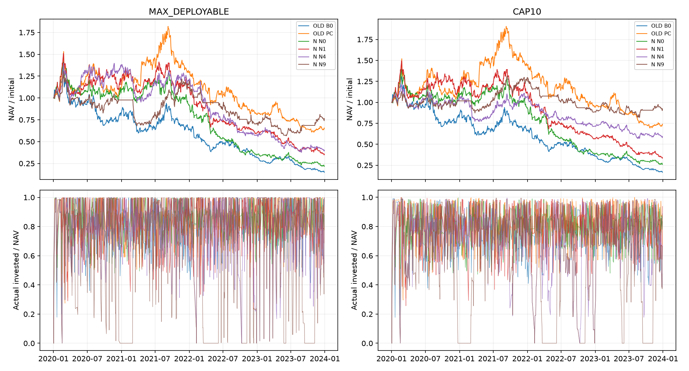

# Minervini启发的A股机械代理：V2历史研究结案

本轮完成58个必需情景及4个行业条件情景。全部62个为本轮真实账户执行，历史结果核验复用为0；消息、业绩共8个位置因数据资格未通过而未运行。最终账户另重复执行一遍，62个账户的310份核心产物逐字节一致。重复核验和修错重跑都不额外增加情景数。

**关闭本次确切定义，不保留影子候选。** 在2020–2023已消费探索样本中，主假说N4及预登记合并版N9均未形成值得保留的绝对收益和回撤组合。MAX_DEPLOYABLE下N4净累计-59.87%、最大回撤-73.00%；CAP10下净累计-40.81%、回撤-53.06%。N9分别净累计-23.57%与-7.86%。相对改善不能消除绝对亏损，也不能替代独立验证。

RESEARCH_VERDICT=NO_INCREMENTAL_EDGE：未证明本次联合定义有可靠、可交易的独立增量；并非声称每个成分的点估计都等于零。
EXECUTION_VERDICT=EXECUTION_FRAGILE。DEPLOYMENT_VERDICT=REJECT。
METHOD_LABEL=MINERVINI_INSPIRED_MECHANICAL_A_SHARE_PROXY。本轮不是完整SEPA、人工VCP、本人盘中执行、progressive exposure或浮盈加仓的复制，也不以名人战绩作证据。

## 样本、独立工作树与证据边界

仓库：`/Users/linmei/Documents/CY-worktrees/minervini-ashare-clean-ascent-20260908`。分支：`research/minervini-ashare-clean-ascent-v2`。BASE_HEAD与START_HEAD均为`c5e3ec548e93df15f4ef492d2aef2dcdd5063df1`。先只读审计CY工作树、分支/日志/reflog、研究台账、样本合同和活动任务，再建立独立工作树；本轮没有切换、编辑或终止五策略任务，也没有发送真实订单。具体环境事实见ENVIRONMENT.md。

V1在所核验Git历史、工作树与已登记研究产物中未找到可验证原始实现/账户结果；不声称全磁盘绝对不存在。附录A作为冻结合同新实现全部20个OLD对照，不把此次实现冒充原作者源码复现。相关动量、Low-MAX、路径、量能和广度研究部分重叠，未发现此次因果VCP时间结构的精确覆盖；逐项证据在duplicate_audit.csv。

使用CY-006的2018–2023六个精确年度文件，共6,155,390行、5,262个历史标识。2018–2019仅暖机；按已登记target_backtest_start=2020回放2020–2023，共970个交易日。没有打开2024+，CY-011保持封存。所有收益均为探索性历史研究，不能称独立样本外验证。历史股票和失效证券按源中存在的时点保留；排除29个不在普通A股身份白名单的标识（27只ETF及302132.SZ、689009.SH；见unsupported_identifiers.json）。没有采用今天的存续名单。上市至少120个已完成交易日按每只股票在授权日历的最早可见上市交易位置检查，N还必须有252个有效收益步；开始于2018年的老股到2020年已完成暖机。

CY-006是PIT-B研究数据，hard_valid与available_at≤decision_at资格按行检查；不升级称PIT-A。原始输入哈希在input_binding.json，价格/特征/事件/账户、公司行动执行事实与源文件全链索引在artifact_manifest.json。2024+并未作为缺失退出的补样本。

## 时间结构与可交易性定义

OLD主窗口：前段T−35…T−6、参考T−36，整理T−5…T−1。N：前段T−60…T−31、参考T−61，整理W=T−30…T−1，末段F=T−5…T−1，A0在T−31冻结。两种时间结构各有自身RS基线：OLD B0与N0之间的差不能直接归为趋势模板增量。

动态VCP由两左两右、确认延迟2日的高低点构造。连续同类点保留更极端者、并列较早者、双极值歧义跳过；至少两个已确认高→低回撤腿逐轮变浅，未确认的新低使资格失败，末段停牌/零量/单价线失败。每个候选保存legs、确认偏移、depth和pivot_reason，绝不把未来最终拐点倒灌过去。静态宽度与动态腿分开保存。Path只用前段，触发日上涨不参与Path。

最早三个具备VCP资格的突破信号，其回撤腿转成绝对交易日期供人工核对（不限实际成交、不按收益选择）：

| symbol | signal_date | leg | high_date | low_date | high_confirm | low_confirm | depth |
| --- | --- | --- | --- | --- | --- | --- | --- |
| 000031.SZ | 2020-01-02 | 1 | 2019-11-25 | 2019-12-04 | 2019-11-27 | 2019-12-06 | 0.09905020352781574 |
| 000031.SZ | 2020-01-02 | 2 | 2019-12-17 | 2019-12-25 | 2019-12-19 | 2019-12-27 | 0.0697674418604649 |
| 000157.SZ | 2020-01-02 | 1 | 2019-11-27 | 2019-12-03 | 2019-11-29 | 2019-12-05 | 0.04234527687296388 |
| 000157.SZ | 2020-01-02 | 2 | 2019-12-11 | 2019-12-16 | 2019-12-13 | 2019-12-18 | 0.029595015576323932 |
| 000338.SZ | 2020-01-02 | 1 | 2019-11-27 | 2019-11-29 | 2019-11-29 | 2019-12-03 | 0.04277286135693214 |
| 000338.SZ | 2020-01-02 | 2 | 2019-12-18 | 2019-12-23 | 2019-12-20 | 2019-12-25 | 0.028150134048257353 |

唯一市场基准是前日可靠普通A股历史池等权收益；不含ETF/未支持身份。真实缺价从当日均值中明确缺失，停牌真实零收益保留；每日有效收益数和前日成员数在market.csv。MR使用T−31冻结的120日beta和W中市场实际下跌日残差中位数；不足5日给0.5并标记。MarketGate只限制新开仓，不强制平旧仓。Volume由末段缩量和触发放量构成；全日期×板块固定效应吸收共同市场行情/缩量，归因中控制beta、波动、历史收益、MAX和流动性。没有为获得更好的结果更换市场基准或搜索新参数。

T收盘信号→T+1预提交限价→开盘代理成交；延迟组固定T+2。买入限价不能因低开回区间而事后取消；超过冻结L不成交。提交价格受当日法定区间约束：超过涨停价向下截到合法上界，冻结L低于跌停价则不提交，绝不提高L追价。按历史板块/日期处理涨跌停、申报量、停牌、T+1。科创板至少200股、之后1股递增；其余普通股票100股整手。日线无法证明开盘队列真实可得，20日日均成交额1%只是容量代理。

100万元初始真实现金，最多10股。MAX_DEPLOYABLE在事前容量约束下分配可用现金，无额外10%单笔上限；CAP10每笔含费用预留不超过前收NAV的10%，持有后权重可以因价格/NAV变化超过10%。两者均不借款、不保证金、不用同次集合竞价尚未发生的卖款；无补单来事后吃掉空闲资金。没有事后杠杆对齐。

固定退出e+10开盘，遇停牌/跌停持续延期。G4单独使用收盘确认结构/趋势退出：结构线或持有至少5日后的SMA10破位，下一可交易开盘执行，最长e+40。不是T+0硬止损，不承诺损失≤计划风险。买入日盘中碰线、收盘触发、隔夜跳空和延期逐项留痕。

佣金双边3bp最低5元（全佣假设）、过户费按2022-04-29分段、卖出印花税按2023-08-28分段、双边5bp滑点并保守按分取整。成本压力将全部摩擦乘2。股权登记、除权应收、现金实际到账、送股实际可卖分别处理，补齐的发行人原始公告见official_sources.json；公告执行事实从未作为消息alpha。红利/红股差别税预留并在出售结算。不参加配股，明确记载权利放弃。零碎送股不能还原假设账户抽签分配，统一记合法整数下界floor，并显式列出不足1股的差额/上界；这属于执行假设而非已核实的个人到账事实。

## 主结果：先展示资金尽可能投入

| 情景 | 净累计 | CAGR | 最大回撤 | 平均仓位 | 最高单股占NAV | 已结清交易 |
| --- | --- | --- | --- | --- | --- | --- |
| OLD_MAIN_B0_MAX_DEPLOYABLE | -85.10% | -39.02% | -88.64% | 81.29% | 25.03% | 790 |
| OLD_MAIN_P_MAX_DEPLOYABLE | -69.28% | -26.41% | -77.73% | 81.78% | 18.46% | 794 |
| OLD_MAIN_C_MAX_DEPLOYABLE | -61.17% | -21.79% | -72.39% | 84.70% | 21.76% | 820 |
| OLD_MAIN_PC_MAX_DEPLOYABLE | -34.47% | -10.40% | -66.61% | 84.23% | 24.47% | 816 |
| N_MAIN_N0_MAX_DEPLOYABLE | -78.28% | -32.74% | -84.61% | 84.30% | 16.69% | 819 |
| N_MAIN_N1_MAX_DEPLOYABLE | -64.44% | -23.55% | -77.00% | 82.94% | 40.17% | 798 |
| N_MAIN_N2_MAX_DEPLOYABLE | -65.91% | -24.39% | -74.81% | 82.95% | 31.23% | 797 |
| N_MAIN_N3_MAX_DEPLOYABLE | -38.41% | -11.83% | -60.51% | 81.22% | 96.97% | 679 |
| N_MAIN_N4_MAX_DEPLOYABLE | -59.87% | -21.12% | -73.00% | 80.84% | 96.96% | 668 |
| N_MAIN_N5_MAX_DEPLOYABLE | -85.47% | -39.41% | -88.29% | 77.07% | 99.19% | 551 |
| N_MAIN_N6_MAX_DEPLOYABLE | -71.46% | -27.80% | -78.78% | 80.54% | 96.41% | 673 |
| N_MAIN_N7_MAX_DEPLOYABLE | -53.11% | -17.86% | -73.18% | 65.68% | 96.45% | 520 |
| N_MAIN_N8_MAX_DEPLOYABLE | -45.25% | -14.49% | -72.44% | 80.88% | 96.94% | 666 |
| N_MAIN_N9_MAX_DEPLOYABLE | -23.57% | -6.75% | -56.55% | 65.45% | 96.87% | 510 |

## 同样展示单笔10%上限

| 情景 | 净累计 | CAGR | 最大回撤 | 平均仓位 | 最高单股占NAV | 已结清交易 |
| --- | --- | --- | --- | --- | --- | --- |
| OLD_MAIN_B0_CAP10 | -83.39% | -37.27% | -87.30% | 77.09% | 19.54% | 790 |
| OLD_MAIN_P_CAP10 | -68.01% | -25.63% | -76.27% | 79.37% | 16.48% | 795 |
| OLD_MAIN_C_CAP10 | -62.04% | -22.25% | -73.08% | 81.78% | 15.22% | 820 |
| OLD_MAIN_PC_CAP10 | -26.06% | -7.54% | -63.63% | 81.85% | 25.65% | 816 |
| N_MAIN_N0_CAP10 | -74.00% | -29.53% | -81.43% | 80.78% | 15.46% | 819 |
| N_MAIN_N1_CAP10 | -66.18% | -24.55% | -77.75% | 79.59% | 14.37% | 800 |
| N_MAIN_N2_CAP10 | -63.96% | -23.29% | -72.93% | 79.37% | 14.37% | 797 |
| N_MAIN_N3_CAP10 | -40.21% | -12.51% | -51.58% | 71.72% | 15.17% | 718 |
| N_MAIN_N4_CAP10 | -40.81% | -12.74% | -53.06% | 70.72% | 15.23% | 709 |
| N_MAIN_N5_CAP10 | -57.51% | -19.94% | -61.09% | 60.20% | 15.01% | 606 |
| N_MAIN_N6_CAP10 | -42.70% | -13.47% | -51.84% | 70.82% | 15.67% | 711 |
| N_MAIN_N7_CAP10 | -24.34% | -6.99% | -44.03% | 57.69% | 14.59% | 577 |
| N_MAIN_N8_CAP10 | -32.46% | -9.69% | -52.14% | 71.54% | 15.29% | 713 |
| N_MAIN_N9_CAP10 | -7.86% | -2.10% | -37.67% | 57.63% | 15.20% | 576 |

净值含现金、未平仓市值、应收分红和税款准备；分红尚未到账不可买股。CAGR按252交易日折算；Sharpe为零无风险日均收益/样本日标准差×√252。完整最大回撤日期、波动、Sharpe、换手、费用、滑点、仓位95分位、持有期和延期数量均在scenario_summary.csv，逐年全62账户在annual_results.csv。表中亏损不是全市场买入持有收益，也不是单笔事件平均。

## 组件归因与不确定性

1. **旧定义与新时间结构分开。** OLD的P/C/PC仅改变同一候选池排序；PC相对B0的改善是同一原始问题的证据。N0改变了上涨—整理时长与历史覆盖，不能将OLD B0→N1的全部差归到LONG_TT。
2. **LONG_TT与MEDIUM_TT。** N0→N1同时改变准入数量和可选股票；控制后long系数见下表，是条件关联而非因果。N5固定短均线版本同时改变覆盖，不是同股票纯排序实验；其账户结果没有为“全部窗口缩短更适合A股”提供可保留证据。
3. **Path、动态VCP与组合。** N1/N2使用无VCP资格池，N3/N4要求VCP_GUARD，不能把N1→N4当纯排序或完整因子交互。N3→N4才更接近相同准入后的Path排序增量。在已准入集合内另做N_ADMITTED_RANK_ONLY控制。相同日期/板块、相近静态宽度与前段涨幅的212个共同格子中，动态VCP资格相对无资格H10均值差为-0.69%，属于小样本、等权格子描述，不能把“安静”误认成动态收缩独立有效。
4. **市场抗跌、择时与量能分开。** N6−N4回答MR排序，N7−N4回答只停新仓，N8−N4回答Volume排序。N9是预登记合并，不是事后选出的最佳权重。Gate影响候选数量、事件转换和账户仓位分别在candidate_funnel.csv、event_stratification.csv与真实NAV中展示；仓位降低造成的回撤下降不等于同风险选股alpha。MR在完整池、LONG子集和已准入子集的方向与标准误不稳定，不解释成控盘或订单意图。
5. **行业只与匹配覆盖基线比较。** 不拿行业增强子集直接对完整N4作纯行业归因。消息和业绩没有合格首次公开版本，不给增量数值，也不把缺数据写成无事件。

| 比较 | 基线→增强 | 判断 | MAX_DEPLOYABLE净累计差 | CAP10净累计差 |
| --- | --- | --- | --- | --- |
| LONG_TT | N0→N1 | 两资金模式相对改善；准入变化，不等于纯排序 | 13.84% | 7.82% |
| MEDIUM_TT | N4→N5 | 未支持统一缩短窗口 | -25.59% | -16.70% |
| Path（无VCP资格） | N1→N2 | 资金模式间方向不稳定 | -1.47% | 2.23% |
| VCP资格及排序 | N1→N3 | 相对改善；静态宽度匹配与控制后独立证据不足 | 26.03% | 25.97% |
| Path（VCP已准入） | N3→N4 | 未形成稳定的联合提升 | -21.47% | -0.59% |
| MR | N4→N6 | 没有可保留的排序增量 | -11.58% | -1.89% |
| MarketGate | N4→N7 | 限制新仓相对改善；伴随仓位下降 | 6.76% | 16.47% |
| Volume | N4→N8 | 账户点估计相对改善；独立稳健证据不足 | 14.63% | 8.34% |
| 固定合并 | N4→N9 | 相对改善，但绝对亏损与回撤不支持保留 | 36.30% | 32.95% |

回归因变量为真实可买开盘后、扣最小合法订单费用的H10事件收益；5/20日仅诊断。控制前段及此前30/60/252日收益、MAX、实现波动、beta、log成交额和静态宽度，使用完整日期×板块固定效应。不存在可靠PIT市值输入，未硬填市值；行业用独立匹配实验。公司行动路径留在真实账户，但从简化事件标签中排除，故事件归因是明确不同的覆盖子集。标准误按信号日聚类，不能消除跨日期持有重叠，不能据此作强显著性宣称。

| model | variable | coefficient_per_sd | cluster_date_se | n | dates |
| --- | --- | --- | --- | --- | --- |
| OLD_30_5_FULL | Path | 0.10% | 0.08% | 48655 | 957 |
| OLD_30_5_FULL | Consolidation | -0.27% | 0.07% | 48655 | 957 |
| N_FULL | Path | 0.05% | 0.06% | 57625 | 958 |
| N_FULL | VCP_GUARD | -0.07% | 0.04% | 57625 | 958 |
| N_FULL | MR | -0.07% | 0.05% | 57625 | 958 |
| N_FULL | Volume | -0.09% | 0.05% | 57625 | 958 |
| N_FULL | long | 0.24% | 0.06% | 57625 | 958 |
| N_LONG_ONLY | Path | -0.05% | 0.19% | 7917 | 909 |
| N_LONG_ONLY | VCP_GUARD | -0.03% | 0.14% | 7917 | 909 |
| N_LONG_ONLY | MR | 0.30% | 0.14% | 7917 | 909 |
| N_LONG_ONLY | Volume | -0.03% | 0.14% | 7917 | 909 |
| N_ADMITTED_RANK_ONLY | Path | 0.28% | 0.33% | 2183 | 699 |
| N_ADMITTED_RANK_ONLY | VCP | -0.25% | 0.37% | 2183 | 699 |
| N_ADMITTED_RANK_ONLY | MR | -0.06% | 0.23% | 2183 | 699 |
| N_ADMITTED_RANK_ONLY | Volume | -0.10% | 0.25% | 2183 | 699 |

账户使用连续20交易日块、固定种子20260908、1000次成对重采样。下表是年化算术日收益差的95%区间，不是累计财富差的置信区间；不作70个独立实验解释，也未据区间重新挑参数。

| baseline | enhanced | cumulative_return_delta | annualized_arithmetic_delta | block20_ci_low | block20_ci_high | exposure_delta |
| --- | --- | --- | --- | --- | --- | --- |
| N_MAIN_N1_CAP10 | N_MAIN_N2_CAP10 | 2.23% | 0.88% | -18.09% | 21.57% | -0.22% |
| N_MAIN_N1_CAP10 | N_MAIN_N3_CAP10 | 25.97% | 13.26% | -7.46% | 34.29% | -7.87% |
| N_MAIN_N1_CAP10 | N_MAIN_N4_CAP10 | 25.38% | 13.01% | -9.30% | 35.36% | -8.87% |
| N_MAIN_N4_CAP10 | N_MAIN_N5_CAP10 | -16.70% | -8.88% | -21.61% | 4.76% | -10.52% |
| N_MAIN_N4_CAP10 | N_MAIN_N6_CAP10 | -1.89% | -0.98% | -10.17% | 7.83% | 0.10% |
| N_MAIN_N4_CAP10 | N_MAIN_N7_CAP10 | 16.47% | 5.84% | -5.04% | 17.00% | -13.04% |
| N_MAIN_N4_CAP10 | N_MAIN_N8_CAP10 | 8.34% | 3.44% | -4.10% | 11.29% | 0.82% |
| N_MAIN_N4_CAP10 | N_MAIN_N9_CAP10 | 32.95% | 10.88% | -1.31% | 23.31% | -13.09% |
| INDUSTRY_N4_MATCH_CAP10 | INDUSTRY_N4_PLUS_CAP10 | 16.40% | 6.57% | -1.12% | 14.25% | -0.09% |

固定Path高/低×静态整理或动态VCP高/低分层在fixed_interactions.csv；阈值为当日同板块、事前准入全样本中位数，先分组后检查收益可用性。它与回归共同限制“联合比单项更好”的解释，不证明统计或经济因果。去重按时间先到、同股间隔10日，不按盈利选取。事件5/10/20日、MFE/MAE见event_horizons.csv；不将入场前上涨记入利润。

## 漏斗、真实成交和尾部损失

| family | stage | count |
| --- | --- | --- |
| OLD_30_5 | STRONG_CANDIDATE | 1092840 |
| OLD_30_5 | BREAKOUT_BEFORE_TT_VCP | 104348 |
| N | STRONG_CANDIDATE | 959997 |
| N | BREAKOUT_BEFORE_TT_VCP | 101405 |
| N | LONG_TT | 117156 |
| N | LONG_TT_AND_VCP | 28956 |
| N | LONG_TT_VCP_BREAKOUT | 4429 |
| N | LONG_TT_VCP_BREAKOUT_GATE | 3541 |
| COMMON_RAW | BASIC_VALID_NON_ST_STOCK_DAYS_BEFORE_HISTORY_WINDOWS | 4107472 |

漏斗的股票池项为通过基本身份/有效性/非ST的股票日，尚未过滤全部历史窗口；强势候选项已完成相应历史窗口与涨幅排名。N的LONG、LONG+VCP、突破、Gate为顺序交集；突破前单独统计项不应与后续交集混加。完整每日期候选计数在四个funnel.csv；每情景的HELD、SLOTS_OR_RANK、CASH_OR_CAPACITY、涨停/停牌、超限价、合法报价拒绝、期末无入场日以及全部退出延期原因在order_statuses.csv。资金机会受旧持仓、名额和事前容量共同限制，订单不是事后从可成交赢家里挑选。

| scenario | filled | lowopen_count | 低开比例 | lowopen_pnl | lowopen_pnl_other | planned_risk_exceeded | buy_day_structure_breaches | open_positions | stale_open_positions |
| --- | --- | --- | --- | --- | --- | --- | --- | --- | --- |
| N_MAIN_N4_MAX_DEPLOYABLE | 675 | 180 | 26.67% | -798,278.15 | 207,138.23 | 91 | 7 | 7 | 0 |
| N_MAIN_N4_CAP10 | 716 | 187 | 26.12% | -489,523.51 | 87,535.68 | 96 | 9 | 7 | 0 |
| N_MAIN_N9_MAX_DEPLOYABLE | 517 | 131 | 25.34% | -457,607.26 | 219,747.74 | 55 | 4 | 7 | 0 |
| N_MAIN_N9_CAP10 | 583 | 143 | 24.53% | -381,291.39 | 311,165.44 | 70 | 8 | 7 | 0 |

低开比例分母是实际买入笔数；lowopen_pnl和other为已结清交易人民币损益，不含期末未结清头寸，不能直接等同累计NAV。低开回整理区仍成交是本轮合法预提交限价的实际经济后果；不能用事后取消这些亏损单“修好”策略。

按时间取最早盈利、亏损、延期和拒绝订单作为说明案例，未成交项不填假收益；订单详情在cases.csv及原始orders中：

| scenario | case | symbol | entry_date | exit_date | pnl | exit_reason | lowopen |
| --- | --- | --- | --- | --- | --- | --- | --- |
| OLD_MAIN_PC_MAX_DEPLOYABLE | first_profitable | 002042.SZ | 2020-01-03 | 2020-01-17 | 1,711.56 | FIXED10 | False |
| OLD_MAIN_PC_MAX_DEPLOYABLE | first_loss | 002624.SZ | 2020-01-06 | 2020-01-20 | -3,468.24 | FIXED10 | True |
| OLD_MAIN_PC_MAX_DEPLOYABLE | first_deferred | 002382.SZ | 2020-07-01 | 2020-07-16 | 14,558.03 | FIXED10 | True |
| OLD_MAIN_PC_MAX_DEPLOYABLE | first_unfilled | 000818.SZ | NA | NA | NA | NA | NA |
| N_MAIN_N4_MAX_DEPLOYABLE | first_profitable | 000786.SZ | 2020-01-03 | 2020-01-17 | 1,773.60 | FIXED10 | False |
| N_MAIN_N4_MAX_DEPLOYABLE | first_loss | 600720.SH | 2020-01-03 | 2020-01-17 | -1,697.59 | FIXED10 | True |
| N_MAIN_N4_MAX_DEPLOYABLE | first_deferred | 000983.SZ | 2021-08-02 | 2021-08-20 | 2,049.07 | FIXED10 | True |
| N_MAIN_N4_MAX_DEPLOYABLE | first_unfilled | 000157.SZ | NA | NA | NA | NA | NA |

计划风险为预算股数×max(0,L−S0)，按前收NAV归一；planned_risk_exceeded表示真实已结清亏损超出该计划。intraday_only_structure_touches、buy_day_structure_breaches、最大实际单笔亏损、最大计划风险占NAV、持有期和延期在execution_diagnostics.csv及交易逐笔数据。期末未平仓继续按授权区间内可信价计价；不为完成持有期读取封存后段。记录数是情景内部统计，同一市场事件在不同账户可重复出现。

每个账户逐日重建现金：初始现金−全部买入支出+卖出净额+实际分红到账−税款结算，对账最大误差1.86e-09元。另由买入股数+除权增加股数−实际卖出股数独立重建每日市值并核对期末股数，62个账户全部通过。全部实际提交价格、买入申报量、CAP10事前含费预算均另行审计通过；现金≥0、总多头市值≤NAV、borrowed_cash=0、margin=0。

现金闲置原因保留逐日cash_no_signal/cash_slots和逐订单拒绝标签。这些原因可能同日重叠，不能相加得到100%现金分解；未把容量、整手余款和竞价失败事后重新分配。MAX_DEPLOYABLE名称不保证每日100%投入，实际仓位和集中度才是证据。

## 分期、板块和集中度

| scenario | 2020 | 2021 | 2022 | 2023 |
| --- | --- | --- | --- | --- |
| N_MAIN_N4_CAP10 | 5.52% | 0.90% | -32.98% | -17.05% |
| N_MAIN_N4_MAX_DEPLOYABLE | 38.18% | -12.79% | -52.68% | -29.63% |
| N_MAIN_N9_CAP10 | 1.71% | 27.39% | -31.75% | 4.20% |
| N_MAIN_N9_MAX_DEPLOYABLE | -2.36% | 22.67% | -41.51% | 9.10% |

| scenario | max_industry_NAV | mean_largest_industry_NAV | best_year | return_ex_best_year |
| --- | --- | --- | --- | --- |
| N_MAIN_N4_MAX_DEPLOYABLE | 99.71% | 34.39% | 2020 | -70.96% |
| N_MAIN_N4_CAP10 | 51.96% | 17.09% | 2020 | -43.90% |
| N_MAIN_N9_MAX_DEPLOYABLE | 99.93% | 30.81% | 2021 | -37.70% |
| N_MAIN_N9_CAP10 | 59.85% | 14.14% | 2021 | -27.67% |

行业集中度按当日PIT标签、实际持仓市值/NAV重建，UNKNOWN单列。单股集中度见主表，最佳股票/单笔/日期和剔除最佳股票损益、最佳1/5日财富敏感性见execution_diagnostics.csv；剔除最佳年份见上表，均为诊断不是重新优化的策略。trade_slices.csv给每情景板块/信号时市场状态的已结清损益和交易数；不将不同资金规模的逐笔损益当同等权事件收益，也不将“删掉所有赢家仍赚钱”作机械门槛。

## 预登记压力、延迟、退出和行业

| 情景 | 净累计 | CAGR | 最大回撤 | 平均仓位 | 最高单股占NAV | 已结清交易 |
| --- | --- | --- | --- | --- | --- | --- |
| N_COST_N1_MAX_DEPLOYABLE | -65.82% | -24.34% | -77.94% | 82.80% | 38.62% | 798 |
| N_COST_N1_CAP10 | -63.87% | -23.24% | -76.44% | 79.37% | 14.28% | 798 |
| N_COST_N4_MAX_DEPLOYABLE | -69.73% | -26.69% | -78.32% | 80.29% | 96.78% | 663 |
| N_COST_N4_CAP10 | -50.47% | -16.69% | -58.39% | 70.29% | 15.25% | 705 |
| N_COST_N9_MAX_DEPLOYABLE | -37.36% | -11.44% | -63.00% | 65.37% | 96.67% | 509 |
| N_COST_N9_CAP10 | -15.12% | -4.17% | -41.82% | 57.55% | 15.23% | 575 |
| N_DELAY_N1_MAX_DEPLOYABLE | -57.90% | -20.13% | -71.20% | 82.33% | 56.62% | 796 |
| N_DELAY_N1_CAP10 | -56.53% | -19.46% | -70.24% | 77.42% | 16.78% | 797 |
| N_DELAY_N4_MAX_DEPLOYABLE | -61.74% | -22.09% | -75.41% | 80.63% | 93.92% | 686 |
| N_DELAY_N4_CAP10 | -43.21% | -13.67% | -57.80% | 70.33% | 15.75% | 714 |
| N_DELAY_N9_MAX_DEPLOYABLE | -67.76% | -25.48% | -75.93% | 65.51% | 93.99% | 543 |
| N_DELAY_N9_CAP10 | -52.66% | -17.66% | -62.56% | 56.93% | 14.35% | 581 |
| N_EXIT_N1_MAX_DEPLOYABLE | -82.59% | -36.50% | -85.28% | 80.14% | 51.65% | 905 |
| N_EXIT_N1_CAP10 | -77.61% | -32.22% | -81.19% | 77.70% | 21.01% | 906 |
| N_EXIT_N4_MAX_DEPLOYABLE | -68.26% | -25.78% | -74.97% | 76.41% | 98.03% | 704 |
| N_EXIT_N4_CAP10 | -50.06% | -16.51% | -57.19% | 65.33% | 20.07% | 739 |
| N_EXIT_N9_MAX_DEPLOYABLE | -48.83% | -15.98% | -64.66% | 63.00% | 94.40% | 550 |
| N_EXIT_N9_CAP10 | -43.34% | -13.72% | -52.67% | 53.59% | 20.09% | 605 |

成本组改变摩擦，延迟组改变实际进入时间，退出组仅改变已冻结入场之后的离场规则。这三个问题分别回答，不将G4变化归到入场信息。G4为CLOSE_CONFIRMED_STRUCTURE_TREND_EXIT_PROXY；所有真实触发/延期时间在trades.parquet和audit.parquet。与对应N1/N4/N9固定10日成对比较见paired_comparisons.csv，不以某一年度较好替代全段结论。

旧冻结压力/邻域完整执行：

| 情景 | 净累计 | CAGR | 最大回撤 | 平均仓位 | 最高单股占NAV | 已结清交易 |
| --- | --- | --- | --- | --- | --- | --- |
| OLD_COST_B0_MAX_DEPLOYABLE | -91.07% | -46.61% | -93.03% | 80.32% | 26.11% | 783 |
| OLD_COST_B0_CAP10 | -89.16% | -43.85% | -91.52% | 75.54% | 19.22% | 783 |
| OLD_COST_PC_MAX_DEPLOYABLE | -55.60% | -19.02% | -72.28% | 83.85% | 19.74% | 812 |
| OLD_COST_PC_CAP10 | -48.71% | -15.93% | -68.21% | 81.65% | 14.91% | 814 |
| OLD_DELAY_B0_MAX_DEPLOYABLE | -90.16% | -45.25% | -93.46% | 81.22% | 26.86% | 798 |
| OLD_DELAY_B0_CAP10 | -86.06% | -40.07% | -90.47% | 75.43% | 18.67% | 799 |
| OLD_DELAY_PC_MAX_DEPLOYABLE | -33.86% | -10.18% | -53.87% | 83.53% | 19.65% | 812 |
| OLD_DELAY_PC_CAP10 | -31.23% | -9.27% | -51.56% | 79.85% | 14.75% | 812 |
| OLD_NEIGHBOR_B0_CAP10_20_3 | -87.10% | -41.26% | -89.23% | 75.24% | 16.87% | 781 |
| OLD_NEIGHBOR_PC_CAP10_20_3 | -23.75% | -6.80% | -63.08% | 82.17% | 16.20% | 819 |
| OLD_NEIGHBOR_B0_CAP10_40_8 | -86.94% | -41.07% | -90.12% | 76.71% | 19.19% | 791 |
| OLD_NEIGHBOR_PC_CAP10_40_8 | -60.34% | -21.36% | -71.60% | 81.23% | 16.78% | 817 |

行业4个条件情景：

| 情景 | 净累计 | CAGR | 最大回撤 | 平均仓位 | 最高单股占NAV | 已结清交易 |
| --- | --- | --- | --- | --- | --- | --- |
| INDUSTRY_N4_MATCH_MAX_DEPLOYABLE | -49.88% | -16.43% | -68.17% | 80.86% | 96.83% | 671 |
| INDUSTRY_N4_MATCH_CAP10 | -42.18% | -13.27% | -54.17% | 70.74% | 15.37% | 709 |
| INDUSTRY_N4_PLUS_MAX_DEPLOYABLE | -41.05% | -12.83% | -67.80% | 80.13% | 96.88% | 666 |
| INDUSTRY_N4_PLUS_CAP10 | -25.78% | -7.45% | -47.38% | 70.65% | 15.27% | 706 |

行业资格在收益读取前按CY-006历史标签、source_notice_date≤交易日、历史覆盖合同通过；行业组仅纳入完整60个有效收益步的成员（不能以跨越缺口的价格比值伪装完整收益），以成员历史收益及自身剔除形成评分，参考分布为等权行业而非按股票数量加权。CATALYST四情景NOT_RUN_DATA_GATE：现存公告资产有其他确切策略用途限制，且不能支撑本轮完整正向催化首次版本覆盖。FUNDAMENTALS四情景NOT_RUN_DATA_GATE：缺首次财报原值与修订谱系，最终修订快照不能伪装当时单季可比增长。两者不是“无帮助”的结论，而是本轮无法检验；未读取受限标题或回填报告期末时间。

## 与五策略的关系

| scenario | strategy | n | status | correlation | joint_negative_days |
| --- | --- | --- | --- | --- | --- |
| N_MAIN_N4_MAX_DEPLOYABLE | atrdr | 969 | PARTIAL_ALIGNED_RESEARCH_NAV | 0.2947 | 214 |
| N_MAIN_N4_CAP10 | atrdr | 969 | PARTIAL_ALIGNED_RESEARCH_NAV | 0.3278 | 217 |
| N_MAIN_N9_MAX_DEPLOYABLE | atrdr | 969 | PARTIAL_ALIGNED_RESEARCH_NAV | 0.2485 | 175 |
| N_MAIN_N9_CAP10 | atrdr | 969 | PARTIAL_ALIGNED_RESEARCH_NAV | 0.3026 | 176 |
| N_MAIN_N4_MAX_DEPLOYABLE | mcb | 969 | PARTIAL_ALIGNED_RESEARCH_NAV | 0.2338 | 106 |
| N_MAIN_N4_CAP10 | mcb | 969 | PARTIAL_ALIGNED_RESEARCH_NAV | 0.2548 | 108 |
| N_MAIN_N9_MAX_DEPLOYABLE | mcb | 969 | PARTIAL_ALIGNED_RESEARCH_NAV | 0.2151 | 102 |
| N_MAIN_N9_CAP10 | mcb | 969 | PARTIAL_ALIGNED_RESEARCH_NAV | 0.2586 | 102 |
| N_MAIN_N4_MAX_DEPLOYABLE | ogr | 969 | PARTIAL_ALIGNED_RESEARCH_NAV | 0.1551 | 117 |
| N_MAIN_N4_CAP10 | ogr | 969 | PARTIAL_ALIGNED_RESEARCH_NAV | 0.1292 | 118 |
| N_MAIN_N9_MAX_DEPLOYABLE | ogr | 969 | PARTIAL_ALIGNED_RESEARCH_NAV | 0.0729 | 91 |
| N_MAIN_N9_CAP10 | ogr | 969 | PARTIAL_ALIGNED_RESEARCH_NAV | 0.0764 | 90 |
| N_MAIN_N4_MAX_DEPLOYABLE | ifcgr | 969 | PARTIAL_ALIGNED_RESEARCH_NAV | 0.1655 | 117 |
| N_MAIN_N4_CAP10 | ifcgr | 969 | PARTIAL_ALIGNED_RESEARCH_NAV | 0.1421 | 118 |
| N_MAIN_N9_MAX_DEPLOYABLE | ifcgr | 969 | PARTIAL_ALIGNED_RESEARCH_NAV | 0.0745 | 91 |
| N_MAIN_N9_CAP10 | ifcgr | 969 | PARTIAL_ALIGNED_RESEARCH_NAV | 0.0781 | 90 |
| N_MAIN_N4_MAX_DEPLOYABLE | smv6 | 969 | PARTIAL_ALIGNED_RESEARCH_NAV | 0.2107 | 86 |
| N_MAIN_N4_CAP10 | smv6 | 969 | PARTIAL_ALIGNED_RESEARCH_NAV | 0.2235 | 82 |
| N_MAIN_N9_MAX_DEPLOYABLE | smv6 | 969 | PARTIAL_ALIGNED_RESEARCH_NAV | 0.1815 | 79 |
| N_MAIN_N9_CAP10 | smv6 | 969 | PARTIAL_ALIGNED_RESEARCH_NAV | 0.1667 | 68 |

只读已有2018–2021、2022–2023研究NAV缓存并保存哈希，跨段首日无前NAV不补0。对齐状态是PARTIAL_ALIGNED_RESEARCH_NAV，不能升级为原生平台等价证明。共同亏损日计数见上表。没有一套已统一时点和账户语义的五策略订单/持仓重叠输入，本轮同股及同日交易重叠NOT_ASSESSED；没有重跑五策略、没有构造共享资金账户，也不据较低相关性宣称组合价值。五策略生产配置及原生退出未修改。

## 修错、产物保留与复现

初期发现非配股日rights_ratio空值被错误当不可用，按源合同的“无配股=0”恢复有效价格链，当时尚未计算收益。缺失的真实持仓送股可卖/现金支付日期曾阻塞账户；逐个核验发行人原公告补齐后重跑，未猜除权日就是上市日。行业评分等权定义在接受行业结果之前核验修正。最终订单审计补齐合法上/下限与期末无入场日的记录。逐股上市120日及普通股票市场基准错误则影响策略资格/信号，必须重建全部共同缓存与账户，不能只改报告。最后还发现4笔旧V1延迟成交在前日坐标缺失时，旧换算可能依赖入场日收盘价；改成由前日已知坐标、原始前收和当日已知公司行动条款直接换算，无法换算拒绝新开仓，并重跑全部账户。该修复前产物在provisional_before_preopen_coordinate，差异逐项披露。行业回看完整性核验还剔除了约1.9%无法提供连续60个有效收益步的成员股票日；保持至少5名合格成员及原评分不变，匹配基线和增强版一同重跑，修正前产物保存在provisional_before_industry_history_completeness。

旧产物保存于provisional_before_legal_submission、provisional_after_upper_cap、provisional_before_universe_correction；第一阶段61份已完成结果通过原source hash和五项产物hash逐项恢复，provisional_recovery.json给出证据。各阶段均为本轮临时结果，不是V1历史复用。股票池/基准修复前62个账户整体停止作为结论依据；其中23个净值路径实际改变，逐项最大差和终值差见correction_effects.csv。其他即使净值相同，订单记录和输入身份也以最终版本为准。SCENARIOS_INVALIDATED_BY_BUG的去重范围以manifest.json为准，不能把修错带来的财富差当策略增量。

测试：23项unittest；500个按时间等距选取的真实VCP/Path快照；四个完整横截面日期的原始价格前缀重建、普通股市场基准、RS/Path、双时点TT、VCP、MR输入、量能、触发与下单价核对；全缓存逐股上市年龄检查；62个现金、股份、市值、法定申报和资金上限审计；62个账户310个核心文件重复执行哈希一致。TEMPORAL_LEAKAGE_CHECK=PASS_SCOPED：通过上述实际覆盖，不冒称独立重跑了每一个历史日期的整个数据管道，也不证明源档案无PIT-B限制。

复现命令见REPRODUCE.md；`verify_artifacts`只读验证全部输入/代码/数据索引哈希，`verify_repeat`实际重做62个账户并比较产物。完整流程每个阶段实际运行过，日志在仓内logs和manifest索引。大件位于`/Volumes/quant/CY_quant_research/minervini_ashare_clean_ascent_v2`，代码/配置/小摘要在Git。END_HEAD、COMMIT、PUSH最终事实写入外部publication_status.json并在交付消息明确给出；提交内不自填不可成立的自引用commit hash。

仍有的限制：PIT-B档案完整性、日线开盘容量/队列代理、未恢复的个人零碎股随机分配、简化事件归因排除公司行动路径、无独立封存验证、消息和财报模块数据资格未通过、五策略实际订单重叠未评估。它们均没有被填成零或写成通过。当前证据足以拒绝把本次确切机械定义保留为影子候选；不扩大成“所有VCP无效”，不现场改阈值、开盘确认时点或退出规则继续救活。
