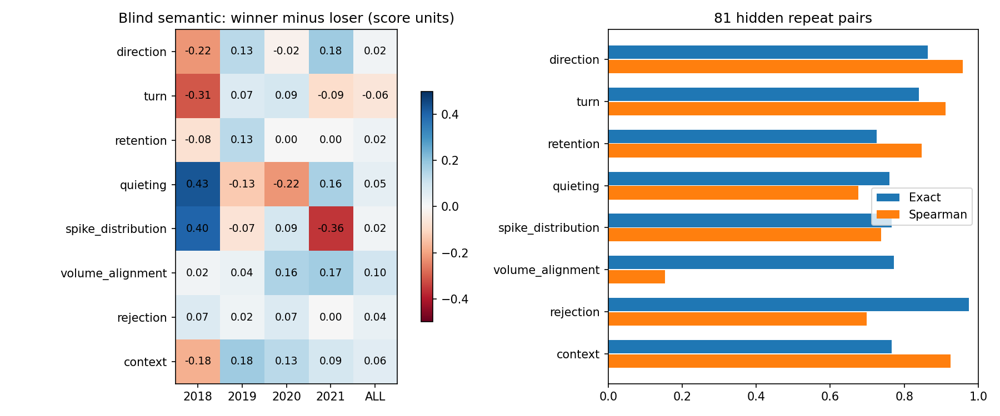

# 第六 Alpha 视觉发现 V1：本轮未找到合格新机制

**FINAL_DECISION：NO_NEW_MECHANISM_FOUND。EXACT_FAILURE_LAYER：VISUAL。**

已完成真实的发现期覆盖、240组三元组抽样、720张原始盲图、81张隐藏重复图、开放编码、正式评分、重复性检验、揭盲响应和稳健性诊断。没有视觉维度同时提供可重复测量与跨年、宽阔的结果分离，因此按第21节门槛，保留0个机制、0个公式化候选、0套策略。发现期冻结提交为 `7a1cb8ddf73bbb1c795ddb6ebf6353593bc7986f`。

这不是“整个趋势/压缩/量价家族无效”，也不是“策略回测失败”。本轮没有满足家族封闭所需的多种视觉与多种公式证据；没有证明 STANDARD_FACTOR_REDISCOVERED 或 DUPLICATES_EXISTING_ALPHA。2022以后验证收益、独立账户和组合增量没有运行，下面相关指标明确留空，不能当作零收益、回测通过或策略崩溃。

## A. 覆盖与输入资格

发现期可投资股票日2,762,870，事件日未覆盖2,761,320，占 **99.943899%**；已覆盖1,550，占0.056101%。主板未覆盖2,071,459，创业板689,861，绝对数量以主板最多。全期2018至2026-09-04可投资股票日6,781,649，事件日未覆盖6,778,166，占99.948641%。各年各板块详见 [coverage_summary.csv](coverage/coverage_summary.csv)。

覆盖是**真实合法原生机会的股票—决策日并集**，不以是否获资决定。ATRDR分Bull/Fast Bear/Slow Bear，MCB、OGR、IFCGR保留各自标记，OGR/IFCGR父子事件按股票日并集，不相加。SMV6只作为账户背景。它衡量新请求空间，不衡量完整持仓期，也不证明经济家族独立；原生持仓状态本身可能抑制重复请求。

正式样本180个赢家中，52个在t以前已有原生机会，2个在t时仍被IFCGR分支的原生物理账户持有；中性为53/2，输家55/0。见 [原生重叠](coverage/visual_sample_native_overlap_summary.csv)。不能把高未覆盖率直接解释为五策略“漏掉99.94%的alpha”。没有合格候选，因此未做候选阈值距离/经济家族近失资格判定，不能宣称独立性通过。

数据沿用注册 `daily_with_snapshot.parquet`（9,527,910行，3725证券，2013-01-04至2026-09-04）。研究宇宙MAIN+CHINEXT，沿用current_valid、hard_valid、非ST、当日可交易。未加入新板块或新上市天数规则。行业资格为 **PIT_B_CAUSAL_RESEARCH_NOT_STRICT_ARCHIVE**，不是PIT-A。市值来自CY-006注册流通股本分区，使用close×circulating_shares，属于流通市值，不冒充总市值或真正自由流通市值。全期覆盖图中2026末段有59,915个股票日缺市值，保持空值；发现期匹配市值完整。已附完成日现金、gross、原生家族敞口、市场状态、参与度、历史收益/波动/ADV。

IFCGR与OGR是替代gap分支，账户背景选IFCGR分支，不把两者作为同时存在的持仓重复相加。SMV6仍是 LOCAL_NATIVE_CALLBACK_REPLAY；NATIVE_SUPERMIND_EQUIVALENCE_UNVERIFIED。

## B. 漏掉的赢家：当前能说到哪里

抽样前将个体未来结果封存。研究标签为行业相对20/40/60日收益的日期内分位中位数，再按日期排名；赢家前15%、中性45–55%、输家后15%，赢家/输家至少2/3期限分别超过70%/低于30%。行业与市场基准为t时可用集合、同期限合法路径等权且剔除自身；行业固定为t行业。5/10日为诊断。结果坐标收益不等于扣费可执行账户收益。

完整未覆盖发现面板保留2,761,320行，包括端点不足的空标签；20/40/60持续分数同时可用2,527,500行，60日合法路径2,528,248行。最后完整持续分数日期2021-10-08，2021年末不借用2022价格。已计算MFE、MAE、未来close路径最大回撤及到MFE/MAE的时间；无效或缺失交易日路径置空。

能观察到上移、反转、收缩与脉冲路径，但同样形态也出现于输家。见 [形态与反例](visual/representative_cases/archetypes_and_counterexamples.png)，每种形态的正反例按blind_id首个符合分数≥1的正式样本选择，没有按收益幅度挑最漂亮案例。没有足够证据给“系统性漏掉的某种赢家”命名。

## C. 盲图、编码与重复性

每年60组三元组，LOW/MID/HIGH参与度各20组；同日同注册行业，按log流通市值、log ADV20、过去20/60收益、60日波动标准化欧氏距离匹配。每证券样本间距至少120交易日。固定种子20260909，实际重建样本哈希一致。开放编码每年每状态5组，共180图；正式540图，加81个随机隐藏重复。分阶段排版共51张4×4联系表；有阶段末页留白。没有额外逐图放大搜索。

图显示截至t的120根OHLC、250日历史条与历史中位量比，无股票代码、年份或未来价格。统一历史坐标归一化；验证raw×factor=coord、有效历史factor变化有公司行动对应、available_at不晚于decision_at。原生有效历史可能包含长期零量/停牌，不能把它当压缩或量价配合，相关维度使用NA。

开放编码完成后固定8维代码本，再标正式样本。正式621条评分及代码本哈希在 `eb8873f13b` 提交后才揭示个体结果。重复图除ID头部以外像素完全相同；它们不进入540个正式结果样本。单一模型的操作盲法不能声称完美人类双盲，也没有第二独立标注员。

|维度|重复精确一致|重复秩相关|配对赢家−输家|判断|
|---|---:|---:|---:|---|
|direction|86.4%|0.958|+0.017|差异小，逐年变号|
|turn|84.0%|0.912|−0.061|无稳定方向|
|retention|72.5%|0.848|+0.006|赢家输家接近，中性更弱|
|quieting|75.9%|0.675|+0.006|年度和市场状态反向|
|spike_distribution|76.5%|0.737|+0.017|2018与2021反向|
|volume_alignment|77.2%|0.153|+0.098|秩重复性不足|
|rejection|97.5%|0.698|+0.040|95.7%标注为中性，尾桶太少|
|context|76.5%|0.926|+0.056|非单调，未形成独立故事|

评分范围−2至+2；配对表仅保留双方有效的同一三元组，故与分组各自均值之差在NA维度略有不同。volume_alignment的高精确率主要来自大量同一分数，不能掩盖低秩相关。rejection有效分数为−1的19例、0的511例、+1的4例；高一致率不代表充分分辨能力。quieting没有+2正式样本，spike_distribution的+2仅2例，均不能利用极稀桶讲故事。

## D–G. 响应、控制、市场状态和发现裁决

[逐年分离](visual/visual_year_spreads.csv)给出所有维度，核心例子如下（表中为未配对分组均值差）：

|维度|2018|2019|2020|2021|
|---|---:|---:|---:|---:|
|direction|−0.222|+0.133|−0.022|+0.178|
|retention|−0.076|+0.133|0.000|0.000|
|quieting|+0.428|−0.131|−0.222|+0.161|
|spike_distribution|+0.400|−0.067|+0.089|−0.356|
|volume_alignment|+0.019|+0.035|+0.156|+0.173|
|context|−0.178|+0.178|+0.133|+0.089|

[分桶响应](visual/visual_score_response.csv)同时列出行业20/40/60收益、持续超额分数、MFE/MAE与未来回撤。direction分数从−2至+2对应持续分数约0.508、0.474、0.529、0.515、0.489；retention为0.523、0.493、0.433、0.552、0.501。局部桶优势没有构成稳定宽梯度。不能把经过赢家/中性/输家抽样的桶均值当作全市场可交易收益。

额外视觉诊断包含：同三元组的日期/行业固定效应、250次组内置换、历史20/60/120收益、流通市值、ADV20、波动和60日市场beta的秩残差控制。beta使用合法日收益相对同日等权市场，窗口信息截至t。完整控制后的视觉残差相关direction−0.124、turn−0.031、retention−0.059、quieting+0.013、spike_distribution−0.020、volume_alignment+0.050、rejection+0.082、context−0.041。残差出现的新符号不是翻转策略方向的授权，未用它反向寻找新规则。随机对照是同日同业已抽取三元组内置换，不是全市场随机股票回测。

配对2000次bootstrap仅为效应范围诊断，多个三元组可能同日，未来持有窗口会重叠，不能视为独立样本置信证明。匹配也不是精确风格复制：赢家—输家过去60收益绝对差中位9.07个百分点、P90约30.32个百分点；log流通市值差绝对中位0.594，P90为1.632。完整质量表位于 [matching_quality.csv](visual/matching_quality.csv)。因此本轮不能强称“全部风格暴露已被因果排除”。

市场状态沿用注册BULL/BEAR/TRANSITION，而非事后重切牛熊。quieting在BEAR赢家−输家+0.121，BULL−0.400，TRANSITION+0.206；volume_alignment在LOW参与度+0.368、HIGH−0.117，但测量重复性不足。没有把某一个状态切片升级为候选。市场状态诊断详见 [discovery_regime_results.csv](quant/discovery_regime_results.csv)。

**公式化数量0，保留机制0。** 根据用户第21节，只有合理重复性且有经济结果分离的语义才能进入2–3种公式。这里没有满足前提，所以没有用RS20/60/120代替视觉发现，没有扫描参数，没有制作虚假的负公式回测。`quant/semantic_response_summary.csv`逐维记录不进入的原因。可选无监督聚类没有运行。整个机制家族保持未裁决，未来改善测量应另开V2，不能改写本轮标签。

## H–M. 冻结、验证、策略和组合

七份规格、代码本、解释文件和哈希清单已冻结。候选数量0；score/entry/exit/topK均为null。用户要求的5%单名、20持仓、100%gross、现金非负、无杠杆保留为未启用的容器合同。没有创建“全现金零策略”来填充账户指标。

|阶段|实际状态|结果指标|
|---|---|---|
|2022熊市压力|NOT_APPLICABLE_NO_QUALIFIED_CANDIDATE|空|
|2023确认|同上|空|
|2024、2025、2026YTD持续性|同上，不能分类PERSISTENT/COLLAPSED|空|
|独立账户及生命周期|未实例化|CAGR/MaxDD/CVaR5/Sharpe/gross/cash/资本日效率均空|
|闲置资本叠加|未进入|增量CAGR/MaxDD/CVaR/gross均空|
|统一六策略竞争|未进入|空|
|尾日正交/前沿/成本/容量|没有最终候选，条件不适用|空|

冻结后仅补齐全期**因果覆盖背景**，未做2022+候选验证收益分析或用其改规则。这不等于“完成了2022–2026策略验证”。条件关闭文件只是状态凭证，不能解释成实际回测。无需授予ALPHA_TIER或FORWARD_SHADOW_SPEC。

MECHANISM_STATUS：NO_VISUAL_STRUCTURE（准确含义：本轮没有足以进入公式化的稳定预测性视觉结构；volume子维度另有VISUAL_STRUCTURE_NOT_REPEATABLE）。IMPLEMENTATION_STATUS：NOT_ENTERED_NO_QUALIFIED_MECHANISM。被否定的是**本轮编码与样本下进入候选阶段的资格**，未被否定的是所有价格路径机制、改善测量的可能性、其他宇宙或未来独立样本中的机会。

## 验证、交付与复现

16项必需检查中，10项实际PASS；5项账户/叠加检查条件不适用；第15项实际样本重建PASS，而策略/叠加重建不适用。另有路径先涨后跌/缺失日审查及81重复图像素一致检查PASS。详见 [test_results.json](output/test_results.json)。不把NA计为通过。

原有五策略源码、参数及注册输入保持哈希一致。基线与开始HEAD均为 `226dbf3b58da7a7928a5016fd97b36107d92ae7c`，父分支 `research/five-strategy-capital-admission-v1`；本分支 `research/sixth-alpha-visual-discovery-v1`。父工作树未修改。

关键输入SHA256：

- daily：`506ab8e3b969156b18d319e8cc74a84a13bbf6a1456309588389c79be3bf8177`
- opportunities：`0c2b577114880721768921df6a47355897996a5a770b99306421875e7b004f21`
- ATRDR population：`a9b531663e709b432624286dce69440573b2c907e6c9511ac40f77d9f950928f`
- 正式盲标签：`518ec0d72ca15e51efbc52692c3043043e14ba86a52e56766b66987db4657205`
- 冻结清单自身：`687882d87369d7e1c43e134bad1e9050c6921ae549453567a9cbc19755d2603e`

其余来源/大文件哈希在input_manifest.json、coverage/*manifest.json、output/size_source_identity.json和output/large_artifact_manifest.sha256。大文件位于 `/Volumes/quant/CY_quant_research/sixth_alpha_visual_discovery_v1`，不进入Git；小图/代码/状态CSV/报告进入Git。Git不包含外盘原始数据本体，因此复现依赖已登记本机数据与外盘。

复现与盲法边界见 [REPRODUCTION_COMMANDS.md](REPRODUCTION_COMMANDS.md)，逐节履约状态见 [requirement_coverage.csv](output/requirement_coverage.csv)。冻结提交后不得重新编辑标签、代码本或冻结规格；重跑代码可以复现数据与统计，不能把既有人工式模型视觉判断变成独立再次盲评。
