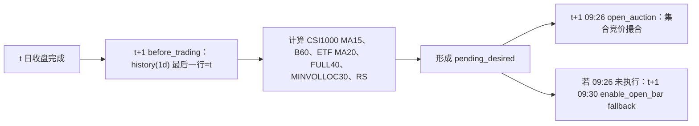

# SuperMind V6 Phase 0：策略语义、因果性与执行审计

- 审计日期：2026-08-28（Asia/Shanghai）
- 审计分支：`research/supermind-v6`
- 审计 HEAD：`b1552e34f394b047e9b39970f333f8b59ab4fd40`
- Frozen input：`research/supermind_v6/strategy/SuperMind_V6_CSI1000_MA15_ENTRY_HS300_MA20_EXIT_MINVOLLOC30_CAP50_SET_TAIL_SELL_OPEN_BUY_COMMENTS_FIXED.py`
- 策略称谓：**V6 structure + V5 20/60/120 RS fallback**
- 本报告没有修改 frozen strategy，也没有运行回测、参数优化或 full-market build。

## 1. Executive summary

当前代码的日频信号窗口大体定义清楚，B60、FULL40、MINVOLLOC30、20/60/120 RS、MA40×2 以及 CSI1000/HS300 双锚的主要切片均能从代码严格还原。SuperMind 官方 API 文档还支持以下关键事实：日频 `history()` 不含当前 bar；`get_all_securities()` 在回测中默认查询当前回测时间的前一交易日；`set_execution('close')` 在分钟回测中按当前 bar 收盘价撮合；`open_auction()` 在回测中使用集合竞价成交数据；`enable_open_bar()` 会在分钟回测中增加 09:30 回调。

但是，当前版本尚不能被认定为“已证明正确、因果且可基线复现”：

1. 固定 152 ETF pool 只有代码内一句“July-20 snapshot supplied in this conversation”，没有来源、形成日期、当时可得性或纳入/剔除规则。用晚期快照约束历史截面会产生 survivorship/selection/future-knowledge bias。
2. `get_all_securities('etf')` 正常路径是 PIT 的，但异常路径直接退回全部静态 152 只，可能把尚未上市或已经退市的 ETF 放入历史候选集。
3. 14:57 `bar.open` 对应的真实分钟区间、回调发生在 bar 开始还是结束，官方文档没有说清；其 fallback `history(..., '1m')` 又明确“包含当前 bar”。因此当前 bar 因果可见性不能靠注释判定。
4. 15:00 下单并按“当前 bar close”成交是官方确认的回测引擎机制，但这属于特殊 same-bar execution assumption；没有证据证明它等价于真实市场中在 14:57 已提交的收盘集合竞价订单。
5. `set_volume_limit()` 官方文档明确允许部分成交。代码却在目标单发出后立即把 `last_target_membership_raw` 记为目标集合；如果所有成员都已出现但权重因部分成交错误，后续只比较 membership，可能永远不重试权重。
6. 本地 CY 注册资产不能完整复现该策略：固定 pool 仅 21/152 只在 QD-001 raw daily inventory 中存在；CY-006 中不含这些 ETF；QD-004/CY-008 的 A 股分钟资产不含抽查 ETF；没有物化、注册的历史 PIT ETF universe；仓库没有 SuperMind baseline 回测结果或交易日志。

因此，本报告的 readiness 结论是：

> **SAFE_TO_PROCEED_TO_PHASE1: NO**

这里的 NO 不表示策略思想无研究价值；它表示在建立可对照的 baseline 和关闭关键执行/数据语义前，不应进入下一阶段的策略实验，更不应开始参数寻优。

### 1.1 结论等级

| 等级 | 含义 |
|---|---|
| `VERIFIED` | 代码切片本身可直接证明，或当前官方 API 文档明确说明该行为。 |
| `LIKELY_CORRECT` | 代码逻辑一致且有间接证据，但没有实际 SuperMind 运行证据或完整字段契约。 |
| `UNRESOLVED` | 现有代码、仓库资料、官方公开文档仍不足以判定。 |
| `INVALID` | 存在可构造的反例，或行为与声明的因果性、PIT、状态契约不一致。 |

## 2. Exact strategy semantics

### 2.1 时间符号

除非另行说明：

- `t`：最新完成的日线信号交易日。
- `t+1`：`t` 之后的下一交易日。
- 在 `t+1 before_trading()` 中，官方文档说明日频 `history()` 不含当前 bar，因此最后一条应为 `t`。
- `C_d`：交易日 `d` 的（SuperMind `fq='pre'`）收盘价。
- `R_d = C_d / C_{d-1} - 1`。
- 14:57 路径中的 `P_t^1457`：`snapshot_price_1457()` 返回的当日伪收盘。

### 2.2 初始化与固定配置

代码证据：strategy lines 74–293。

- benchmark：`000300.SH`。
- 手续费：`PerShare(type='stock', cost=0.0002)`，即文档定义的成交额 2bp/笔。
- 滑点：`PriceSlippage(0.0016)`。官方文档定义参数在买卖两侧各分一半，因此对应买入约 +8bp、卖出约 -8bp。
- 成交量限制：日线 25%、分钟 50%；本策略必须运行于 MINUTE/1m。
- 全局撮合：`set_execution('close')`。
- 额外 09:30 回调：`enable_open_bar()`。
- 入场市场锚：CSI1000 `000852.SH`，MA15。
- 离场市场锚：HS300 ETF `510300.SH`，MA20。
- 最多 5 只；单只上限 50%。
- 历史长度请求 140 日；合格最低 121 日；分批 20 个 symbol。
- 固定 pool：152 个不重复的 raw codes（本审计用 AST 只读确认）。

注意：`context.breakout_days=60`、`context.box_days=40`、`context.exit_confirm=2` 在实际计算函数中没有被引用；当前函数分别硬编码 60、40 和两日确认。固定配置下结果一致，但这些 context 字段不是可生效的研究参数。

### 2.3 状态机

代码证据：strategy lines 218–242、503–594、1124–1411、1825–2359、2399–2669。

| 状态 | 语义 | 建立 | 清理/重试 |
|---|---|---|---|
| `force_exit_all` | 组合级清仓的 sticky flag | 14:57 或 official-close 市场退出 | 仅在账户确认已空仓时清除 |
| `forced_sells` | ETF 自身 MA40×2 的 sticky 列表 | 14:57 或 official-close 个券退出 | 持仓实际消失后由 `cleanup_forced_sells()` 清除 |
| `pending_desired` | 下一开盘要处理的目标成员集合 | `before_trading()` | `execute_pending_open()` 调用后清除 |
| `last_target_membership_raw` | 最近一次“已处理”的 CAP50_SET 目标集合 | 开盘目标单循环后写入 | 组合确认空仓时清空；不记录目标权重是否真正成交 |
| `pending_close_sells` | 14:57 冻结、15:00 消费的 sell-only 队列 | `queue_close_sells()` | 15:00 提交后无条件清空；跨日队列也被丢弃 |
| 三个 `last_*_date` | 09:30、14:57、15:00 一次性 guard | 对应 callback | 每日 `before_trading()` 重置 |

每日状态转移顺序：

1. `before_trading()` 清理跨日 close queue，读取上一完成日的双市场锚和 ETF 日线。
2. 市场级退出优先级最高；若触发，目标集合直接为空。
3. 若有历史未完成的组合清仓，继续目标为空。
4. 检查持仓 ETF official-close MA40×2，将其加入 sticky `forced_sells`。
5. 市场数据无效或 CSI1000 gate off 时，禁止新开仓，但可处理个券退出并 resize survivors。
6. 还有空位时才运行 eligibility、B60、FULL40、MINVOLLOC30、RS，并形成下一开盘目标集合。
7. 名义 14:57 只做退出判定，不选择买入；代码实际在 14:57–14:59 之间遇到的第一个 callback 运行一次。名义 15:00 只提交卖单；代码实际接受 15:00–15:05 之间的第一个 callback。
8. 下一开盘先卖掉不在目标集合的持仓，再对每个 desired member 发 `order_target_percent()`。

## 3. Timeline

### 3.1 Official close entry → next open buy

信号在 `t` 收盘后才完整可得；买单不在 `t` 内成交。正常 `open_auction()` 路径的 T+1 语义由官方文档支持。09:30 fallback 在全局 `set_execution('close')` 下到底按哪个特殊 bar 的哪一个价格撮合，仍为 `UNRESOLVED`。

### 3.2 Intraday tail exit

通常完整分钟数据下实际 callback 应为 14:57 和 15:00，但代码契约允许上述窗口内更晚的首次 callback。引擎的 current-bar-close 规则是 `VERIFIED`，但 bar 标签/可见性和该回测成交是否等价于真实收盘集合竞价委托仍未被日志或事件时间证据验证。

### 3.3 Official close late-exit fallback

## 4. Entry audit

### 4.1 Universe 与 eligibility

代码证据：strategy lines 178–212、332–400、433–480、1421–1444。

1. 每天调用 `get_all_securities('etf')`，与固定 152 raw-code set 取交集。
2. `get_all_securities()` 官方契约：无 `date` 参数时，回测中默认当前回测时间的前一交易日；返回指定日所有上市证券及上市/退市等基础信息。因此正常路径会阻止未上市 ETF 进入当日 active pool。
3. raw code 以 `5` 开头映射 `.SH`，以 `1` 开头映射 `.SZ`。固定 pool 全部属于这两类；代码没有使用 API 实际返回的 suffix，而是重新推导 suffix。
4. `history()` 请求 140 条 `close/volume/turnover`、`skip_paused=False`、`fq='pre'`。
5. 合格条件：
   - raw close 至少 121 条；
   - raw turnover 至少 20 条；
   - 最近 121 个 close（包含 `t`）全部 finite；
   - 最近 20 个 turnover（`t-19..t`，包含 `t`）全部 finite；
   - 最近 20 日 turnover 均值至少 20,000,000。

`turnover` 在 SuperMind `Bar` 对象文档中表示成交额（元），所以 20,000,000 更像 20 日平均成交额门槛而不是换手率门槛；但公开页面没有单独展示 ETF 日频 `history.turnover` 的字段单位，结论为 `LIKELY_CORRECT`。

### 4.2 CSI1000 market-entry gate

代码证据：strategy lines 602–648、690–847、1883–1937。

- `entry_close_now = C_t`。
- `MA15_t = mean(C_{t-14}, ..., C_t)`，包含 signal day。
- gate 为 `C_t > MA15_t`，严格大于。
- gate 只控制新增标的；gate off 时保留 survivors，并允许因已有成员退出而发生一次 CAP50_SET resize。
- gate off 不主动清仓。
- 当前 `market_exit_mode='BOTH'`，所以入场还要求 HS300 exit anchor 数据有效且没有触发任一市场退出。

结论：切片和 only-new-entry 语义为 `VERIFIED`。

### 4.3 ETF entry windows

代码证据：strategy lines 1451–1713、1749–1816、2039–2359。

| 条件 | 精确 observation | 是否含 `t` | off-by-one 审计 |
|---|---|---:|---|
| B60 | `C_t > max(C_{t-60}..C_{t-1})`；代码 `close[-61:-1]` | 比较值含 `t`，基准窗不含 | `VERIFIED`：恰好 60 个 prior closes |
| ETF MA20 | `C_t > mean(C_{t-19}..C_t)` | 是 | `VERIFIED`：恰好 20 个 closes |
| FULL40 box | `max/min(C_{t-40}..C_{t-1}) - 1 <= 12.5%` | 否 | `VERIFIED`：`[-41:-1]` 恰好 40 条 |
| FULL40 MA dispersion | 在 `t-1` 计算 MA5/10/20/30；例如 MA5=`mean(C_{t-5}..C_{t-1})`；`max(MA)/min(MA)-1 <= 5%` | 否 | `VERIFIED` |
| FULL40 direction efficiency | `abs(C_{t-1}-C_{t-40}) / sum(abs(diff(C_{t-40}..C_{t-1}))) <= 0.40` | 否 | `VERIFIED`：40 closes、39 段路径 |
| FULL40 vol10/vol60 | `std(R_{t-10}..R_{t-1}, ddof=1) / std(R_{t-60}..R_{t-1}, ddof=1) <= 0.90` | 否 | `VERIFIED`：需要 `C_{t-61}..C_{t-1}` |
| MINVOLLOC30 | 在 `t-30..t-1` 的 volume 中找最小值日；其 close 在相同 30 日 close box 的 location `<=0.50` | 否 | `VERIFIED`：`[-31:-1]`；明确排除 `t` |
| RS20 | `C_t/C_{t-20}-1` | 是 | `VERIFIED` |
| RS60 | `C_t/C_{t-60}-1` | 是 | `VERIFIED` |
| RS120 | `C_t/C_{t-120}-1` | 是 | `VERIFIED` |

FULL40 其他边界：

- box low 必须大于 0。
- direction path 为 0 时 efficiency 设为 0。
- vol60 必须大于 0。
- 所有相关 observation 必须 finite。

MINVOLLOC30 其他边界：

- close 与 volume 先按共同右边界对齐。
- nonfinite、nonpositive price/volume、长度不足全部 fail closed。
- 最小 volume 并列时 `np.argmin` 取最早 occurrence；该 tie rule 是实现定义，不是已恢复的原始 V6 证据。
- 完全平坦的价格 box 被定义为 location=0，从而通过；这是显式实现假设。
- 当前 `HARD` 模式：失败即阻止新入场，不影响已有持仓和退出。

### 4.4 Cross-sectional ranking 与 vacancy filling

- 正确称谓必须是 **V6 structure + V5 20/60/120 RS fallback**；没有原始 V6 `asset_balanced` ranking 的证据。
- 百分位排名在全部 `eligible` ETF 上计算，不只在今日 breakout candidates 上计算。
- score=`(rank_pct(RS20)+rank_pct(RS60)+rank_pct(RS120))/3`。
- 排序 tie-break：score 降序、原始 mom60 降序、symbol 升序。
- survivors 先保留；只填空位，最多 5 只。
- 当前持仓不会被同日卖出再买回。
- 满 5 只时不因更高 RS 发生 rank replacement。

这些代码语义为 `VERIFIED`。横截面没有使用 `t` 之后的收益，但固定 pool 本身存在后述历史选择偏差。

## 5. Exit audit

### 5.1 ETF MA40 × 2

代码证据：strategy lines 1217–1292、1720–1740、1942–1987。

Official-close 路径在 `t+1 before_trading()` 中使用：

- `t close = C_t`。
- `t MA40 = mean(C_{t-39}..C_t)`。
- `t-1 close = C_{t-1}`。
- `t-1 MA40 = mean(C_{t-40}..C_{t-1})`。
- 当两者均严格低于各自 MA40 时退出。

14:57 pseudo-close 路径使用 completed daily closes 到 `t-1`，再 append `P_t^1457`：

- pseudo `t close = P_t^1457`。
- pseudo `t MA40 = mean(C_{t-39}..C_{t-1}, P_t^1457)`。
- `t-1 close` 与 `t-1 MA40` 仍使用 official daily values。
- 若触发，加入 `forced_sells` 并排入 15:00 sell-only queue。

区别：14:57 路径追求当日尾盘退出；official-close 路径捕捉 14:57 之后才发生的 final-close crossing，或重试未完成卖出，并在 `t+1` 开盘执行。

公式切片为 `VERIFIED`；`P_t^1457` 的真实时点语义为 `UNRESOLVED`。

### 5.2 HS300 ETF market exit：mode=BOTH

代码证据：strategy lines 690–847、920–1121、1158–1213、1863–1937。

#### before_trading official-close logic

- exit anchor：`510300.SH`。
- `C_t^HS300ETF` 与 `MA20_t=mean(C_{t-19}..C_t)`。
- weekly threshold：`MA20_t * (1 - 0.00)`。
- daily emergency threshold：`MA20_t * (1 - 0.02)`。
- mode `BOTH`：weekly exit 或 daily emergency exit 任一成立即全组合退出。
- daily emergency 每个交易日检查。
- weekly exit 只在“当前 before_trading 是新周首个观测交易日”时检查上一完成交易日 `t`。

#### 14:57 intraday logic

- 用 `P_t^1457` append 到截至 `t-1` 的 HS300 ETF daily close。
- pseudo MA20 包含 `P_t^1457`。
- weekly tail exit 只在当天是本周最后交易日时检查。
- daily 2% emergency 每天检查。
- tail weekly buffer 当前为 0；official weekly buffer 也为 0。

#### week boundary 与 holiday semantics

`is_new_trading_week()` 比较上一 observed trading date 与 today 的 `W-FRI` period。因为 `before_trading()` 只在交易日调用，正常运行时可以处理周一休市、周二开市以及跨长假，结论 `VERIFIED`。

但有两个确定边界：

1. `context.prev_trade_date` 初始为 `None`，所以回测第一个交易日永远不是 week boundary。若回测从新周首日开始，首个 weekly exit 被跳过。结论 `INVALID`。
2. `is_last_trading_day_of_week()` 只查询 `today..today+10 calendar days`。如果下一交易日超过 +10 天，`future_days` 为空并退回 `weekday()==4`；春节等长休市前最后交易日可能不是周五，因此会漏掉 tail weekly exit。API 异常也会使用同一近似 fallback。结论 `INVALID`。official-close next-open 路径之后仍可能补救，但执行日期已改变。

## 6. CAP50_SET audit

代码证据：strategy lines 512–594、1989–2359、2399–2556。

### 6.1 权重定义

`target_weight = min(0.50, 1/N)`，其中 `N` 是去重后的 desired membership 数：

| N | 每只目标权重 | 组合名义目标 |
|---:|---:|---:|
| 1 | 50% | 50% |
| 2 | 50% | 100% |
| 3 | 33.33% | 100% |
| 4 | 25% | 100% |
| 5 | 20% | 100% |

该函数定义为 `VERIFIED`。

### 6.2 何时 rebalance

只有下列任一成立才排队：

- desired membership 与 actual current membership 不同；或
- desired membership 与 `last_target_membership_raw` 不同。

普通价格漂移不会触发每日 target restoration。成员改变时，会对所有 desired members 重新发目标比例单，而不只是新成员。

### 6.3 tail exit 后为什么下一交易日 resize survivors

假设此前集合 `{A,B,C}` 按每只 33.33% 处理。`t` 日尾盘卖掉 `C` 后：

- actual current=`{A,B}`；
- 若下一日 desired 仍为 `{A,B}`，actual 已等于 desired；
- 但 `last_target_membership_raw` 仍是 `{A,B,C}`；
- 第二个 membership 比较触发一次 resize，将 A/B 目标调到各 50%。

这一意图与代码一致，结论 `VERIFIED`。

### 6.4 部分成交状态错误

官方文档明确 `set_volume_limit()` 可导致部分成交。代码却不检查 `Order.status`、`filled_amount` 或成交回调，并在所有目标单提交后立即写入 desired membership。可构造反例：A/B/C 均已持有，但从 2×50% 过渡到 3×33.33% 时，A/B 减仓或 C 加仓只部分成交；membership 已是 `{A,B,C}`，`last_target_membership_raw` 也是 `{A,B,C}`，下一日 `cap50_set_change_required()` 为 False，错误权重不再修复。

因此，“CAP50_SET 在部分成交下保持目标状态正确”的结论为 `INVALID`。

组合清仓和个券退出相对更稳健：`force_exit_all`/`forced_sells` 以实际持仓是否消失为准保留 sticky state，下一交易日会重试。但没有真实日志证明停牌、跌停、退市和引擎撤单时的全部边界。

## 7. Universe audit

### 7.1 固定 152 ETF pool

- 数量与去重：`VERIFIED`，152 rows / 152 unique。
- 来源：只有 strategy lines 178–181 的注释；没有独立清单、生成查询、快照时间、source hash、纳入规则或退市样本说明。结论 `UNRESOLVED`。
- 如果该 July-20 snapshot 晚于回测期，用它定义历史可选集合会：
  - 排除当时存在但后来不在 snapshot 的 ETF；
  - 偏向后来仍存续且在 snapshot 中可见的 ETF；
  - 使用未来形成的研究边界。

因此，固定 pool 不能支持 survivorship-free 或 selection-unbiased 的历史表现声明，结论 `INVALID`。可以研究“条件于该固定 pool 的策略”，但必须如此命名。

### 7.2 `get_all_securities('etf')`

当前 SuperMind 官方 API 文档明确：

- API 获取指定日期所有上市证券及基本信息；
- `ty='etf'` 表示 ETF；
- `date=None` 时，回测中默认当前回测时间的前一交易日。

因此 API 成功路径为 point-in-time active intersection，结论 `VERIFIED`。这能避免在上市前交易 pool 内的未来 ETF，但不能消除固定 pool 的选择偏差。

### 7.3 API failure fallback

strategy lines 473–480 捕获所有异常并返回全部 `static_symbols`。该路径不校验 listed/de-listed dates，会重新引入 future-listed contamination。虽然有 warn log，不属于“静默”，但它仍是未经证明的替代数据路径，与 fail-closed research 要求不一致，结论 `INVALID`。

### 7.4 listing / delisting

- 新上市：正常 API 路径会在上市后才进入 active pool；且仍需 121 条历史，因此不会立即成为 candidate。`VERIFIED`。
- 已退市标的的新入场：正常 API 路径应排除。`LIKELY_CORRECT`。
- 已持有 ETF 的退市、终止上市现金结算、最后可交易日、代码变化：策略没有显式处理；是否由 SuperMind portfolio/engine 正确完成，仓库与公开文档没有证据。`UNRESOLVED`。

## 8. Data causality audit

| 审计项 | 结论 | 代码/证据与理由 |
|---|---|---|
| look-ahead bias | `UNRESOLVED` | 日频信号到 T+1 open 的公式无未来数据；但 14:57 current-bar 标签和 15:00 same-bar-close execution 尚未由事件日志证明。 |
| survivorship bias | `INVALID` | 晚期固定 152 ETF snapshot 没有历史形成证据，不能代表历史无偏 universe。 |
| future-listed ETF contamination | `INVALID` | API 成功路径可防止；异常时 static fallback 会把全部 152 只放回候选集。 |
| delisted ETF handling | `UNRESOLVED` | 新入场应被 PIT API 排除，但持仓退市/现金结算/终止交易没有策略或日志证据。 |
| current-bar leakage | `UNRESOLVED` | 官方文档说分钟 `history()` 包含当前 bar；14:57 fallback 用 current-bar close，回调在 bar 开始/结束未说明。 |
| daily/minute timestamp alignment | `UNRESOLVED` | 日频 boundary 已明确；14:57/15:00 minute label 的 interval convention 未明确。 |
| signal-day volume leakage | `VERIFIED` | MINVOLLOC 使用 `[-31:-1]`，只含 `t-30..t-1`。 |
| adjusted price semantics | `UNRESOLVED` | `fq='pre'` 已确认是前复权/动态前复权；ETF 分红、拆分、复权因子在每个回测时点的精确版本与 volume 行为无本地证据。 |
| ranking cross-section leakage | `VERIFIED` | RS 只用截至 `t` 的 close，并在当日 eligible intersection 上排名；固定 pool bias 另列。 |
| turnover data semantics | `LIKELY_CORRECT` | 阈值和 Bar 文档支持“成交额（元）”解释；ETF 日频 history 字段页未单独核实单位。 |
| B60 off-by-one | `VERIFIED` | `C_t` 对 `t-60..t-1` 共 60 closes，严格大于。 |
| FULL40 off-by-one | `VERIFIED` | box/MA dispersion/direction/volatility 全部明确排除 `t`；窗口见 §4.3。 |
| MINVOLLOC off-by-one | `VERIFIED` | 30 条 `t-30..t-1`，signal-day volume 明确排除。 |
| MA calculations | `VERIFIED` | CSI MA15、ETF entry MA20、ETF exit MA40×2、HS300 ETF exit MA20 的包含关系均可由 slice 证明。 |
| unfinished daily bar included | `VERIFIED` | SuperMind 官方文档明确日频 `history()` 不含当前 bar；DataFrame 路径还二次过滤 `< today`。 |
| weekly boundary errors | `INVALID` | 正常跨周正确，但回测首日固定返回 False，会跳过首个 weekly check。 |
| holiday errors | `INVALID` | `today+10` 查找 horizon 和 weekday fallback 可漏掉长假前非周五的最后交易日。 |

## 9. SuperMind execution audit

公开证据来源（访问于 2026-08-28）：

- [SuperMind API 文档](https://quant.10jqka.com.cn/view/help/4?from=ifind)
- [SuperMind 回测引擎说明](https://quant.10jqka.com.cn/view/help/12?from=ifind)
- [SuperMind 常见问题](https://quant.10jqka.com.cn/view/help/16)

仓库内除 frozen strategy 外没有 SuperMind 文档、tests、historical logs 或 backtest artifacts；因此公开文档没有覆盖的行为不得升级为 VERIFIED。

### 9.1 `before_trading()` 中 `history(..., '1d')` 最后一行

**结论：`VERIFIED`。** 官方 API 明确“取日频历史行情时，不包含当前 bar 的数据”；`before_trading()` 在当日开盘前调用，因此最后一行是前一完成交易日。strategy 传 `df=False`，所以返回数组没有日期 index，但不改变这一边界。

### 9.2 14:57 minute callback 的 `bar.open`

**结论：`UNRESOLVED`。** 文档只说明 `bar_dict` 保存“当前时间的 Bar”，并定义 `Bar.open` 为开盘价；没有说明 timestamp 14:57 对应 `[14:56,14:57]`、`[14:57,14:58]` 或其他区间，也没有说明 callback 在 bar 开始还是闭合后发生。`bar.open` 通常比 close 更容易因果可见，但不能把通常做法当作该引擎事实。

fallback 风险更明确：官方文档说分钟 `history()` 包含当前 bar；strategy lines 875–899 在 `bar.open` 不可用时取 1m history 最后一条 close，却注释为“latest completed one-minute close”。这两者只有在 callback 确实发生于 current bar 闭合后才一致，目前未证明。

### 9.3 `set_execution('close')` + 15:00 `order_target(code,0)`

**引擎价格结论：`VERIFIED`。真实可执行性结论：`UNRESOLVED`。** 官方文档明确 `close` 表示“当前 bar 收盘价撮合”，且只在分钟回测中有效。因此 15:00 callback 的订单会被引擎按当前 15:00 bar close 撮合，而不是下一 bar。

这也确认它是 current-bar execution assumption。策略在 14:57 只把 symbol 写入自定义 queue，直到 15:00 才调用下单 API；没有证据说明引擎把该自定义 queue 视为 14:57 已进入收盘集合竞价的订单。故不能声明“真实市场一定能拿到 final close”。baseline 必须单独标注这一回测假设。

### 9.4 `open_auction()`、`enable_open_bar()` 与重复执行

- 官方文档：`open_auction()` 在 9:26 调用一次；回测中使用集合竞价成交数据撮合。`VERIFIED`。
- 官方文档：`enable_open_bar()` 在分钟回测中增加一次 09:30 `handle_bar`。`VERIFIED`。
- 是否当前策略类型/账户配置下每次 minute backtest 都一定调用 `open_auction()`：缺少实际日志，`LIKELY_CORRECT`，不能写成 guaranteed。
- 重复 guard：9:26 成功进入 `execute_pending_open()` 后会设置 `last_open_execution_date` 并清空 `pending_desired`；09:30 条件同时要求 pending 非空且当日未执行。正常控制流足够阻止重复，`VERIFIED`。
- 09:30 fallback 的成交价格：全局仍是 `set_execution('close')`。官方文档没有说明新增 09:30 bar 的 OHLC 及其与集合竞价/open 的关系，`UNRESOLVED`。不能仅根据函数名 `opening_reference_price()` 认定成交价为 open，因为该值只用于日志，订单没有显式 price，真正价格由 engine execution mode 决定。

### 9.5 `order_target()` / `order_target_percent()` 返回 `None`

官方文档明确：有效订单返回唯一订单 ID，否则返回 `None`；标的不存在、资金不足、可卖持仓不足是失败示例。因此：

- `None` 作为 rejected/invalid order：`VERIFIED`。
- target 已满足、delta=0 时是否也返回 `None`：官方文档未说明，仓库无日志，`UNRESOLVED`。
- strategy 注释把 `None` 同时视为 rejected 与 possible no-op，后一半不能当作已确认事实。

### 9.6 部分成交、停牌、涨跌停、流动性限制下的状态

| 状态 | 结论 | 理由 |
|---|---|---|
| `force_exit_all` | `LIKELY_CORRECT` | 只有实际空仓后清除；未退出持仓会在下一开盘/尾盘继续进入清仓目标。缺停牌/跌停实测日志。 |
| `forced_sells` | `LIKELY_CORRECT` | 以实际 current holdings 过滤；持仓仍在则继续从 survivors 剔除并重试。缺退市/现金结算证据。 |
| `last_target_membership_raw` | `INVALID` | 仅保存 member set，不保存/核对 filled weights；部分成交且 membership 已满足时不会重试。 |
| close sell queue | `LIKELY_CORRECT` | queue 提交后清空，但 sticky exit flags 保留未退出持仓；API 提交状态与最终成交仍无 on_order/on_trade reconciliation。 |

## 10. Known assumptions

1. 策略目标条件于固定 152 ETF pool，而不是全历史 ETF universe。
2. 原始 V6 `asset_balanced` ranking 不可得；当前明确采用 V5 20/60/120 RS fallback。
3. `fq='pre'` 是策略定义的一部分；不能用 raw close 悄悄替换。
4. MINVOLLOC30 平坦价格 box 的 location 定义为 0；最小 volume 并列取最早日。
5. `skip_paused=False`；停牌 observation 如何由 SuperMind 填充属于引擎数据语义。
6. CSI1000 MA15 只控制新增风险，不负责退出。
7. HS300 ETF MA20 同时承担周度退出与日度 2% emergency exit。
8. 满仓时不做 rank replacement；ordinary price drift 不 rebalance。
9. 交易成本代码参数等价于约 2bp commission + 8bp/side slippage，但 ETF 税费、最低手续费和真实成交成本没有日志证明。
10. strategy context 中的 `breakout_days/box_days/exit_confirm` 是说明性配置，当前实际函数使用硬编码窗口。

## 11. Unresolved assumptions

1. 固定 152 ETF snapshot 的来源、日期、查询条件、历史可得性和剔除规则。
2. 14:57 current bar 的时间区间与 callback phase；`bar.open`/fallback close 的确切可见时间。
3. 09:30 extra open bar 在 `set_execution('close')` 下的实际成交价格。
4. 15:00 current-bar-close fill 与真实收盘集合竞价委托的等价性。
5. target 已满足时 `order_target*()` 是否返回 `None`。
6. SuperMind ETF 前复权因子、分红/拆分处理、volume/turnover adjustment 和历史版本一致性。
7. ETF `history.turnover` 的精确日频单位；当前仅有间接证据支持成交额解释。
8. 已持有 ETF 退市、终止上市、代码变化和现金结算的引擎处理。
9. 停牌、涨跌停、部分成交和市价单剩余撤单时的完整 event/order callback 顺序。
10. `PerShare(type='stock')` 应用于 ETF 时的税费、最低手续费和 rounding 细节。
11. strategy batch history 返回“部分 symbol 成功”时，SuperMind 是否可能省略部分 key；当前 loader 只要拿到任意 key 就不会递归重试缺失 key。

## 12. Invalid findings

1. **固定晚期 snapshot 不能支持无 survivorship/selection bias 的历史研究声明。**
2. **`get_all_securities()` 失败后退回静态 152 全集，破坏 PIT universe。**
3. **CAP50_SET 在部分成交且 membership 已满足时可能永久保留错误权重。**
4. **回测首日 weekly boundary 固定为 False，可能跳过应有的周度退出/入场阻断。**
5. **last-trading-day 查询只看未来 10 天并以 weekday Friday fallback，长假前可误判。**

本阶段只记录问题，不修改策略。

## 13. Baseline reproduction prerequisites

### 13.1 当前本地能力

| 问题 | 结论 | 证据 |
|---|---|---|
| 1. 能否本地独立重建完整日频 signal？ | **不能** | QD-003 有 `csi000852` 日线，但固定 152 ETF 中只有 21 只存在 QD-001 raw daily 文件；且策略使用 `fq='pre'`，注册表只授权 `*.none.parquet` 作为价格事实。 |
| 2. 是否有 PIT ETF universe？ | **没有** | QD-007 是未物化的历史 A 股 security universe candidate，状态 `DISCOVERY_ONLY`，明确禁止 universe construction/backtest；没有单独注册 ETF PIT master。 |
| 3. 是否有 ETF daily OHLCV/turnover？ | **部分 raw 数据，不能完整复现** | 21/152 存在 `.none.parquet`，字段含 OHLC、volume、amount、turnover_rate；131 只缺失。CY-006 的 2025 分区对这 21 个 codes 查询为 0 rows。 |
| 4. 是否有分钟数据审计 14:57/15:00？ | **没有可用 ETF 分钟 baseline** | QD-004/CY-008 是 A 股分钟资产；2025 QD-004 对 `510300/159915/512880/588000` 的只读查询均为 0 rows。 |
| 5. 是否有 SuperMind 原始回测/交易日志？ | **没有** | repo 全文与路径检索仅发现 frozen strategy；`research/supermind_v6` 历史只有该 input commit。 |
| 6. 是否有真实 commission/slippage 记录？ | **没有** | 只有 strategy 中的模型参数，没有 orders/trades/transaction-cost baseline artifact。 |
| 7. 哪些必须依赖 SuperMind？ | **见下** | 精确 API 数据版本、PIT ETF list、callback phase、auction/open/close fill、order status/partial fills、退市与费用细节。 |

QD-001 当前可见的 21 个 pool codes：

`510300, 512880, 159915, 510500, 512100, 510880, 510050, 512480, 512400, 512010, 515220, 512690, 159870, 512800, 512760, 512660, 515790, 159980, 512200, 515030, 515210`

注册表证据：

- `configs/data_asset_registry.json:5-10`：只允许注册资产，fail closed，禁止 silent substitution。
- `configs/data_asset_registry.json:36-80`：QD-001 是 raw/unadjusted daily，只有 `*.none.parquet` 是 eligible price fact，且不能 standalone backtest。
- `configs/data_asset_registry.json:139-188`：QD-003 含 `csi000852` 指数日线。
- `configs/data_asset_registry.json:192-262`：QD-004 是 A 股 raw 1m，并明确禁止 same-bar fill。
- `configs/data_asset_registry.json:347-385`：QD-007 未物化且禁止 universe construction/backtest。
- `configs/data_asset_registry.json:960-1025`、`:1029-1090`：CY-006/CY-008 是 PIT-B 股票研究表，并要求 hard_valid、T+1/next-window 约束；当前不能替代 SuperMind ETF 数据。

### 13.2 进入 baseline reproduction 前必须具备

1. 冻结且有 lineage 的 152 ETF pool source，或明确接受“条件于晚期固定 pool”的研究协议。
2. 一套完整的、注册的 ETF 日频 OHLCV/成交额、dynamic pre-adjustment 和 date-effective ETF security master；不得用未注册 qfq 或其他 vendor 静默补缺。
3. 若要独立验证 14:57/15:00，需完整 ETF 1m 数据、明确 bar interval/available_at，并禁止当前 bar 内形成信号后同 bar fill。
4. 至少一份 frozen SuperMind baseline run：回测配置、引擎版本、frequency、起止日、初始资金、完整 log、orders、trades、positions、fees、daily NAV。
5. 最小 SuperMind probe，应逐项记录：
   - before_trading 日频 history 的最后 index；
   - 14:57 `get_datetime()`、`bar.datetime/open/close`、1m history 最后 index；
   - 15:00 current bar 与 fill time/price；
   - `open_auction()` 和 09:30 是否都触发；
   - target already satisfied、拒单、停牌、涨跌停、部分成交时的 return value、Order/Trade 状态。
6. 在改变任何策略代码前，先冻结上述 baseline 和 probe artifact；本报告不授权自动修复。

## 14. Phase 1 readiness decision

Phase 0 已经足以说明策略的公式主体，但尚不足以建立可比较、可复现、真实执行语义受控的 baseline。以下是阻断项：

- universe source bias 未关闭；
- 本地 152 ETF 日频/PIT/minute 输入不完整且无授权替代源；
- SuperMind baseline logs/artifacts 缺失；
- 09:30/14:57/15:00 关键时点仍有执行语义未决；
- CAP50_SET 部分成交状态存在确定错误路径；
- weekly/holiday 边界存在确定错误路径。

因此：

> **SAFE_TO_PROCEED_TO_PHASE1: NO**

允许的下一步仅应是补齐 Phase 0 证据（尤其 SuperMind 最小 probe 与 baseline artifact）以及制定 append-only 的修复/验证协议；不应进入参数优化，也不应在没有 regression evidence 的情况下修改 frozen strategy。
