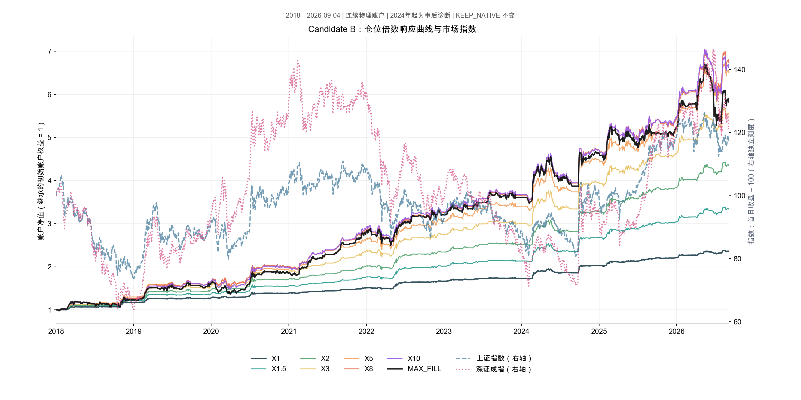
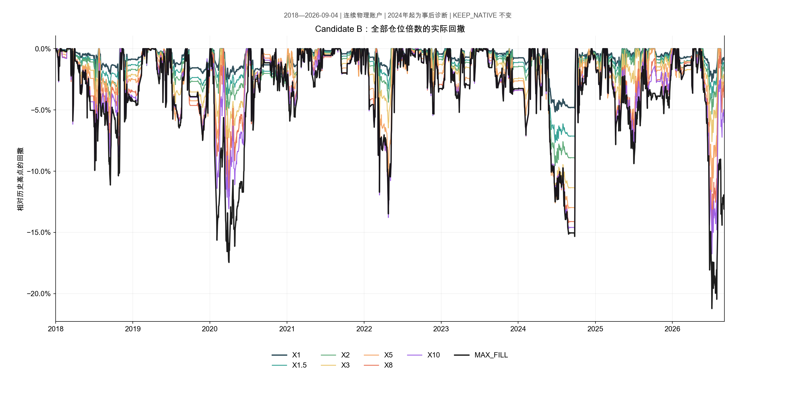
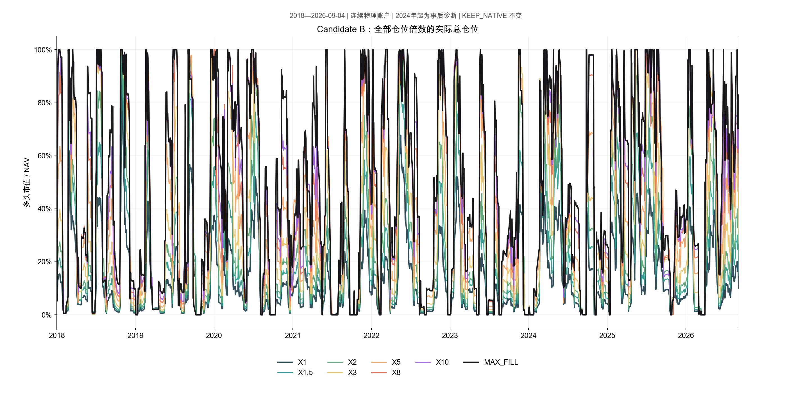

# Candidate B 仓位倍数响应曲线：独立诊断

本诊断已完成8个连续真实物理账户，期间2018-01-01至2026-09-04。**现有KEEP_NATIVE研究结论保持不变；没有优化X，没有选择新的生产或shadow参数。**

固定候选为R1_RP100_S10_F1。B_i按用户确认的当前诊断账户NAV和冻结B公式计算，有限档请求X×B_i；机会目标、单票尾部、账户尾部和family尾部软预算同步放大。10%单票准入上限、cash/gross、同票聚合、注册流动性和Native执行/退出保持不变。MAX_FILL取消全部RP/family软预算，仍按R1优先级、同分同比例和全部硬防线执行。

用户另明确确认：冻结原始信号来源，允许原生持仓状态改变合法请求。因此不把旧B逐请求列表当作新的准入过滤器。生产者、校准、R1、质量阈值、信号时钟均未修改；opportunity_population_audit.csv单列真实状态反馈造成的请求增减。初始继承NAV为4,904,782.129191859元，原持仓连续保留。

ETF的Native目标delta与注册窗口执行上限分开处理：前者参与B_i，后者保持原生50%分钟窗口和100股整手限制。否则把原有仓位目标当成不可扩张的流动性上限，会把纯定仓缩放机械压回原仓位。股票仍使用严格滞后20完整会话的有效原始amount，缺分母则使用原Native可执行金额；没有放大该fallback。

## 全期响应

| scale | CAGR | MaxDD | CVaR5 | Sharpe | average_gross | P95_gross | max_gross | cash_ratio |
| --- | --- | --- | --- | --- | --- | --- | --- | --- |
| X1 | 10.40% | 5.15% | 0.68% | 1.974 | 13.46% | 41.90% | 100.00% | 86.54% |
| X1.5 | 14.92% | 7.65% | 1.00% | 1.941 | 19.66% | 61.66% | 100.00% | 80.34% |
| X2 | 18.48% | 9.55% | 1.25% | 1.930 | 24.90% | 77.89% | 100.00% | 75.10% |
| X3 | 21.80% | 12.03% | 1.61% | 1.826 | 32.08% | 93.22% | 100.00% | 67.92% |
| X5 | 24.10% | 13.18% | 1.97% | 1.675 | 39.46% | 97.99% | 100.00% | 60.54% |
| X8 | 24.63% | 15.41% | 2.21% | 1.552 | 44.04% | 99.84% | 100.00% | 55.96% |
| X10 | 24.41% | 16.75% | 2.29% | 1.503 | 45.63% | 100.00% | 100.00% | 54.37% |
| MAX_FILL | 22.60% | 21.22% | 2.44% | 1.348 | 48.41% | 100.00% | 100.00% | 51.59% |

| scale | days_gross_gt25 | days_gross_gt50 | days_gross_gt75 | days_gross_gt90 | days_gross_ge99 | turnover | fees | worst_month | max_security | max_family |
| --- | --- | --- | --- | --- | --- | --- | --- | --- | --- | --- |
| X1 | 403 | 52 | 5 | 3 | 1 | 5.330 | 672,888.49 | -2.30% | 2.48% | 87.70% |
| X1.5 | 617 | 236 | 42 | 5 | 1 | 7.820 | 1,204,661.45 | -3.46% | 3.57% | 82.31% |
| X2 | 760 | 375 | 134 | 33 | 1 | 9.916 | 1,792,468.79 | -4.33% | 4.64% | 84.51% |
| X3 | 995 | 513 | 299 | 142 | 35 | 12.621 | 2,650,224.48 | -5.33% | 6.87% | 97.04% |
| X5 | 1205 | 722 | 401 | 225 | 86 | 15.309 | 3,570,679.90 | -6.51% | 10.29% | 100.00% |
| X8 | 1311 | 863 | 529 | 298 | 119 | 17.148 | 4,242,844.01 | -8.75% | 11.59% | 100.00% |
| X10 | 1347 | 920 | 555 | 329 | 137 | 17.721 | 4,403,289.99 | -9.72% | 11.69% | 100.00% |
| MAX_FILL | 1415 | 979 | 649 | 361 | 169 | 18.550 | 4,462,374.12 | -12.98% | 11.91% | 100.00% |

gross、现金比例、各阈值日数、单票/family峰值的主表口径为每日收盘；turnover是买卖双边金额/平均NAV/年，fees为累计人民币费用。所有Native盘中时点的单票峰值另见hard_defense_audit.csv。2026为YTD、CAGR年化；CVaR5为日收益最差5%均值的损失幅度。2024–2026仅为POST_HOC_ROLLFORWARD_DIAGNOSTIC。

## 对六个问题的回答

1. **平均仓位先快后慢。** X1→X2从13.46%到24.90%，增加11.43个百分点；X2→X3再增7.18个百分点；X3→X5再增7.38个百分点。X5→X10仅再增6.18个百分点，MAX_FILL也只到48.41%。更高的请求额越来越多地受到硬上限、流动性及合格机会时点/证券广度限制。

2. **在本次固定网格中，X8→X10首次出现CAGR下降。** X5、X8、X10分别为24.10%、24.63%、24.41%；MAX_FILL降至22.60%。这是响应曲线上的观察，不是选择X8，也不是声称网格之间存在已识别的最优点。平台点随时期改变：2022–2023在X5→X8下降，2024在X3→X5已下降，2026 YTD在X5→X8下降；发现期则仍随有限X增加。这进一步排除了把全期X8当成稳定最优参数的解释。

3. **不能把所有尾部风险写成某一X之后统一“加速”。** MaxDD/CVaR从X1.5即明显增加，但CVaR按每单位X的增量总体递减，未呈现全程凸性。MaxDD在X3→5较缓，X5→8的每单位X增幅又提高；更明确的是X5之后收益增量迅速变小，风险却继续恶化。X5→X10的CAGR仅增加0.31个百分点，而MaxDD增加3.57个百分点、CVaR5从1.97%升至2.29%；MAX_FILL为21.22%/2.44%。

4. **风险定仓显著压低了B的利用率，但不是唯一或最终瓶颈。** 原B的86.54%平均现金，在下面预声明顺序的归因中，19.46个百分点来自机会目标/单票尾部/总尾部软风险，family仅0.03个百分点；53.23个百分点来自10%单票约束与同刻可分散证券数不足，7.23来自流动性，6.60来自暂无合格请求/新释放现金等待。取消软预算的真实MAX_FILL账户仍有51.59%平均现金，说明不能靠继续放大RP解决全部闲置。不能把“没有合格请求”这一单列与“有合格请求、但证券数量不足以在10%上限下承接全账户”混为一谈。

5. **可阶段性使用大部分账户，不能稳定持续。** MAX_FILL在649/2106个交易日gross>75%（30.82%），361日>90%，169日≥99%（8.02%）；平均gross只有48.41%，超过50%的979日也少于一半。保持正质量门槛和硬防线，五个现有策略并不能持续承接大部分账户资金。此处“合格”是冻结研究门槛，不升级为预测质量或实盘保证。

6. **MAX_FILL是更高波动、较低风险调整表现的极端路径。** 全期CAGR22.60%、MaxDD21.22%、CVaR5 2.44%、Sharpe1.348、平均gross48.41%、P95/max gross100%，最差月-12.98%，累计费用约446.24万元。它比X8/X10收益低、回撤大；这是R1下硬约束尽量成交的诊断路径，不是收益上界或最优资产配置。

## 闲置现金归因

下表为每日归因现金/NAV的时间平均，合计等于对应平均现金比例。

| scale | NO_QUALIFYING_OPPORTUNITY | SINGLE_SECURITY_CAP | LIQUIDITY_CAP | GROSS_CAP | CASH_EXHAUSTED | SOFT_RISK_BUDGET | FAMILY_RISK_BUDGET |
| --- | --- | --- | --- | --- | --- | --- | --- |
| X1 | 6.60% | 53.23% | 7.23% | 0.00% | 0.00% | 19.46% | 0.03% |
| X1.5 | 9.03% | 48.03% | 7.25% | 0.00% | 0.00% | 16.00% | 0.03% |
| X2 | 11.13% | 43.56% | 7.47% | 0.00% | 0.00% | 12.94% | 0.00% |
| X3 | 13.70% | 38.46% | 6.97% | 0.00% | 0.00% | 8.80% | 0.00% |
| X5 | 15.91% | 33.50% | 6.36% | 0.00% | 0.00% | 4.78% | 0.00% |
| X8 | 17.02% | 31.11% | 5.81% | 0.00% | 0.00% | 2.02% | 0.00% |
| X10 | 17.42% | 30.05% | 5.69% | 0.00% | 0.00% | 1.21% | 0.00% |
| MAX_FILL | 18.21% | 28.53% | 4.85% | 0.00% | 0.00% | 0.00% | 0.00% |

方法是同一真实事前状态下的只读、按R1执行的嵌套资金可部署量归因：先单票上限，再注册流动性/执行规则，再机会目标及非family软风险，再family。不会执行这些归因中的假想订单，更不会由此生成新NAV。MAX_FILL的SOFT_RISK_BUDGET与FAMILY_RISK_BUDGET逐时点严格为0。

在无融资多头账户中gross与cash是同一可用资本约束；现金耗尽本身不会留下待归因的现金，因此GROSS_CAP和CASH_EXHAUSTED保留为0，不重复把同一资金限制记两次。整手/原生执行余数归LIQUIDITY_CAP，并另记native_execution_residual。新释放现金先记NO_QUALIFYING_OPPORTUNITY，等下一次合法请求再归因；其他原因随剩余现金保留到下一次分配。

这是顺序依赖的资金来源分解，不是唯一的因果识别或Shapley分解。约束引起重分配/整手变化时，少数日期有小额负交互项，未clip，文件有negative_interaction_days列；所有每日归因仍与实际现金对账。归因表同时给出平均NAV占比、闲置现金资本天占比及决策时点金额；这里的资本天为交易日收盘现金求和，不是包含周末的日历日积分。

## 硬防线与容量

所有新获资证券在时点完成后的占比≤10%，共19521次核查通过。既有持仓不会因新信号或X变化重归一；价格漂移可以使持有期间占比高于10%。MAX_FILL每日峰值11.91%，所有Native时点峰值12.02%，不是新订单突破10%。

所有事件级cash/gross/P&L/数量对账通过；沿用Native现金1e-8元数值容差，无现金裁剪、借款或保证金。实际最小现金-6.98491930962e-10元、最大gross 1.0000000000000002，保留浮点残差。

八档实际有可靠分母的股票订单/ADV20均不超过1%，ETF订单/注册窗口量均不超过50%。MAX_FILL的单笔订单/当日amount峰值为3.03%；当日amount只用于事后容量诊断，未用于准入。缺失ADV分母的订单数量单列，并执行未放大的Native金额fallback。没有冲击模型，不把容量占比称为实盘保证。

## 图表与完整交付

左轴：账户净值/继承初始权益。右轴：上证指数、深证成指，2018-01-02首日收盘归一100，使用独立刻度，因此不能直接用左右曲线的屏幕高度比较收益。指数来自本地QMT日线，仅用于展示，严格截断至2026-09-04；价格和文件哈希见benchmark_prices.csv与benchmark_manifest.json。

candidate_b_exposure_scale_metrics.csv包含8×6=48条分期记录；candidate_b_exposure_scale_yearly.csv包含8×9=72条逐年记录。每条记录覆盖全部要求的收益、尾部风险、仓位、阈值日数、换手、费用和集中度指标。容量按相同分期另列candidate_b_exposure_scale_capacity.csv。candidate_b_unused_cash_attribution.csv及各X的逐日/逐时点明细保留完整现金证据。

测试85项通过。X1的2106日全部日状态、成交、规范化Native callback state及完整终态与封存Candidate B精确相等。原研究全部交付文件和冻结生产者另由seal.py逐哈希复核，原KEEP_NATIVE不改写。复现见REPRODUCTION_COMMANDS.md，来源见input_manifest.json，全部交付哈希见output/output_manifest.sha256。
