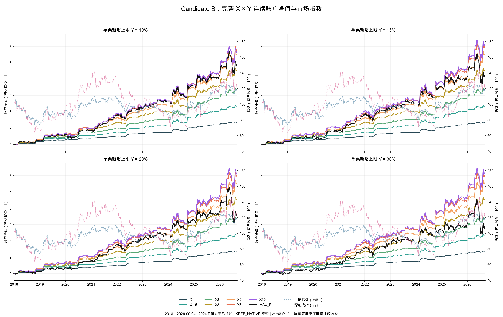
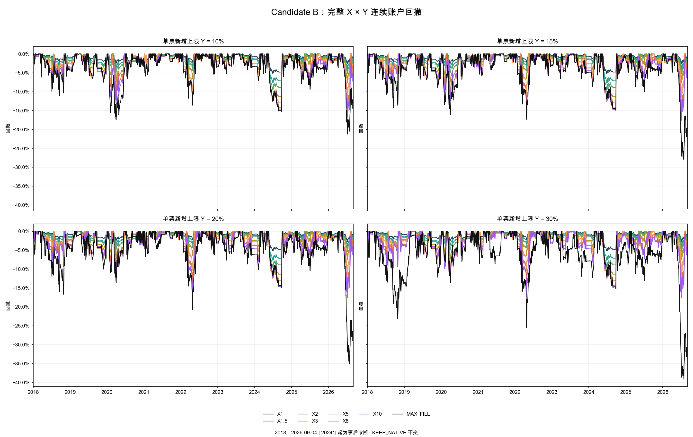

# Candidate B：X × 单票上限 Y 二维诊断

已完成32组真实连续账户：X=1、1.5、2、3、5、8、10、MAX_FILL，分别交叉Y=10%、15%、20%、30%。已有Y=10%八组及本轮先完成的MAX_FILL三组逐文件哈希复核后复用，另外21组均独立实际重跑。没有以净值相乘、收益拼接或静态生命周期加总代替账户。

相同X下，相较Y=10%，新增Y档位中同时满足“CAGR不低、MaxDD不高，且至少一项严格改善”的组合为：**无**。相等不算改善。此处只描述预定网格，不挑选或推广新的生产参数；原KEEP_NATIVE结论保持不变。

## 全期：每格为年化CAGR / 最大回撤

2018-01-01至2026-09-04，继承初始NAV/持仓连续运行。

| X | Y=10% | Y=15% | Y=20% | Y=30% |
| --- | --- | --- | --- | --- |
| X1 | 10.40% / 5.15% | 10.40% / 5.15% | 10.40% / 5.15% | 10.40% / 5.15% |
| X1.5 | 14.92% / 7.65% | 14.92% / 7.65% | 14.92% / 7.65% | 14.92% / 7.65% |
| X2 | 18.48% / 9.55% | 18.48% / 9.55% | 18.48% / 9.55% | 18.48% / 9.55% |
| X3 | 21.80% / 12.03% | 21.80% / 12.03% | 21.80% / 12.03% | 21.80% / 12.03% |
| X5 | 24.10% / 13.18% | 24.10% / 13.18% | 24.10% / 13.18% | 24.10% / 13.18% |
| X8 | 24.63% / 15.41% | 25.06% / 15.98% | 25.06% / 15.98% | 25.06% / 15.98% |
| X10 | 24.41% / 16.75% | 25.30% / 17.56% | 25.39% / 17.53% | 25.39% / 17.53% |
| MAX_FILL | 22.60% / 21.22% | 20.95% / 27.94% | 19.13% / 35.18% | 16.60% / 39.12% |

Y是单票新增仓位的硬上限，不是每只必须买到的目标。有限X仍保留按X缩放的机会、单票尾部、总尾部和family软风险预算。因此提高Y可能没有任何实际作用。MAX_FILL才取消这些软预算。

冻结校准中的最小尾部损失是5.75%，单票RP100尾部预算为0.09441549% NAV。由此，有限X下单票新增后暴露还受约X×1.6424%的软约束：X5约9.44%，X8约15.11%，X10约18.88%。所以Y20和Y30不一定产生差别。真实重跑的低X每日NAV、现金、gross、原生回调及最终账户完全一致；成交/分lot明细按绝对1e-10容差检查，实际最大差异另见nonbinding_Y_replay_validation.csv，不能把相等表格误解为未运行。

本次证据不支持通过单纯放宽单票上限来稳定地“保持利润、控制最大回撤”：X≤5不产生经济变化，X8/X10增加收益也增加全期回撤，MAX_FILL则收益下降且回撤明显扩大。年度效果并不一致，例如X10/Y20相对Y10在2020、2025年回撤较小，但2022年从13.79%扩大到17.39%。X10/Y20相对Y15有微小的收益/回撤双改善，但相对Y10仍是更高回撤，不能据此认定稳定风险改进。

## 全部32条曲线





每个Y面板都画出全部8个X，四个面板使用相同账户纵轴。指数使用独立右轴、首日收盘归一100；左右轴曲线高度不能直接比较收益。指数仅展示，复用前轮已校验的本地价格文件。

## 全部逐年最大回撤

每年以该年开始前的实际账户权益为起点计算年内峰谷回撤。全期MaxDD则保留跨年高点，所以二者不能互相替代。2026截至9月4日，2024–2026仍为事后诊断。

### X1：每年最大回撤

| year | Y=10% | Y=15% | Y=20% | Y=30% |
| --- | --- | --- | --- | --- |
| 2018 | 3.19% | 3.19% | 3.19% | 3.19% |
| 2019 | 2.14% | 2.14% | 2.14% | 2.14% |
| 2020 | 3.02% | 3.02% | 3.02% | 3.02% |
| 2021 | 0.91% | 0.91% | 0.91% | 0.91% |
| 2022 | 2.62% | 2.62% | 2.62% | 2.62% |
| 2023 | 1.18% | 1.18% | 1.18% | 1.18% |
| 2024 | 5.15% | 5.15% | 5.15% | 5.15% |
| 2025 | 1.52% | 1.52% | 1.52% | 1.52% |
| 2026 YTD | 2.69% | 2.69% | 2.69% | 2.69% |
### X1.5：每年最大回撤

| year | Y=10% | Y=15% | Y=20% | Y=30% |
| --- | --- | --- | --- | --- |
| 2018 | 4.11% | 4.11% | 4.11% | 4.11% |
| 2019 | 3.20% | 3.20% | 3.20% | 3.20% |
| 2020 | 4.41% | 4.41% | 4.41% | 4.41% |
| 2021 | 1.36% | 1.36% | 1.36% | 1.36% |
| 2022 | 3.72% | 3.72% | 3.72% | 3.72% |
| 2023 | 1.71% | 1.71% | 1.71% | 1.71% |
| 2024 | 7.65% | 7.65% | 7.65% | 7.65% |
| 2025 | 2.26% | 2.26% | 2.26% | 2.26% |
| 2026 YTD | 4.02% | 4.02% | 4.02% | 4.02% |
### X2：每年最大回撤

| year | Y=10% | Y=15% | Y=20% | Y=30% |
| --- | --- | --- | --- | --- |
| 2018 | 4.96% | 4.96% | 4.96% | 4.96% |
| 2019 | 3.81% | 3.81% | 3.81% | 3.81% |
| 2020 | 5.43% | 5.43% | 5.43% | 5.43% |
| 2021 | 1.79% | 1.79% | 1.79% | 1.79% |
| 2022 | 4.87% | 4.87% | 4.87% | 4.87% |
| 2023 | 2.11% | 2.11% | 2.11% | 2.11% |
| 2024 | 9.55% | 9.55% | 9.55% | 9.55% |
| 2025 | 2.97% | 2.97% | 2.97% | 2.97% |
| 2026 YTD | 5.34% | 5.34% | 5.34% | 5.34% |
### X3：每年最大回撤

| year | Y=10% | Y=15% | Y=20% | Y=30% |
| --- | --- | --- | --- | --- |
| 2018 | 6.58% | 6.58% | 6.58% | 6.58% |
| 2019 | 5.30% | 5.30% | 5.30% | 5.30% |
| 2020 | 8.06% | 8.06% | 8.06% | 8.06% |
| 2021 | 2.37% | 2.37% | 2.37% | 2.37% |
| 2022 | 7.15% | 7.15% | 7.15% | 7.15% |
| 2023 | 3.08% | 3.08% | 3.08% | 3.08% |
| 2024 | 12.03% | 12.03% | 12.03% | 12.03% |
| 2025 | 4.42% | 4.42% | 4.42% | 4.42% |
| 2026 YTD | 7.60% | 7.60% | 7.60% | 7.60% |
### X5：每年最大回撤

| year | Y=10% | Y=15% | Y=20% | Y=30% |
| --- | --- | --- | --- | --- |
| 2018 | 7.60% | 7.60% | 7.60% | 7.60% |
| 2019 | 6.34% | 6.34% | 6.34% | 6.34% |
| 2020 | 10.33% | 10.33% | 10.33% | 10.33% |
| 2021 | 3.30% | 3.30% | 3.30% | 3.30% |
| 2022 | 11.07% | 11.07% | 11.07% | 11.07% |
| 2023 | 4.23% | 4.23% | 4.23% | 4.23% |
| 2024 | 13.18% | 13.18% | 13.18% | 13.18% |
| 2025 | 6.41% | 6.41% | 6.41% | 6.41% |
| 2026 YTD | 11.68% | 11.68% | 11.68% | 11.68% |
### X8：每年最大回撤

| year | Y=10% | Y=15% | Y=20% | Y=30% |
| --- | --- | --- | --- | --- |
| 2018 | 9.00% | 9.00% | 9.00% | 9.00% |
| 2019 | 7.32% | 7.38% | 7.38% | 7.38% |
| 2020 | 11.64% | 12.05% | 12.05% | 12.05% |
| 2021 | 2.57% | 2.53% | 2.53% | 2.53% |
| 2022 | 13.45% | 14.56% | 14.56% | 14.56% |
| 2023 | 4.72% | 5.18% | 5.18% | 5.18% |
| 2024 | 14.35% | 14.57% | 14.57% | 14.57% |
| 2025 | 7.33% | 7.21% | 7.21% | 7.21% |
| 2026 YTD | 15.41% | 15.98% | 15.98% | 15.98% |
### X10：每年最大回撤

| year | Y=10% | Y=15% | Y=20% | Y=30% |
| --- | --- | --- | --- | --- |
| 2018 | 9.35% | 9.74% | 9.74% | 9.74% |
| 2019 | 6.87% | 6.99% | 7.02% | 7.02% |
| 2020 | 13.08% | 12.42% | 12.31% | 12.31% |
| 2021 | 2.78% | 2.73% | 2.72% | 2.72% |
| 2022 | 13.79% | 17.35% | 17.39% | 17.39% |
| 2023 | 4.81% | 5.51% | 5.64% | 5.64% |
| 2024 | 14.84% | 15.02% | 14.93% | 14.93% |
| 2025 | 8.28% | 7.23% | 7.21% | 7.21% |
| 2026 YTD | 16.75% | 17.56% | 17.53% | 17.53% |
### MAX_FILL：每年最大回撤

| year | Y=10% | Y=15% | Y=20% | Y=30% |
| --- | --- | --- | --- | --- |
| 2018 | 11.13% | 14.19% | 16.69% | 23.13% |
| 2019 | 7.49% | 8.97% | 10.00% | 12.15% |
| 2020 | 17.45% | 16.16% | 13.62% | 13.59% |
| 2021 | 3.91% | 5.91% | 6.78% | 8.61% |
| 2022 | 13.49% | 17.28% | 20.82% | 25.58% |
| 2023 | 5.20% | 6.56% | 8.68% | 11.95% |
| 2024 | 15.33% | 14.84% | 14.85% | 15.26% |
| 2025 | 9.38% | 9.99% | 10.42% | 13.02% |
| 2026 YTD | 21.22% | 27.94% | 35.18% | 39.12% |

## 冻结与审计边界

Candidate B的信号来源、R1、发现期校准、正质量门槛、原生时钟和退出不变；按用户已确认口径允许原生持仓状态反馈改变后续合法请求。有限X的B_i由当前诊断账户NAV按冻结B公式计算，仅新增/增持目标乘X，已有仓位不重归一。总gross≤100%、现金不融资、同票聚合和注册流动性/执行限制不变，Y是唯一新增的硬约束实验维度。

每个新获资证券的时点完成占比均不超过对应Y，后续价格漂移可能使已有持仓超过Y，不强行退出。全部32组现金/gross/P&L、正质量准入及注册流动性检查通过；MAX_FILL的两类软预算均为0。沿用Native现金1e-8元数值容差，无clip、借款或保证金。

120项测试通过，442个注册输入哈希通过。前一轮仓位倍数研究文件哈希保持不变；本轮账户路径、生成身份和文件哈希见account_run_manifest.json。大体积账户缓存留在本地且不进入Git，代码、合同、完整结果和摘要清单进入Git。

## 文件与复现

- candidate_b_xy_full_metrics.csv：32组全期CAGR、MaxDD、CVaR5、Sharpe、平均gross、现金、费用、换手等。
- candidate_b_xy_yearly_metrics.csv：288条逐年记录，含实际收益、年化CAGR、MaxDD等；2026的年化不代表全年已实现收益。
- candidate_b_xy_cagr_matrix.csv / candidate_b_xy_max_drawdown_matrix.csv：完整二维矩阵。
- candidate_b_xy_yearly_max_drawdown.csv：全部逐年回撤矩阵。
- paired_Y_effects.csv：同X下相对Y10的收益/回撤变化，不是参数优化。
- account_validation.csv / liquidity_validation.csv / nonbinding_Y_replay_validation.csv：账户、流动性及低X不绑定路径核对。

```sh
PYTHONPATH=.:src /opt/anaconda3/bin/python -m research.unified_opportunity_risk_v1.max_fill_security_cap.run
PYTHONPATH=.:src /opt/anaconda3/bin/python -m research.unified_opportunity_risk_v1.max_fill_security_cap.grid
PYTHONPATH=.:src /opt/anaconda3/bin/python -m research.unified_opportunity_risk_v1.max_fill_security_cap.analyze
PYTHONPATH=.:src /opt/anaconda3/bin/python -m research.unified_opportunity_risk_v1.max_fill_security_cap.plot
PYTHONPATH=.:src /opt/anaconda3/bin/python -m research.unified_opportunity_risk_v1.max_fill_security_cap.report
```

run.py只负责MAX_FILL三组，是网格的一个子集；grid.py补齐其他21组。grid_contract.json是最终用户更正后的研究合同，contract.json保留三个已运行MAX_FILL账户的原始生成身份，不改写历史receipt。
