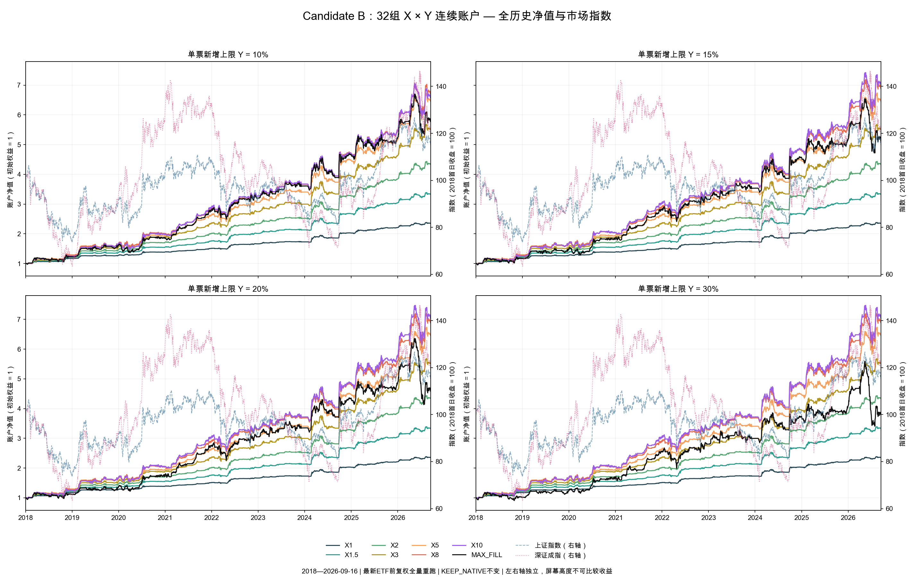
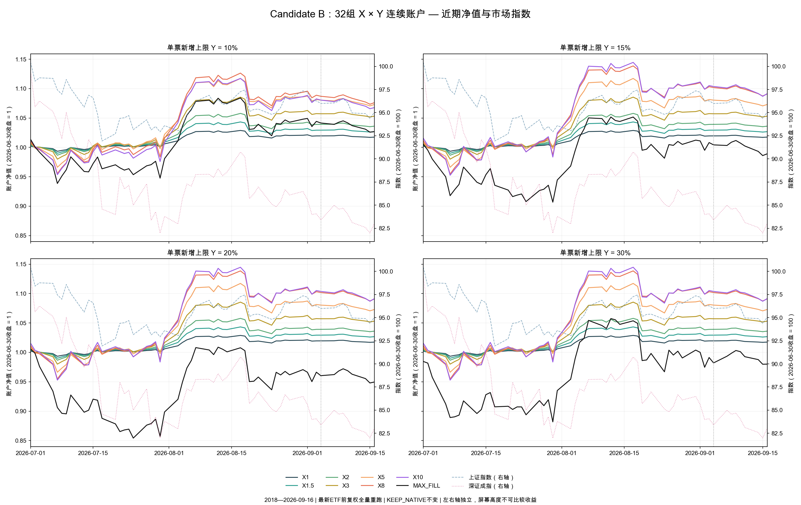
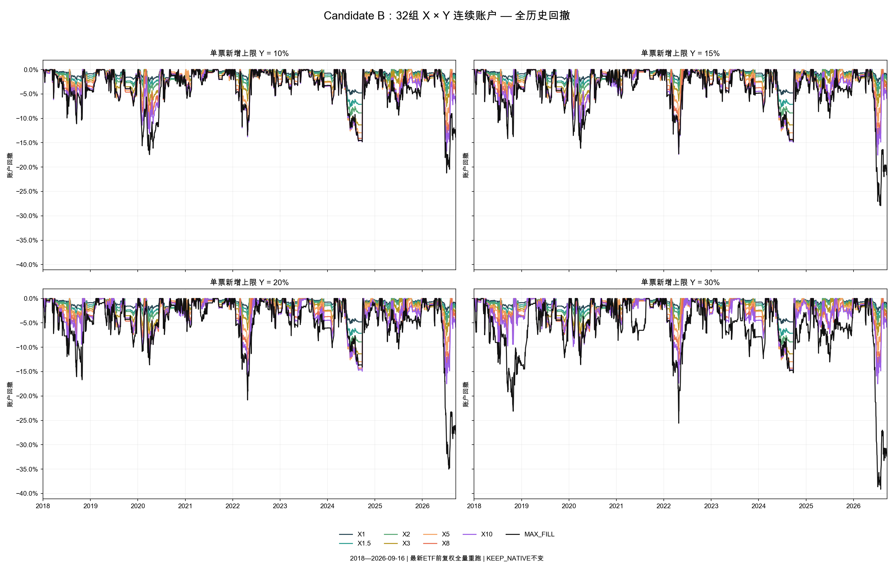
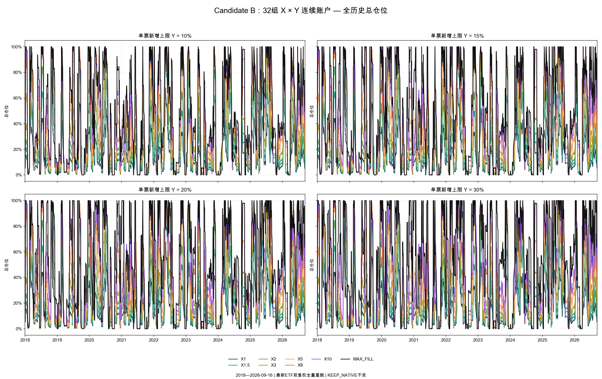

# Candidate B：32组 X × Y 更新至 2026-09-16

本次是冻结 Candidate B 的曝光响应曲线诊断。全部账户从 2018 年连续重跑；不挑选最优 X，不修改 KEEP_NATIVE。

数据采集时为 2026-09-17 盘中，统一使用最近完整交易日 2026-09-16。每个账户延续实际现金、持仓与原生状态；年度指标是连续账户切片，未按年重置本金。

## 32组全期结果

表格每格为 **CAGR / 最大回撤**。Y 是新增／增加请求的单只证券硬上限；原生持仓被动价格漂移继续沿用冻结规则。

| X        | Y=10%           | Y=15%           | Y=20%           | Y=30%           |
|:---------|:----------------|:----------------|:----------------|:----------------|
| X1       | 10.33% / 5.15%  | 10.33% / 5.15%  | 10.33% / 5.15%  | 10.33% / 5.15%  |
| X1.5     | 14.83% / 7.65%  | 14.83% / 7.65%  | 14.83% / 7.65%  | 14.83% / 7.65%  |
| X2       | 18.37% / 9.55%  | 18.37% / 9.55%  | 18.37% / 9.55%  | 18.37% / 9.55%  |
| X3       | 21.66% / 12.03% | 21.66% / 12.03% | 21.66% / 12.03% | 21.66% / 12.03% |
| X5       | 23.91% / 13.18% | 23.91% / 13.18% | 23.91% / 13.18% | 23.91% / 13.18% |
| X8       | 24.44% / 15.38% | 24.84% / 15.97% | 24.84% / 15.97% | 24.84% / 15.97% |
| X10      | 24.15% / 16.75% | 25.06% / 17.55% | 25.16% / 17.51% | 25.16% / 17.51% |
| MAX_FILL | 22.31% / 21.22% | 20.70% / 27.92% | 19.13% / 35.01% | 16.51% / 39.14% |

## 全期净值与市场指数

每个 Y 面板叠加全部 8 个 X；左轴账户净值，右轴上证指数、深证成指（2018首日收盘归一为100）。左右轴独立，不能比较屏幕高度。指数只用于展示。

## 近期放大

## 全期回撤

## 仓位响应

Y=10% 的响应曲线：

| X        | CAGR   | MaxDD   | CVaR5   |   Sharpe | average_gross   | P95_gross   | max_gross   | cash_ratio   |   days_gross_gt25 |   days_gross_gt50 |   days_gross_gt75 |   days_gross_gt90 |   days_gross_ge99 |
|:---------|:-------|:--------|:--------|---------:|:----------------|:------------|:------------|:-------------|------------------:|------------------:|------------------:|------------------:|------------------:|
| X1       | 10.33% | 5.15%   | 0.68%   |  1.9658  | 13.44%          | 41.85%      | 100.00%     | 86.56%       |               403 |                52 |                 5 |                 3 |                 1 |
| X1.5     | 14.83% | 7.65%   | 1.00%   |  1.93315 | 19.63%          | 61.62%      | 100.00%     | 80.37%       |               617 |               236 |                42 |                 5 |                 1 |
| X2       | 18.37% | 9.55%   | 1.25%   |  1.92314 | 24.86%          | 77.85%      | 100.00%     | 75.14%       |               760 |               375 |               134 |                33 |                 1 |
| X3       | 21.66% | 12.03%  | 1.61%   |  1.81855 | 32.03%          | 93.18%      | 100.00%     | 67.97%       |               997 |               513 |               299 |               142 |                35 |
| X5       | 23.91% | 13.18%  | 1.97%   |  1.66617 | 39.43%          | 97.97%      | 100.00%     | 60.57%       |              1210 |               722 |               401 |               225 |                86 |
| X8       | 24.44% | 15.38%  | 2.20%   |  1.54514 | 44.00%          | 99.81%      | 100.00%     | 56.00%       |              1319 |               865 |               528 |               297 |               119 |
| X10      | 24.15% | 16.75%  | 2.29%   |  1.49162 | 45.65%          | 100.00%     | 100.00%     | 54.35%       |              1355 |               925 |               555 |               329 |               137 |
| MAX_FILL | 22.31% | 21.22%  | 2.44%   |  1.33584 | 48.50%          | 100.00%     | 100.00%     | 51.50%       |              1434 |               984 |               649 |               361 |               167 |

## 历史重算和新增交易日分开解释

按用户确认，采用最新 ETF 前复权数据从 2018 年完整重跑。8只 ETF 新增分红／拆分引起历史前复权价格变化；其余策略、参数、校准、信号时点与原生退出规则未改。历史分钟行情采用已登记原始分钟记录，用新发生的实际分红／拆分事实更新复权列，并与新 QMT 可取重叠区间核对；未伪造早期原始分钟行情。股票维持原算法的原始价格与 QD010 因果坐标，9月4日以前输入逐行保持一致。

重算旧区间（截至9月4日）的 CAGR 变化范围为 +0.0023 至 +0.2291 个百分点，最大回撤变化范围为 -0.1744 至 +0.0116 个百分点。这部分不能解释为9月新赚取的收益。

9月7日至16日是8个新增交易日，单列实际区间收益，避免将短区间年化当作策略表现。公告沿用PIT-B当前历史快照与保守可用时间，不声称拥有严格归档PIT-A证据。

| X        | Y      |   CAGR_revision_pp |   MaxDD_revision_pp | new_period_return   | new_period_MaxDD   |
|:---------|:-------|-------------------:|--------------------:|:--------------------|:-------------------|
| X1       | 10.00% |         0.00227599 |        -2.92513e-09 | -0.20%              | 0.34%              |
| X1       | 15.00% |         0.00227599 |        -2.92513e-09 | -0.20%              | 0.34%              |
| X1       | 20.00% |         0.00227599 |        -2.92513e-09 | -0.20%              | 0.34%              |
| X1       | 30.00% |         0.00227599 |        -2.92513e-09 | -0.20%              | 0.34%              |
| X1.5     | 10.00% |         0.00339598 |        -5.5563e-09  | -0.25%              | 0.47%              |
| X1.5     | 15.00% |         0.00339598 |        -5.5563e-09  | -0.25%              | 0.47%              |
| X1.5     | 20.00% |         0.00339598 |        -5.5563e-09  | -0.25%              | 0.47%              |
| X1.5     | 30.00% |         0.00339598 |        -5.5563e-09  | -0.25%              | 0.47%              |
| X2       | 10.00% |         0.00545453 |        -1.34743e-08 | -0.29%              | 0.58%              |
| X2       | 15.00% |         0.00545453 |        -1.34743e-08 | -0.29%              | 0.58%              |
| X2       | 20.00% |         0.00545453 |        -1.34743e-08 | -0.29%              | 0.58%              |
| X2       | 30.00% |         0.00545453 |        -1.34743e-08 | -0.29%              | 0.58%              |
| X3       | 10.00% |         0.00801684 |        -5.62584e-08 | -0.38%              | 0.77%              |
| X3       | 15.00% |         0.00801684 |        -5.62584e-08 | -0.38%              | 0.77%              |
| X3       | 20.00% |         0.00801684 |        -5.62584e-08 | -0.38%              | 0.77%              |
| X3       | 30.00% |         0.00801684 |        -5.62584e-08 | -0.38%              | 0.77%              |
| X5       | 10.00% |         0.0119246  |        -3.07129e-08 | -0.69%              | 1.15%              |
| X5       | 15.00% |         0.0119246  |        -3.07129e-08 | -0.69%              | 1.15%              |
| X5       | 20.00% |         0.0119246  |        -3.07129e-08 | -0.69%              | 1.15%              |
| X5       | 30.00% |         0.0119246  |        -3.07129e-08 | -0.69%              | 1.15%              |
| X8       | 10.00% |         0.0649477  |        -0.030548    | -1.00%              | 1.47%              |
| X8       | 15.00% |         0.0229816  |        -0.0107578   | -0.98%              | 1.54%              |
| X8       | 20.00% |         0.0229816  |        -0.0107578   | -0.98%              | 1.54%              |
| X8       | 30.00% |         0.0229816  |        -0.0107578   | -0.98%              | 1.54%              |
| X10      | 10.00% |         0.0158985  |        -0.00673005  | -1.18%              | 1.58%              |
| X10      | 15.00% |         0.0313543  |        -0.0133416   | -1.12%              | 1.78%              |
| X10      | 20.00% |         0.0333816  |        -0.0140049   | -1.12%              | 1.78%              |
| X10      | 30.00% |         0.0333816  |        -0.0140049   | -1.12%              | 1.78%              |
| MAX_FILL | 10.00% |         0.00396315 |        -0.000491845 | -1.40%              | 1.84%              |
| MAX_FILL | 15.00% |         0.0449814  |        -0.0220229   | -1.52%              | 2.54%              |
| MAX_FILL | 20.00% |         0.229077   |        -0.174434    | -1.12%              | 2.48%              |
| MAX_FILL | 30.00% |         0.0131465  |         0.0116055   | -0.21%              | 2.33%              |

## 每年最大回撤

2026为截至9月16日的YTD；所有年份以年初权益作为回撤起点，不将跨年高水位带入年度最大回撤。全期最大回撤另外保留跨年高水位。

### X1

|   year | Y=10%   | Y=15%   | Y=20%   | Y=30%   |
|-------:|:--------|:--------|:--------|:--------|
|   2018 | 3.19%   | 3.19%   | 3.19%   | 3.19%   |
|   2019 | 2.14%   | 2.14%   | 2.14%   | 2.14%   |
|   2020 | 3.02%   | 3.02%   | 3.02%   | 3.02%   |
|   2021 | 0.91%   | 0.91%   | 0.91%   | 0.91%   |
|   2022 | 2.62%   | 2.62%   | 2.62%   | 2.62%   |
|   2023 | 1.18%   | 1.18%   | 1.18%   | 1.18%   |
|   2024 | 5.15%   | 5.15%   | 5.15%   | 5.15%   |
|   2025 | 1.52%   | 1.52%   | 1.52%   | 1.52%   |
|   2026 | 2.69%   | 2.69%   | 2.69%   | 2.69%   |

### X1.5

|   year | Y=10%   | Y=15%   | Y=20%   | Y=30%   |
|-------:|:--------|:--------|:--------|:--------|
|   2018 | 4.11%   | 4.11%   | 4.11%   | 4.11%   |
|   2019 | 3.20%   | 3.20%   | 3.20%   | 3.20%   |
|   2020 | 4.41%   | 4.41%   | 4.41%   | 4.41%   |
|   2021 | 1.36%   | 1.36%   | 1.36%   | 1.36%   |
|   2022 | 3.72%   | 3.72%   | 3.72%   | 3.72%   |
|   2023 | 1.71%   | 1.71%   | 1.71%   | 1.71%   |
|   2024 | 7.65%   | 7.65%   | 7.65%   | 7.65%   |
|   2025 | 2.26%   | 2.26%   | 2.26%   | 2.26%   |
|   2026 | 4.02%   | 4.02%   | 4.02%   | 4.02%   |

### X2

|   year | Y=10%   | Y=15%   | Y=20%   | Y=30%   |
|-------:|:--------|:--------|:--------|:--------|
|   2018 | 4.96%   | 4.96%   | 4.96%   | 4.96%   |
|   2019 | 3.81%   | 3.81%   | 3.81%   | 3.81%   |
|   2020 | 5.43%   | 5.43%   | 5.43%   | 5.43%   |
|   2021 | 1.79%   | 1.79%   | 1.79%   | 1.79%   |
|   2022 | 4.87%   | 4.87%   | 4.87%   | 4.87%   |
|   2023 | 2.11%   | 2.11%   | 2.11%   | 2.11%   |
|   2024 | 9.55%   | 9.55%   | 9.55%   | 9.55%   |
|   2025 | 2.97%   | 2.97%   | 2.97%   | 2.97%   |
|   2026 | 5.34%   | 5.34%   | 5.34%   | 5.34%   |

### X3

|   year | Y=10%   | Y=15%   | Y=20%   | Y=30%   |
|-------:|:--------|:--------|:--------|:--------|
|   2018 | 6.58%   | 6.58%   | 6.58%   | 6.58%   |
|   2019 | 5.30%   | 5.30%   | 5.30%   | 5.30%   |
|   2020 | 8.06%   | 8.06%   | 8.06%   | 8.06%   |
|   2021 | 2.37%   | 2.37%   | 2.37%   | 2.37%   |
|   2022 | 7.15%   | 7.15%   | 7.15%   | 7.15%   |
|   2023 | 3.08%   | 3.08%   | 3.08%   | 3.08%   |
|   2024 | 12.03%  | 12.03%  | 12.03%  | 12.03%  |
|   2025 | 4.42%   | 4.42%   | 4.42%   | 4.42%   |
|   2026 | 7.60%   | 7.60%   | 7.60%   | 7.60%   |

### X5

|   year | Y=10%   | Y=15%   | Y=20%   | Y=30%   |
|-------:|:--------|:--------|:--------|:--------|
|   2018 | 7.60%   | 7.60%   | 7.60%   | 7.60%   |
|   2019 | 6.34%   | 6.34%   | 6.34%   | 6.34%   |
|   2020 | 10.33%  | 10.33%  | 10.33%  | 10.33%  |
|   2021 | 3.30%   | 3.30%   | 3.30%   | 3.30%   |
|   2022 | 11.07%  | 11.07%  | 11.07%  | 11.07%  |
|   2023 | 4.23%   | 4.23%   | 4.23%   | 4.23%   |
|   2024 | 13.18%  | 13.18%  | 13.18%  | 13.18%  |
|   2025 | 6.41%   | 6.41%   | 6.41%   | 6.41%   |
|   2026 | 11.68%  | 11.68%  | 11.68%  | 11.68%  |

### X8

|   year | Y=10%   | Y=15%   | Y=20%   | Y=30%   |
|-------:|:--------|:--------|:--------|:--------|
|   2018 | 8.95%   | 9.00%   | 9.00%   | 9.00%   |
|   2019 | 7.32%   | 7.38%   | 7.38%   | 7.38%   |
|   2020 | 11.64%  | 12.05%  | 12.05%  | 12.05%  |
|   2021 | 2.56%   | 2.53%   | 2.53%   | 2.53%   |
|   2022 | 13.45%  | 14.56%  | 14.56%  | 14.56%  |
|   2023 | 4.72%   | 5.18%   | 5.18%   | 5.18%   |
|   2024 | 14.35%  | 14.57%  | 14.57%  | 14.57%  |
|   2025 | 7.44%   | 7.21%   | 7.21%   | 7.21%   |
|   2026 | 15.38%  | 15.97%  | 15.97%  | 15.97%  |

### X10

|   year | Y=10%   | Y=15%   | Y=20%   | Y=30%   |
|-------:|:--------|:--------|:--------|:--------|
|   2018 | 9.35%   | 9.74%   | 9.74%   | 9.74%   |
|   2019 | 6.87%   | 6.99%   | 7.02%   | 7.02%   |
|   2020 | 13.08%  | 12.42%  | 12.31%  | 12.31%  |
|   2021 | 2.78%   | 2.73%   | 2.72%   | 2.72%   |
|   2022 | 13.79%  | 17.40%  | 17.35%  | 17.35%  |
|   2023 | 4.81%   | 5.51%   | 5.64%   | 5.64%   |
|   2024 | 14.84%  | 14.95%  | 14.92%  | 14.92%  |
|   2025 | 8.28%   | 7.23%   | 7.21%   | 7.21%   |
|   2026 | 16.75%  | 17.55%  | 17.51%  | 17.51%  |

### MAX_FILL

|   year | Y=10%   | Y=15%   | Y=20%   | Y=30%   |
|-------:|:--------|:--------|:--------|:--------|
|   2018 | 11.13%  | 14.19%  | 16.69%  | 23.13%  |
|   2019 | 7.49%   | 8.97%   | 10.00%  | 12.15%  |
|   2020 | 17.45%  | 16.16%  | 13.62%  | 13.59%  |
|   2021 | 3.91%   | 5.91%   | 6.78%   | 8.61%   |
|   2022 | 13.49%  | 17.28%  | 20.82%  | 25.58%  |
|   2023 | 5.20%   | 6.56%   | 8.68%   | 11.95%  |
|   2024 | 14.83%  | 14.76%  | 14.07%  | 15.26%  |
|   2025 | 9.35%   | 9.99%   | 10.36%  | 13.02%  |
|   2026 | 21.22%  | 27.92%  | 35.01%  | 39.14%  |

## 闲置现金归因

沿用原有同一时点、只读的约束放松瀑布，并追踪至每日收盘。各分类金额合计等于实际闲置现金；属于顺序相关的有符号归因，不是 Shapley 因果分解。SOFT_RISK_BUDGET 包含有限X目标大小及软风险约束的限制；不得把它解释为只有组合总风险预算一个因素。

MAX_FILL 不使用软风险／家族风险预算，这两列必须为零。GROSS_CAP、CASH_EXHAUSTED 对剩余现金的金额归因可能为零；零不表示回测取消了这些硬约束。

| X        | reason                    | average_cash_NAV_share   | share_of_unused_cash_NAV_days   |
|:---------|:--------------------------|:-------------------------|:--------------------------------|
| X1       | NO_QUALIFYING_OPPORTUNITY | 6.59%                    | 7.61%                           |
| X1       | SINGLE_SECURITY_CAP       | 53.28%                   | 61.55%                          |
| X1       | LIQUIDITY_CAP             | 7.25%                    | 8.38%                           |
| X1       | GROSS_CAP                 | 0.00%                    | 0.00%                           |
| X1       | CASH_EXHAUSTED            | 0.00%                    | 0.00%                           |
| X1       | SOFT_RISK_BUDGET          | 19.42%                   | 22.43%                          |
| X1       | FAMILY_RISK_BUDGET        | 0.03%                    | 0.03%                           |
| X1.5     | NO_QUALIFYING_OPPORTUNITY | 9.02%                    | 11.22%                          |
| X1.5     | SINGLE_SECURITY_CAP       | 48.08%                   | 59.82%                          |
| X1.5     | LIQUIDITY_CAP             | 7.28%                    | 9.05%                           |
| X1.5     | GROSS_CAP                 | 0.00%                    | 0.00%                           |
| X1.5     | CASH_EXHAUSTED            | 0.00%                    | 0.00%                           |
| X1.5     | SOFT_RISK_BUDGET          | 15.97%                   | 19.86%                          |
| X1.5     | FAMILY_RISK_BUDGET        | 0.03%                    | 0.04%                           |
| X2       | NO_QUALIFYING_OPPORTUNITY | 11.11%                   | 14.78%                          |
| X2       | SINGLE_SECURITY_CAP       | 43.62%                   | 58.04%                          |
| X2       | LIQUIDITY_CAP             | 7.50%                    | 9.99%                           |
| X2       | GROSS_CAP                 | 0.00%                    | 0.00%                           |
| X2       | CASH_EXHAUSTED            | 0.00%                    | 0.00%                           |
| X2       | SOFT_RISK_BUDGET          | 12.91%                   | 17.18%                          |
| X2       | FAMILY_RISK_BUDGET        | -0.00%                   | -0.00%                          |
| X3       | NO_QUALIFYING_OPPORTUNITY | 13.67%                   | 20.11%                          |
| X3       | SINGLE_SECURITY_CAP       | 38.51%                   | 56.66%                          |
| X3       | LIQUIDITY_CAP             | 7.01%                    | 10.31%                          |
| X3       | GROSS_CAP                 | 0.00%                    | 0.00%                           |
| X3       | CASH_EXHAUSTED            | 0.00%                    | 0.00%                           |
| X3       | SOFT_RISK_BUDGET          | 8.78%                    | 12.92%                          |
| X3       | FAMILY_RISK_BUDGET        | 0.00%                    | 0.00%                           |
| X5       | NO_QUALIFYING_OPPORTUNITY | 15.87%                   | 26.20%                          |
| X5       | SINGLE_SECURITY_CAP       | 33.52%                   | 55.34%                          |
| X5       | LIQUIDITY_CAP             | 6.41%                    | 10.58%                          |
| X5       | GROSS_CAP                 | 0.00%                    | 0.00%                           |
| X5       | CASH_EXHAUSTED            | 0.00%                    | 0.00%                           |
| X5       | SOFT_RISK_BUDGET          | 4.77%                    | 7.88%                           |
| X5       | FAMILY_RISK_BUDGET        | 0.00%                    | 0.00%                           |
| X8       | NO_QUALIFYING_OPPORTUNITY | 16.95%                   | 30.27%                          |
| X8       | SINGLE_SECURITY_CAP       | 31.14%                   | 55.60%                          |
| X8       | LIQUIDITY_CAP             | 5.89%                    | 10.51%                          |
| X8       | GROSS_CAP                 | 0.00%                    | 0.00%                           |
| X8       | CASH_EXHAUSTED            | 0.00%                    | 0.00%                           |
| X8       | SOFT_RISK_BUDGET          | 2.02%                    | 3.61%                           |
| X8       | FAMILY_RISK_BUDGET        | 0.00%                    | 0.00%                           |
| X10      | NO_QUALIFYING_OPPORTUNITY | 17.38%                   | 31.97%                          |
| X10      | SINGLE_SECURITY_CAP       | 30.03%                   | 55.25%                          |
| X10      | LIQUIDITY_CAP             | 5.74%                    | 10.56%                          |
| X10      | GROSS_CAP                 | 0.00%                    | 0.00%                           |
| X10      | CASH_EXHAUSTED            | 0.00%                    | 0.00%                           |
| X10      | SOFT_RISK_BUDGET          | 1.21%                    | 2.22%                           |
| X10      | FAMILY_RISK_BUDGET        | -0.00%                   | -0.00%                          |
| MAX_FILL | NO_QUALIFYING_OPPORTUNITY | 18.20%                   | 35.34%                          |
| MAX_FILL | SINGLE_SECURITY_CAP       | 28.40%                   | 55.14%                          |
| MAX_FILL | LIQUIDITY_CAP             | 4.90%                    | 9.52%                           |
| MAX_FILL | GROSS_CAP                 | 0.00%                    | 0.00%                           |
| MAX_FILL | CASH_EXHAUSTED            | 0.00%                    | 0.00%                           |
| MAX_FILL | SOFT_RISK_BUDGET          | 0.00%                    | 0.00%                           |
| MAX_FILL | FAMILY_RISK_BUDGET        | 0.00%                    | 0.00%                           |

## 数据和账户验证

- 冻结股票人口3,725只；新增区间日期快照中的3,712只逐日核对。QMT与另一已保存来源比较2,511只、20,061个股票日记录，价格及量额一致性门槛通过。停牌缺失报价保留NULL且不可交易。股票报价按分规范化，消除API二进制浮点尾差导致的零宽假缺口。

- 90条新增公司行动事实来自原登记的巨潮接口；原有记录保留。全部未解释参考价跳变清零。中国平安0.98元分红另与发行人实施公告核对，按原生登记日权益与支付日计入现金。

- 新增两个日线缺口候选均补齐120天、每日241条的一分钟历史；一个通过原门槛。新中际旭创请求通过官方120天公告窗口的冻结IFCGR分类，退出按Native规则持续跟踪，截至数据终点仍持有。

- QMT取不到独立换手率字段，采用原登记的数据构建器既有缺失换手率分支，不推算流通股本。ST历史状态不能确认的行按原质量门槛排除；没有降低门槛。

- 逐账户验证现金非负、总敞口不超NAV、PnL守恒、新增证券上限、同证券合并、登记流动性限制、正质量门槛和实际持仓公司行动。

- 容量表提供登记执行限额使用率及请求/成交数量；未拟合额外冲击模型，不声称任意大本金都能复制收益。

发行人分红依据：[中国平安2026年半年度权益分派实施公告](https://file.finance.sina.com.cn/211.154.219.97:9494/MRGG/CNSESH_STOCK/2026/2026-9/2026-09-03/12580396.PDF)。

## 可复核文件

- `output/candidate_b_xy_full_metrics.csv`：32组全期指标。

- `output/candidate_b_xy_yearly_metrics.csv`：288组年度指标，含实际收益与年化指标。

- `output/candidate_b_exposure_scale_metrics.csv`：六个指定时间区间 × 32组。

- `output/candidate_b_unused_cash_attribution.csv`：七项现金归因。

- `output/history_revision_and_new_period.csv`：旧历史重算影响与新增8日收益拆开。

- `input_manifest.json`、`contract.json`、`output/account_run_manifest.json`、`output/account_validation.csv`：输入与实际运行证据。

## 对六个问题的直接回答

**1. 平均仓位随X提高有多快？** Y=10%时：X1：13.44%；X1.5：19.63%；X2：24.86%；X3：32.03%；X5：39.43%；X8：44.00%；X10：45.65%；MAX_FILL：48.50%。这是真实连续账户平均仓位，不是目标仓位。

**2. 从哪个X开始追加资金不再提高CAGR？** Y=10%时，在本次离散网格中，首次出现相邻X提高但CAGR不再提高的是 X10；这只是响应曲线观测，不是最优参数选择。 Y=15%、20%、30%的有限X网格内仍上升至X10，但增益已很小；所有Y切到MAX_FILL后CAGR都下降。

**3. MaxDD／CVaR何时加速？** 没有共同、持续的加速拐点。Y=10%时，MaxDD每增加1单位X的增量从X3→5约0.576个百分点，回升到X5→8约0.732个百分点；但CVaR5每单位X增幅继续递减，不能称为同步加速。实际值得注意的是X5以后新增收益趋缓，而风险仍增加：X5→8 CAGR仅增加0.53个百分点，MaxDD增加2.20个百分点；X8→10 CAGR下降0.29个百分点，MaxDD再增加1.37个百分点。下表列出原始增量，避免拟合精确风险阈值。

| X    | CAGR增量       | MaxDD增量      | CVaR5增量      | 平均仓位增量   |
|:-----|:---------------|:---------------|:---------------|:---------------|
| X1.5 | +4.499个百分点 | +2.498个百分点 | +0.317个百分点 | +6.184个百分点 |
| X2   | +3.540个百分点 | +1.904个百分点 | +0.257个百分点 | +5.232个百分点 |
| X3   | +3.290个百分点 | +2.474个百分点 | +0.356个百分点 | +7.176个百分点 |
| X5   | +2.254个百分点 | +1.152个百分点 | +0.364个百分点 | +7.394个百分点 |
| X8   | +0.529个百分点 | +2.195个百分点 | +0.231个百分点 | +4.572个百分点 |
| X10  | -0.292个百分点 | +1.370个百分点 | +0.085个百分点 | +1.652个百分点 |

**4. 低利用率主要因为缺机会还是风险预算？** 在X1、Y=10%的原瀑布口径中，无合格机会占平均NAV的 6.59%，单票上限占 53.28%，目标大小／软风险预算占 19.42%。因此不能将闲置全部归因于RP总预算，也不能将“有合格机会”理解为“有足够多可分散部署的机会”。

**5. 五个现有策略能否不降低质量就用掉大部分账户？** 如果“大部分”只指超过一半，放宽Y的MAX_FILL可以做到；如果指长期75%—90%或接近满仓，这组证据不支持。Y=10%的极端上界平均仓位48.50%，即使Y=30%也只有57.12%；后者超过90%仓位仅614/2114天（29.04%）。质量门槛未降，但提高集中度明显恶化收益与回撤，不能据此视为实用方案。

**6. MAX_FILL极端上界是什么样？** 下表是原机会和原退出下的真实账户极端请求结果，未使用软风险或家族风险预算。

| Y      | CAGR   | MaxDD   | CVaR5   | average_gross   | P95_gross   | max_gross   |   days_gross_gt75 |   days_gross_ge99 |
|:-------|:-------|:--------|:--------|:----------------|:------------|:------------|------------------:|------------------:|
| 10.00% | 22.31% | 21.22%  | 2.44%   | 48.50%          | 100.00%     | 100.00%     |               649 |               167 |
| 15.00% | 20.70% | 27.92%  | 2.66%   | 52.08%          | 100.00%     | 100.00%     |               759 |               230 |
| 20.00% | 19.13% | 35.01%  | 2.79%   | 54.21%          | 100.00%     | 100.00%     |               803 |               272 |
| 30.00% | 16.51% | 39.14%  | 3.09%   | 57.12%          | 100.00%     | 100.00%     |               836 |               377 |

KEEP_NATIVE 保持不变。本报告是独立的新证据，既不优化X，也不将MAX_FILL升级为生产候选。
