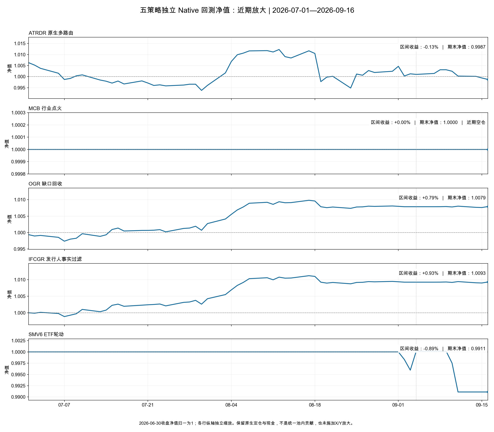
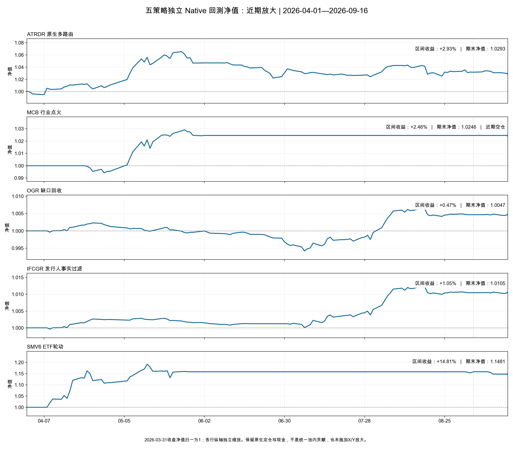
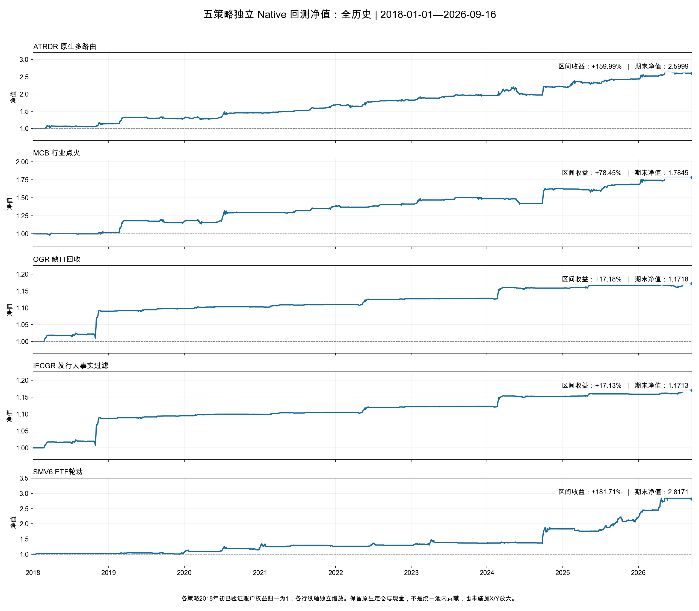

# 五策略独立回测净值

截至2026-09-16。按用户更正展示净值曲线。使用同一批最新前复权数据及已完成的五个独立Native账户；保留2018年初已验证状态，不施加X/Y放大。

近期图以窗口前一交易日收盘权益归一为1，各行纵轴独立缩放，不能比较屏幕高度。曲线包含实际空仓期。

| strategy   | return_   | average_gross   |
|:-----------|:----------|:----------------|
| ATRDR      | -0.13%    | 15.97%          |
| MCB        | 0.00%     | 0.00%           |
| OGR        | 0.79%     | 2.35%           |
| IFCGR      | 0.93%     | 2.09%           |
| SMV6       | -0.89%    | 2.47%           |

MCB在7月至9月16日实际空仓、没有成交，近期净值为平线。OGR与IFCGR分别作为替代策略独立重放，不能直接相加为组合收益。现金、总敞口、损益守恒、持仓公司行动及2114个交易日覆盖检查通过。KEEP_NATIVE不变。
