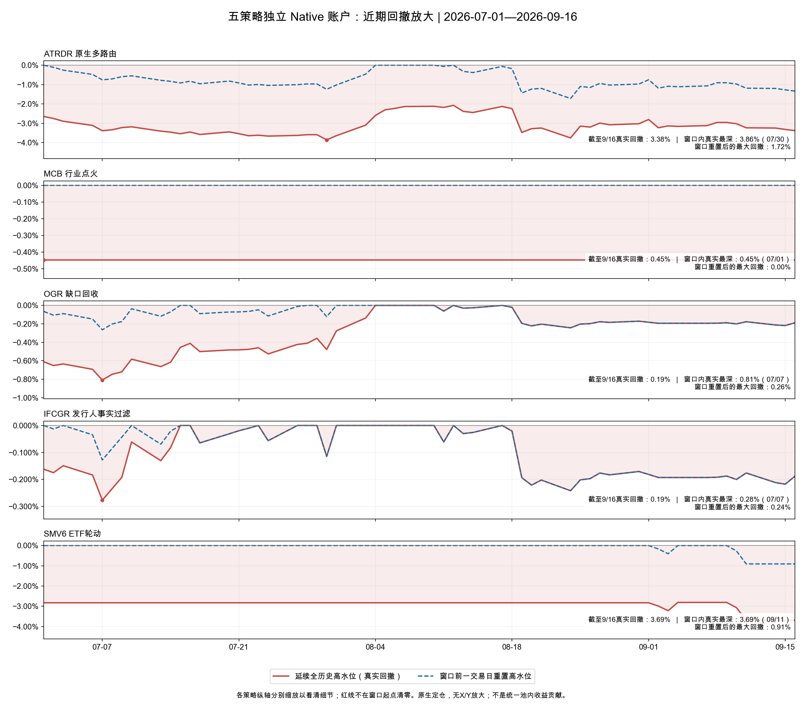
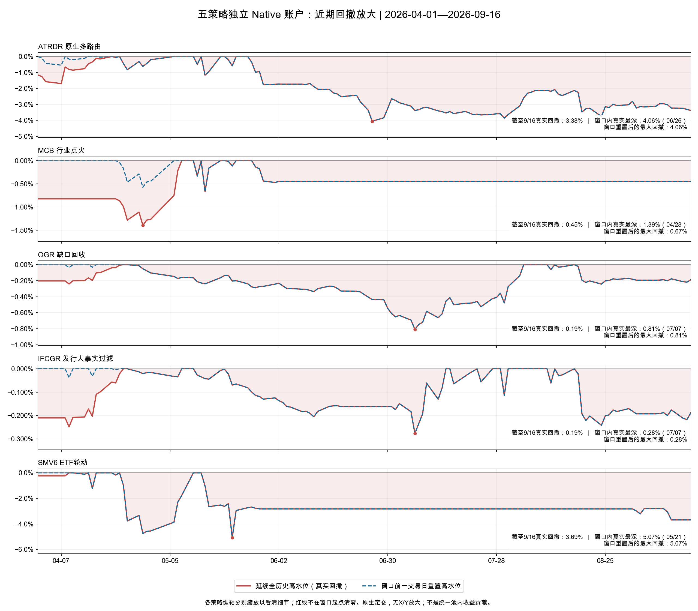
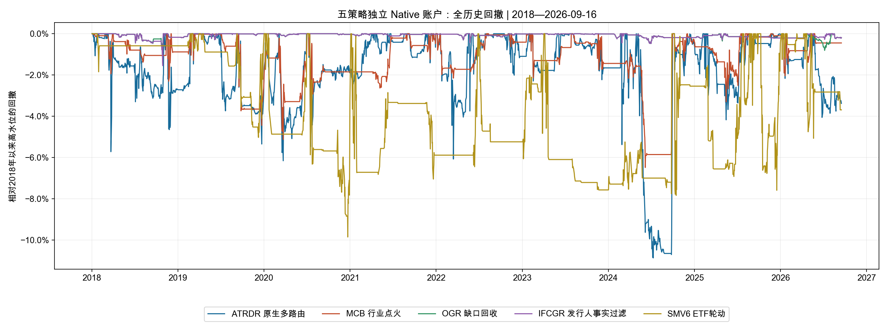

# 五策略独立 Native 回撤

数据截至 2026-09-16，与上一轮32组实验使用相同的冻结刷新数据。分别重放五个独立原生账户，保留各自已验证的2018年初现金和持仓；没有X/Y放大，也不是组合内贡献曲线。

红线延续全历史高水位，蓝虚线仅用于观察窗口内回撤，窗口前已有亏损不会从红线消失。各策略近景纵轴独立缩放。

| strategy   | window   | start      | end        |     return_ |   window_MaxDD | window_trough   |   deepest_full_history_drawdown_in_window | full_history_trough   |   current_full_history_drawdown |
|:-----------|:---------|:-----------|:-----------|------------:|---------------:|:----------------|------------------------------------------:|:----------------------|--------------------------------:|
| ATRDR      | 7月至今  | 2026-07-01 | 2026-09-16 | -0.00125601 |     0.0171892  | 2026-08-24      |                                0.0385836  | 2026-07-30            |                      0.0337919  |
| MCB        | 7月至今  | 2026-07-01 | 2026-09-16 |  0          |     0          | 2026-07-01      |                                0.0044823  | 2026-07-01            |                      0.0044823  |
| OGR        | 7月至今  | 2026-07-01 | 2026-09-16 |  0.00790612 |     0.00264335 | 2026-07-07      |                                0.00808616 | 2026-07-07            |                      0.00188918 |
| IFCGR      | 7月至今  | 2026-07-01 | 2026-09-16 |  0.00928542 |     0.00241858 | 2026-08-24      |                                0.00276825 | 2026-07-07            |                      0.00188249 |
| SMV6       | 7月至今  | 2026-07-01 | 2026-09-16 | -0.00889283 |     0.00907204 | 2026-09-11      |                                0.0369202  | 2026-09-11            |                      0.0369202  |

MCB自6月2日退出后，7月至9月16日实际空仓，近期平线并非缺失值填零。Gap适配器仅沿用上一轮已使用的未退出日期为空值保护，未改变入场、定仓或退出规则。OGR与IFCGR是分别运行的替代策略，不能相加理解为组合收益。KEEP_NATIVE保持不变。
